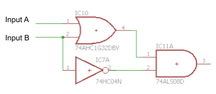

SIMPLE CIRCUIT

# Overview

A circuit is simply a series of components connected in a way that current can flow from the positive terminal on a voltage source to the negative terminal on a voltage source. One of the simplest examples of a circuit is one designed to light an LED.

### Exercise:

Construct the following circuit using your [bench supply](https://www.google.com/url?q=https://docs.google.com/document/d/1BmZbXzxnD2j17QToSZ9jeZmnP7burwfksfQq2v4zu-Y/edit%23heading%3Dh.x2bqdmttrjfd&sa=D&ust=1587613173836000) as a voltage source. You will simply need to connect the [components](https://www.google.com/url?q=https://docs.google.com/document/d/1BmZbXzxnD2j17QToSZ9jeZmnP7burwfksfQq2v4zu-Y/edit%23heading%3Dh.s6ahz6tu1kg9&sa=D&ust=1587613173836000) in the order shown below. You can connect them by touching the lead of one component to the lead of another component or bending them to hold them in place. You will need two [test leads](https://www.google.com/url?q=https://docs.google.com/document/d/1BmZbXzxnD2j17QToSZ9jeZmnP7burwfksfQq2v4zu-Y/edit%23heading%3Dh.21kolzx0ntn7&sa=D&ust=1587613173836000) to connect your bench supply to your circuit.

The correct circuit will light the LED without destroying the LED. It may take a few tries to get it right and you may need to try placing a component in BOTH directions (i.e. flipping the direction of a component might make the circuit work or not work.) Don’t worry about destroying an LED. This is part of learning.

TEACHER CHECK \_\_\_\_\_

### Exercise:

1.  Change the order of the components so that the LED is directly connected to the 5V lead of the power supply with the resistor following second as shown below. Do you notice any difference in the function of the circuit?

TEACHER CHECK \_\_\_\_\_

2.  Reverse the direction of the LED in the circuit. Does the LED still light? The LED should only work in one direction. Because of this feature, we call an LED a polarized device. Try to identify a feature on the LED that signifies which direction it should be facing in the circuit.

TEACHER CHECK \_\_\_\_\_

3.  Reverse the direction of the resistor in the circuit. Does the LED still light? It should work in either direction. Because of this feature, we call a resistor a non-polarized device.

TEACHER CHECK \_\_\_\_\_

-----

BREADBOARD CIRCUIT

# Overview

Breadboards provide a convenient way to connect components together to make a circuit.

### 

### 

### Exercise:

Construct the above three circuits on your [breadboard](https://www.google.com/url?q=https://docs.google.com/document/d/1BmZbXzxnD2j17QToSZ9jeZmnP7burwfksfQq2v4zu-Y/edit%23heading%3Dh.utuueb8q3cey&sa=D&ust=1587613173841000). Note that NOT all three circuits will light the LED. What is important is that you are able to follow the schematic design correctly. IMPORTANT: Each of the component leads should be placed in one of the breadboard holes. No holes should have more than one lead.

TEACHER CHECK \_\_\_\_\_

-----

MORE LEDS

# Overview

In this lesson, you will get more practice using your breadboard. The two circuits are designed to light three LEDs. The first one is a parallel circuit. The second one is a series circuit. The advantage of the parallel circuit is that you can set different resistor values for each LED. The advantage of the second circuit only needs one resistor.

### Exercise:

Following the schematic below, create a circuit to light three LEDs in parallel on your breadboard. You will need three LEDs and three resistors.

TEACHER CHECK \_\_\_\_\_

### Exercise:

Following the schematic below, create a circuit to light three LEDs in series on your breadboard. You will need three LEDs and one resistors.

TEACHER CHECK \_\_\_\_

-----

SIMPLE SWITCH

# Overview

In this lesson, you will use a momentary switch to turn on and off an LED. Like all switches, a momentary switch is able to complete or disconnect a circuit with the press of a button. A momentary switch is named for the fact that it is only connected (completing the circuit) when the button is pressed. When the button is released the circuit is disconnected. Below is a picture of a momentary switch.

Momentary Switch

Below are two diagrams from the datasheet for a momentary switch. Note how the four pins are connected in the circuit diagram.

### Exercise:

Complete the following circuit which uses a switch to turn on and off an LED.

### Exercise:

Add a second LED circuit with a switch. Wire the components in a different order from the circuit shown above.

TEACHER CHECK \_\_\_\_\_

-----

THE POWER BUS

# Overview

Connect power to your power bus and measure the voltage on your breadboard using a multimeter.

# Power Bus

As you may have noted from the guide on [breadboards](https://www.google.com/url?q=https://docs.google.com/document/d/1BmZbXzxnD2j17QToSZ9jeZmnP7burwfksfQq2v4zu-Y/edit%23heading%3Dh.utuueb8q3cey&sa=D&ust=1587613173846000) in concepts, the two sets of long rows at the top of and bottom of your breadboard are referred to as busses. Each bus has a red side and a blue side. Standard practice is to connect power (the red lead from your bench supply) to the red side of the bus and ground (the black lead from your bench supply) to the blue side. You can use alligator clips and long jump wires.

### Exercise:

1.  Set up the board with power and ground as described above. Using a [multimeter](https://www.google.com/url?q=https://docs.google.com/document/d/1BmZbXzxnD2j17QToSZ9jeZmnP7burwfksfQq2v4zu-Y/edit%23heading%3Dh.sf66jio1dnm6&sa=D&ust=1587613173847000), confirm that correct voltage is on your bus.

TEACHER CHECK \_\_\_\_\_

2.  Add a couple of wires to bring power and ground to both sides of your board and confirm with a multimeter.

TEACHER CHECK \_\_\_\_\_

3.  Set up the following LED circuit on your board.

-----

CHALLENGES CIRCUITS

# Overview

In this lesson you will get more experience following circuit diagrams. Make sure to use the efficient breadboard techniques that you learned in the previous lesson.                                                                                                                                  

### Exercise:

Complete the following circuits.

TEACHER CHECK \_\_\_\_\_

-----

MEASURING VOLTAGE

# Overview

Being able to measure voltage is extremely helpful for troubleshooting a circuit. A voltage level can indicate if a circuit is correctly powered. A voltage level can also indicate if a logic level is correct.

### Exercise:

Construct a simple LED circuit on your breadboard with one resistor and one LED. Use your [multimeter](https://www.google.com/url?q=https://docs.google.com/document/d/1BmZbXzxnD2j17QToSZ9jeZmnP7burwfksfQq2v4zu-Y/edit%23heading%3Dh.sf66jio1dnm6&sa=D&ust=1587613173850000) to [measure the voltage](https://www.google.com/url?q=https://docs.google.com/document/d/1BmZbXzxnD2j17QToSZ9jeZmnP7burwfksfQq2v4zu-Y/edit%23heading%3Dh.1d4or8wh0xdv&sa=D&ust=1587613173850000) across the resistor and the LED in your simple circuit and write the results below. If you do not know how to use a multimeter please click on the link above for more information.

Voltage across resistor:         \_\_\_\_\_\_

Voltage across LED:                 \_\_\_\_\_\_

Voltage across entire circuit:        \_\_\_\_\_\_

TEACHER CHECK \_\_\_\_\_

### Exercise:

Note that the total voltage across the entire circuit should equal the voltage of each of the parts. Add up the voltages you measured across the resistor and the LED. How does this compare with the voltage you measured for the entire circuit.

Voltage across resistor \_\_\_\_  + voltage across LED \_\_\_ = Voltage across entire circuit  \_\_\_\_

TEACHER CHECK \_\_\_\_\_

-----

PROGRAMMING THE METRO MINI

# Overview

In this lesson you will learn how to use a [Metro Mini](https://www.google.com/url?q=https://www.adafruit.com/product/2590&sa=D&ust=1587613173853000) as a basic microcontroller platform. At the heart of the Metro Mini is a microcontroller which is essentially a very small computer that can be programmed to perform an infinite number of tasks.

# USB Connection

In addition to a microcontroller, the Metro Mini includes a micro USB header which allows you to connect the Metro Mini to a computer. The USB cable enables the following:

  - Power Supply: The Metro Mini can get its power (5V and Ground) from the host computer and through the USB cable.
  - Programming: Code written on your computer is uploaded to the Metro Mini through the USB cable.
  - Data Communication: The USB cable can also be used to send data to the Metro Mini from your computer as well as receive data to your computer from the Metro Mini.

# Programming

You will program your Metro Mini using the Arduino Integrated Development Environment (IDE). An IDE is an editor where you can write, compile and download your code to your microcontroller.

### Exercise:

1.  Make Connection: If you have not already done so, connect the Metro Mini to your computer using a USB cable. You DO NOT need to use your breadboard at this point just plug your Metro Mini directly into the USB cable.
2.  Open IDE: Open the Arduino program. This is the IDE you will be using to program your microcontroller. You can find program in the Start menu with the icon shown below.

 

3.  Open the Blink Code File: Select the Blink code file. It can be found under File/Examples/01.Basics/Blink
4.  Select COM Port: Under the Tools/port menu select the highest numbered COM port. If you only see COM1 and COM3 as options wait for help from your teacher.
5.  Select Board: Under the Tools/board menu, make sure that the board selected is Arduino/Genuino Uno.
6.  Compile Code: Press the compile button to confirm that you code can be compiled. The compile button is the circle with a check inside in the upper left of your screen. If there is an error in your code, you will see a message at the bottom of the screen. If you get an error, ask your teacher for help.
7.  Program Controller: Select the program to download your code to the Metro Mini. The program button is the circle with an arrow inside and just right of the compile button. You should see both the yellow TX LED and the yellow RX LED light as the code is being downloaded.
8.  Check: If you code was downloaded correctly the red light on your Metro Mini should blink on and off once every second.

TEACHER CHECK \_\_\_\_\_

-----

METRO MINI AND BREADBOARD

# Overview

In order to do something more interesting with your Metro Mini, you will need to connect it to a breadboard.

# Power and Ground

The Metro Mini can supply power to your breadboard through its pins 5V and GND. These will provide power supplied by the computer through the USB cable. Note that there are two pins for ground. You only need to connect one of the pins.

# Digital Pins

The Metro Mini has 14 digital pins (labeled 0 through 13 as shown below) that can be used to control external devices from a simple LED to a complex robot. IMPORTANT: Generally you want to avoid using pins 0 and 1 if possible. Using these pins might interfere with the programming of your device.

### Exercise:

1.  Insert the Metro Mini into your breadboard. Make sure to remove all of your previous circuits before starting this step.
2.  Connect the 5V pin from your Metro Mini to the power bus (red) of your breadboard.
3.  Connect one of the GND pins from your Metro Mini to the ground bus (blue) of your breadboard.
4.  Connect the power buses on your breadboard together and the ground buses on your breadboard together.

<!-- end list -->

5.  Connect a USB Mini cable to your Metro Mini.

TEACHER CHECK \_\_\_\_\_

-----

OUTPUT PINS

# Overview

The digital pins on your microcontroller (described above) can be used as either [inputs or outputs](https://www.google.com/url?q=https://docs.google.com/document/d/1BmZbXzxnD2j17QToSZ9jeZmnP7burwfksfQq2v4zu-Y/edit%23heading%3Dh.12g8aset9qzv&sa=D&ust=1587613173860000). As an output, the voltage on the pin can be set to either HIGH (5V) or LOW (0V). A pin set as an output can be used to control an LED, a speaker, a motor or just about any sort of electronic device.

### Exercise:

In this first exercise, you will set one of the pins of your microcontroller as an output pin and then set that pin to HIGH.

1.  Open a new code file (File/New) in your Arduino IDE.

<!-- end list -->

2.  Type the following two lines of code inside your setup [function](https://www.google.com/url?q=https://docs.google.com/document/d/1BmZbXzxnD2j17QToSZ9jeZmnP7burwfksfQq2v4zu-Y/edit%23heading%3Dh.45j551ci2de&sa=D&ust=1587613173861000). The first line sets pin 8 on your microcontroller as an output pin. The second line sets the value of pin 8 to HIGH.

pinMode(8, OUTPUT);

digitalWrite(8, HIGH);

        

3.  Compile and download your code. If you have errors, ask your teacher for help.

<!-- end list -->

4.  Use a multimeter to confirm that the voltage on pin 8 is 5V (or close to 5V). Connect the black lead to ground on your circuit and touch the red lead to pin 8 on your Metro Mini.

TEACHER CHECK \_\_\_\_\_

5.  Modify your code to set pin 8 to 0V (LOW).

<!-- end list -->

6.  Program your microcontroller and confirm with a multimeter.

TEACHER CHECK \_\_\_\_\_

7.  Modify your code to set pin 6 to 5V. Program and confirm with your multimeter.

TEACHER CHECK \_\_\_\_\_

-----

PROGRAMMING LEDS

# Overview

LEDs are a good example of the kinds of devices you can drive with a microcontroller. LEDs also provide an easy way to indicate if a microcontroller pin is set to HIGH or LOW. IMPORTANT to use a resistor in series with any LED so you do not use too much current. Driving too much current through and LED will damage the LED and the microcontroller.

# Schematic

The following is the schematic for the circuit you need to construct on your breadboard.

It is important that your LED and resistor are not placed directly next to your Metro Mini on the breadboard. This will result in the components interfering with unintended pins. Use a long jump wire from the Metro Mini (pin 8 in this case) to an empty portion of the board. Now add your resistor and LED. See [here](https://www.google.com/url?q=https://docs.google.com/document/d/1BmZbXzxnD2j17QToSZ9jeZmnP7burwfksfQq2v4zu-Y/edit%23heading%3Dh.mfgepxcw4elz&sa=D&ust=1587613173864000) for an example.

TEACHER CHECK \_\_\_\_\_

# Code

1.  Write a program to turn on the LED. NOTE: In this lesson you will be choosing which digital pin to use with you LED. You may use any of the digital pins (0 -13) but you should generally avoid using digital pins 0 and 1 as using these pins might interfere with the programming of your device.

<!-- end list -->

1.  Set the pin you are using to control the LED as an output pin.
2.  Use digitalWrite to drive the pin to 5V.

TEACHER CHECK \_\_\_\_\_

2.  Modify your program to turn off the LED.
3.  Change the LED to a different pin and turn it on.
4.  Add two more LEDs to two additional pins on your microcontroller and turn them all on.

TEACHER CHECK \_\_\_\_\_

DELAYS

# Overview

Delays are used in code to freeze the state of the controller for a specified amount of time. The delay function we are using is measured in milliseconds and have a [range](https://www.google.com/url?q=https://docs.google.com/document/d/1BmZbXzxnD2j17QToSZ9jeZmnP7burwfksfQq2v4zu-Y/edit%23heading%3Dh.7lc2dw9cimru&sa=D&ust=1587613173867000) from 0 to 10,000 milliseconds.

### 

Below is an example of the delay command. In this example, the delay is set for 1500 milliseconds (or 1.5 seconds).

        delay(1500);

# Code

1.  Write a program to turn your LED on and off and on again. The program should turn your LED on for two seconds and then off for one second and then back on. This code should again be placed in your setup function.

IMPORTANT: Do not forget to make sure to set the pin the LED is using to an output.

TEACHER CHECK \_\_\_\_\_

-----

LOOPS

# Overview

Up until this point all of your code has been placed in your setup function. As you have probably noted, this function only runs once. The loop function is designed to run continuously. Any code place in this function will run continuously until power is removed from the Metro Mini.

# Code

1.  Using a delay and your loop function, write a program to make your LED blink (on for one second and off for one second) continuously.

TEACHER CHECK \_\_\_\_\_

2.  Set up two LEDs on your breadboard on different pins. Make the LEDs flash alternately (i.e. one is on while the other is off)

TEACHER CHECK \_\_\_\_\_

# 

INPUT PINS

# Overview

The digital pins on the Metro Mini can also be set as inputs. As an input, the Metro Mini can read the value of a pin, i.e. if the pin is externally driven as HIGH (5V) or LOW (0V). Generally inputs are used for receiving information from the outside world, such a reading the value of a sensor or getting data from a robotic device.

Setting up software and hardware to test an input is a little more complicated than setting up software and hardware to test an output.

# Schematic

Set up the following circuit on your breadboard. Make sure to use a long jump wire for the connection between pin 9 and ground. You will be moving this pin between power and ground so using a long jump wire will make this much easier. By moving the long jump wire between GND and power you will be setting the input of pin 9 as HIGH and LOW. This wire will essentially act as a crude switch.

# Code

1.  In your  setup function, insert the following two lines to ensure that that pin 6 is an OUTPUT and pin 9 is an INPUT.

pinMode(9, INPUT);        

pinMode(6, OUTPUT):

2.  Type the following code inside of the loop function. This code is set in the loop function because it needs to repeatedly check the value of pin 9. For more information about how this code works you can review [conditionals](https://www.google.com/url?q=https://docs.google.com/document/d/1BmZbXzxnD2j17QToSZ9jeZmnP7burwfksfQq2v4zu-Y/edit%23heading%3Dh.o11qq65yx4ek&sa=D&ust=1587613173872000) in concepts.

3.  Compile and download your code.
4.  Connect pin 9 to the power bus (HIGH). The LED should be lit.
5.  Connect pin 9 to the ground bus (LOW). The LED should be off.

TEACHER CHECK \_\_\_\_\_

6.  What happens when the pin is in neither ground or power? Move the pin around or touch it with your hand. A pin when not connected to power or ground is said to [float](https://www.google.com/url?q=https://docs.google.com/document/d/1BmZbXzxnD2j17QToSZ9jeZmnP7burwfksfQq2v4zu-Y/edit%23heading%3Dh.jcbntq8yv6k7&sa=D&ust=1587613173873000).
7.  Modify your code so that it reverses operation. The LED should be lit when pin 9 is connected to LOW and vise versa.

TEACHER CHECK \_\_\_\_\_

-----

CHALLENGE REVIEW

# Overview

Complete the following six challenges.

1.  Program an LED to flash with 1.5 seconds on and .5 seconds off.

TEACHER CHECK \_\_\_\_\_

2.  Program an LED to flash with .5 seconds on and 1.5 seconds off.

TEACHER CHECK \_\_\_\_\_

3.  Program three LEDs to turn on in sequence with a delay of half a second between each one.

TEACHER CHECK \_\_\_\_\_

4.  Program three LEDs to flash alternately with two on and one off and vice versa.

TEACHER CHECK \_\_\_\_\_

5.  Program three LEDs on three different pins to turn on when pin 5 is LOW and off when pin 5 is HIGH.

TEACHER CHECK \_\_\_\_\_

6.  Do something interesting\!

TEACHER CHECK \_\_\_\_\_

-----

SERIAL COMMUNICATION

# Overview

Serial communication provides an excellent way to send data to and get data from your microcontroller. It can be used as a way to provide a human interface to your device allowing the user to type commands on the computer that control operations on your device. It is also commonly used to debug a problem in your device by providing a way to visualize what is happening in your code.

# Reading Data

Serial communication can be used to read the value a variable or the state of a sensor attached to a computer.

### Exercise:

1.  Use the following command to set up the serial port for the baud rate of 9600 bps.

                Serial.begin(9600);

2.  Use the following command to send the word “cat” to your terminal window. This command should be placed in your setup function. NOTE: If you cut and paste the code below you will need to replace the quotation marks as the characters on the page are different from the characters in your IDE.

                Serial.print(“cat”);

3.  Download your code to the microcontroller.
4.  Open the terminal window. If you are successful the word “cat” should be displayed in your terminal window.

TEACHER CHECK \_\_\_\_\_

# Looping Data

You can use the loop function to send data repeatedly to the terminal window.

### Exercise:

Repeat the steps above but instead of placing your serial.write command in the setup function, place it in the loop function. IMPORTANT: Make sure to add a delay of at least 100ms to your loop function. This will ensure that the program does not try to send data too quickly to the serial port.

TEACHER CHECK \_\_\_\_\_

FORMATING SERIAL COMMUNICATION

# Overview

In order to make the information you are sending to the terminal window readable, it is important to know how to format the text.

# Column and Separators

As you may have noted in the previous lesson, the word “cat” was displayed across the screen making it difficult to read. You can display text in a column by simply adding a carriage return at the end of each line using the following command.

Serial.println();

### Exercise:

1.  Write a program that repeatedly prints the word “robot” in your terminal window. Using the addition of the command shown above ensure that the word “robot” is displayed in a single column in your window.

TEACHER CHECK \_\_\_\_\_

2.  Modify your program so that it prints the word “robot” and the word “engineer” in two columns and a space between the words. This should be accomplished with at least three separate print statements.
3.  Modify your program so that a colon separates the two columns.
4.  Modify your program so that a [tab separates](https://www.google.com/url?q=https://docs.google.com/document/d/1BmZbXzxnD2j17QToSZ9jeZmnP7burwfksfQq2v4zu-Y/edit%23heading%3Dh.idcad0tlxp8n&sa=D&ust=1587613173880000) the two columns.

TEACHER CHECK \_\_\_\_\_

-----

VARIABLES

# Overview

Variables are placeholders used to store values that can be modified.

# Initializing

In order to use a variable you must first initialize it. Initially you will do this at the top of your code file outside of both the loop and setup functions. This will make the variable available everywhere in your code or globally. Check out Lessons for more information about [variables](https://www.google.com/url?q=https://docs.google.com/document/d/1BmZbXzxnD2j17QToSZ9jeZmnP7burwfksfQq2v4zu-Y/edit%23heading%3Dh.vbe1wov8lque&sa=D&ust=1587613173882000).

### Exercise:

1.  Initialize the variable z at the top of your code file and set its initial value to 9.

<!-- end list -->

2.  Print the variable to your terminal window using the following command.

Serial.print(z);

TEACHER CHECK \_\_\_\_\_

3.  Modify your code so that the variable starts at the value 9 and [counts up](https://www.google.com/url?q=https://docs.google.com/document/d/1BmZbXzxnD2j17QToSZ9jeZmnP7burwfksfQq2v4zu-Y/edit%23heading%3Dh.j1vujjth5hql&sa=D&ust=1587613173884000) by one every 500 milliseconds. It should display the values in a column in your terminal window.

TEACHER CHECK \_\_\_\_\_

4.  Modify your code so that the variable starts at the value 9 and counts down by one every 500 milliseconds. It should display the values in a column in your terminal window.

TEACHER CHECK \_\_\_\_\_

5.  Modify your code so that there are two variables x and y. The variable x should start at 6 and count up by 2. The variable y should start at 50 and count down by 2. The variables should be displayed in two columns in your terminal window.

TEACHER CHECK \_\_\_\_\_

-----

RESISTOR VALUES

# Overview

The value of any through-hole resistor can be determined by the color bands on the resistor. While you should be able to work out the resistance value for any resistor based on color, you should be able to identify a  330 Ohm, 1K and 10K resistor on site.

### Exercise:

Complete the following table for the resistors given. You can use the [guide](https://www.google.com/url?q=https://docs.google.com/document/d/1BmZbXzxnD2j17QToSZ9jeZmnP7burwfksfQq2v4zu-Y/edit%23heading%3Dh.ex2xtjdrup0t&sa=D&ust=1587613173886000) here for assistance.

|       |        |        |            |
| ----- | ------ | ------ | ---------- |
| Value | Band 1 | Band 2 | Multiplier |
| 10K   |        |        |            |
| 330R  |        |        |            |
| 1K    |        |        |            |
| 4.7K  |        |        |            |
| 470R  |        |        |            |

TEACHER CHECK \_\_\_\_\_

Quiz

Have your teacher provide you with three resistors of values 10K, 1K, 330 Ohm. Make sure you can easily identify these resistors by site.

TEACHER CHECK \_\_\_\_\_

-----

OHMS LAW

Overview

[Ohms law](https://www.google.com/url?q=https://docs.google.com/document/d/1BmZbXzxnD2j17QToSZ9jeZmnP7burwfksfQq2v4zu-Y/edit%23heading%3Dh.t5bxsyeu98j2&sa=D&ust=1587613173894000) describes an important relationship between [voltage, current and resistance](https://www.google.com/url?q=https://docs.google.com/document/d/1BmZbXzxnD2j17QToSZ9jeZmnP7burwfksfQq2v4zu-Y/edit%23heading%3Dh.7g89z82u0oqw&sa=D&ust=1587613173895000). Ohm’s law you can correctly specify the proper resistor for limiting current to any device. Most often in the shop, we are using resistors to limit current to LEDs. Driving an LED without a resistor will invariably lead to failure of the LED due to too much current. Driving an LED with too large an LED will result in no light from the LED.

For each type of LED there is a maximum safe current. The following is a table from the datasheet for the 334-15/T1C1-4WYA which an Everlight 5mm Round White LED (T-1 3/4). There are literally millions of different types of LEDs and each has its own datasheet.

Note that in the table above the recommended maximum current is 30ma. If you cannot find the datasheet for an LED, it is generally safe to assume that the maximum current is at least 15ma.

### Challenge

Ohm’s law describes the fundamental relationship between [voltage, current and resistance](https://www.google.com/url?q=https://docs.google.com/document/d/1BmZbXzxnD2j17QToSZ9jeZmnP7burwfksfQq2v4zu-Y/edit%23heading%3Dh.7g89z82u0oqw&sa=D&ust=1587613173896000). Voltage represents a pressure driving current. Resistance represents a pressure limiting current. In other words, the ratio of voltage (V) over resistance (R) is directly proportional to current (I) or (V/R = I). More generally this relationship is represented at V = IR. In this lesson, round your measurements for current to the nearest thousandth.

\_\_\_\_\_\_ Amps                 \_\_\_\_\_\_ Amps                \_\_\_\_\_\_ Amps

TEACHER CHECK \_\_\_\_

### Challenge

Using Ohm’s law calculate the missing value in the table below for the example circuit.

Circuit

Voltage

Current

Resistance

1

5.00 Volts

100 ohms

2

3.00 Volts

.020 Amps

3

.005 Amps

330 ohms

4

12.00 Volts

.400 Amps

5

1.80 Volts

470 ohms

6

.250 Amps

1000 ohms

TEACHER CHECK \_\_\_\_\_

-----

RESISTORS AND LEDS

# Overview

In this lesson you will learn how to determine the correct value of a resistor to limit current in an LED circuit. The amount of current flowing through an LED determines its brightness. If too much current flows through an LED it will burn out. If too little current flows through an LED it will be impossible to see.

The following are the two basic steps necessary to calculate the correct resistor value for an LED circuit. Note that this is essentially the same circuit you used in the Ohm’s law exercise above except with the addition of an LED. Each LED drops a specific amount of voltage. Once you know this voltage drop, you simply subtract it to get the voltage across the resistor.

1.  Subtract the voltage drop of the LED from the circuit to get the exact voltage across the resistor.
2.  Use Ohm’s law to determine the correct resistor value for the target current you are trying to achieve in the circuit.

Supply Voltage

LED Voltage Drop

Target Current

Resistor Value

5 Volts

2.3 Volts

.005 A

5 Volts

1.8 Volts

.002 A

3 Volts

2.0 Volts

.040 A

7 Volts

3.0 Volts

.003 A

12 Volts

1.8 Volts

.015 A

3 Volts

2.0 Volts

.008 A

6 Volts

3.0 Volts

.003 A

-----

BUTTONS

# Overview

Buttons represent the most common form of input found on electronic devices and are used for everything from turning on the device to sending the letter ‘s’ to the computer screen. All buttons have exactly two states. The button is either pressed or it is not pressed. There are no states in between. For this reason they can be categorized as binary devices.

## Button Circuit

In order to make the states of the button readable by a digital electronic device such as your microcontroller, you will need to construct a circuit that converts the states of pressed and not pressed into voltage levels that the microcontroller can use.

Above are two examples of the same circuit. On the left the switch is open and on the right the switch is closed. When the switch is open, the circuit is tied to ground through a resistor so the voltage level at the mid-point is 0 Volts or ground. When the switch is closed, the circuit is tied directly to 5 V. Even though it is also tied to GND through a resistor, the voltage is pulled almost completely to 5 Volts.

### Exercise

Construct the circuit shown below on your breadboard. Using a multimeter record the output voltage for the circuit with the button pressed and not pressed. Make sure to include your units.

|             |                        |
| ----------- | ---------------------- |
|             | Output Voltage Point A |
| Pressed     |                        |
| Not Pressed |                        |

TEACHER CHECK \_\_\_\_

### Exercise:

Construct a circuit that with a button connected to one pin of your microcontroller and a LED connected to another pin. Write code to make the LED turn on when the button is pressed.

TEACHER CHECK \_\_\_\_

-----

POTENTIOMETERS

# Overview

Potentiometers are another common form of input for controlling an electronic device. They generally come in two forms: dials and sliders. Dials are commonly used to control the volume on an audio device or temperature on a thermostat. Sliders are commonly used in joysticks to convert the motion of the joystick into signals that can be used by a digital microcontroller.

## Potentiometer Design

All potentiometers have three leads as shown in the diagram below. The two outside leads (A and B) form a fixed value resistor (i.e. the value of resistance between A and B is fixed). The wiper (W) shorts the resistor. The value between W and B varies depending on the placement of the wiper. Note that the resistance value between W and B is the inverse of the resistance value between W and A.

On the right is a schematic symbol for a potentiometer. Connecting pins A and B to 5V and ground (the order does not matter) creates a voltage divider whose output value at W varies with the position of the potentiometer.

### Exercise

Construct the following circuit on your breadboard. Connect the output to a multimeter. Record the highest and lowest voltage by turning the potentiometer all the way to the right or left.

|                 |                      |
| --------------- | -------------------- |
|                 | Potentiometer Output |
| Highest Voltage |                      |
| Lowest Voltage  |                      |

1\. TEACHER CHECK \_\_\_\_

-----

ANALOG TO DIGITAL CONVERSION

# Overview

In order to convert an analog signal to a digital signal the microcontroller on the Metro Mini has an internal analog to digital converter (ADC) which is accessible on six pins labeled A0 through A5.

The ADC has 1024 states so that any analog voltage applied to an ADC pin is converted to one of 1024 different states.

For example, if your analog device had a voltage range of 0 volts to 5 volts than 0 volts would correspond to a state of 0 and 5 volts would correspond to a state of 1023, and each voltage level in between would correspond to exactly one of the 1024 states (0 - 1023). The diagram below shows an example. You can read more about analog conversion in analog section of [concepts](https://www.google.com/url?q=https://docs.google.com/document/d/1BmZbXzxnD2j17QToSZ9jeZmnP7burwfksfQq2v4zu-Y/edit%23heading%3Dh.vhex7ebzcaik&sa=D&ust=1587613173930000).

# Code

In order to use the analog to digital converter (ADC) on your Metro Mini you will need to use the following command.

### Exercise

1.  Connect the output of one of your potentiometers to an ADC port on your microcontroller. Write a program to read the value from this port and display the value in a column on your serial monitor. The value should range from 0 to 1023.

2\. TEACHER CHECK \_\_\_\_

2.  Calculate the number of volts for each step of the ADC in the following table.  For example, if the range of voltage is 0 volts to 6 volts and there were 3 steps (as shown below) than each step would be 2 volts.

|             |              |       |                |
| ----------- | ------------ | ----- | -------------- |
| Low Voltage | High Voltage | Steps | Volts per Step |
| 0 Volts     | 6 Volts      | 3     | 2 Volts/Step   |
| 0 Volts     | 5 Volts      | 10    |                |
| 0 Volts     | 5 Volts      | 1024  |                |

TEACHER CHECK \_\_\_\_

3.  Modify your code to display the voltage at the output from your potentiometer. Now that you have calculated the Volts per Step (above) you should be able to convert steps (0 - 1023) to volts.

<!-- end list -->

1.  Copy the conversion factor from your table above. (i.e. How many volts is each step of the A/D converter): \_\_\_\_\_
2.  In your code multiply this factor by the results of the A/D converter. (i.e. if you are using the variable x to store the results of the A/D conversion than you would multiply this number by the conversion factor from above before printing the result). You can find information about how to multiply a variable [here](https://www.google.com/url?q=https://docs.google.com/document/d/1BmZbXzxnD2j17QToSZ9jeZmnP7burwfksfQq2v4zu-Y/edit%23heading%3Dh.j1vujjth5hql&sa=D&ust=1587613173936000).
3.  If you did this correctly, you should see the results vary between 0 and 5 (or maybe just 4 depending on your potentiometer) representing the voltage produced by your potentiometer.

TEACHER CHECK \_\_\_\_

4.  The voltage range 0 - 5 is a very crude representation of the voltage. Modify your code to display a voltage to a hundredth of a volt (2 decimal places).

<!-- end list -->

1.  In order to store a number with a range of less than one (2 decimal place) you will need to initialize your variable as a [float](https://www.google.com/url?q=https://docs.google.com/document/d/1BmZbXzxnD2j17QToSZ9jeZmnP7burwfksfQq2v4zu-Y/edit%23heading%3Dh.86fwcjklmgvf&sa=D&ust=1587613173937000) instead of an int.
2.  Confirm you results by connecting a multimeter to the output of your potentiometer and measuring voltage. The results from the multimeter should match fairly closely the results in your serial monitor.

TEACHER CHECK \_\_\_\_

-----

RELATIONAL OPERATORS

# Overview

In this lesson you will learn to use the greater than and less than logical operators. The greater than operator checks if the value of a variable is greater than a compared value and the less than operator checks if the value of a variable is less than a compared value.

x \> 23 //If x is greater than 23 this returns true

X \< 23 //If x is less than 23 this returns true

# Conditionals

In this lesson you will again need to use conditionals. Note you last used a conditional in the lesson on Inputs and you can read more about conditionals [here](https://www.google.com/url?q=https://docs.google.com/document/d/1BmZbXzxnD2j17QToSZ9jeZmnP7burwfksfQq2v4zu-Y/edit%23heading%3Dh.o11qq65yx4ek&sa=D&ust=1587613173938000) in concepts.

### Exercise:

1.  Set up your board with an LED and a potentiometer. Write a program that checks the value of the potentiometer. If it is greater than 400, the LED should turn on.
2.  Modify your code so that if the potentiometer is greater than 400, the LED should turn on. If it is less than 400, it should turn off.

TEACHER CHECK \_\_\_\_\_

3.  Add two more LEDs to your board. Write a program that turns on the first led when the value of the pot is greater than 400, the second LED when the value of the pot is greater than 600 and the third LED when the value of the pot is greater than 800.
4.  Modify your code so that the respective LEDs turn off when they are below the values given above. (i.e. the third LED turns on when the pot is greater than 800 and off when it is less than 800).

TEACHER CHECK \_\_\_\_\_

-----

LOGICAL OPERATORS

# Overview

In this lesson, you will learn to use the [logical operators](https://www.google.com/url?q=https://docs.google.com/document/d/1BmZbXzxnD2j17QToSZ9jeZmnP7burwfksfQq2v4zu-Y/edit%23heading%3Dh.wu2vkp32zpto&sa=D&ust=1587613173940000) AND, OR and NOT. As with relational operators, these are mostly used with conditionals.

### Exercise:

1.  With a potentiometer and at least one LED on your board, write a program to turn on the LED with the value of the potentiometer is above 600 or below 400.
2.  Add a button on your board (see the section on inputs above for details). Write a program that turns on the LED when the value of the potentiometer is between 200 and 400 and the button is pressed.

TEACHER CHECK \_\_\_\_\_

-----

PULSES

# Overview

Pulses are used in everything from communication signals to controlling the speed of a motor. A pulse can be created on a microcontroller by simply setting a pin HIGH and then LOW in an infinite loop.

The following shows an example of a code that creates an infinite set of pulses. To the right of the code is a diagram of the pulses showing how each line of code creates one section of the pulse.

### Exercise:

Add an LED to your board if there is not already one on there. Write a program to flash the LED using a pulse. Reduce the delay until you can no longer see that the LED is flashing. Write the value of your delay here: \_\_\_\_\_ ms. This is your CFF or critical flicker-fusion frequency. Read an article about CFF [here](https://www.google.com/url?q=https://www.economist.com/news/science-and-technology/21586532-small-creatures-fast-metabolisms-see-world-action-replay-slo-mo&sa=D&ust=1587613173941000). It is pretty cool.

TEACHER CHECK \_\_\_\_

-----

FREQUENCY CONVERSION

# Overview

Frequency is a primary measurement of pulses and measures the waves that pass a point over time. Frequency is often used to measure the speed of a  CPU as in a 3Ghz processor. Your home router most likely supports 2.4Ghz and 5.0Ghz. The microcontroller that you are using runs at 16Mhz. The frequency of middle C on a piano is 261.6Hz.

In the following exercise, you will convert between frequency and period. Read the section on [waves](https://www.google.com/url?q=https://docs.google.com/document/d/1BmZbXzxnD2j17QToSZ9jeZmnP7burwfksfQq2v4zu-Y/edit%23heading%3Dh.r3kc4sg9zrj4&sa=D&ust=1587613173942000) in concepts to learn more about frequency conversion

### Exercise

Use the equation for conversion that you found in concepts to complete the following two tables. Note that the units of Hertz are cycles per second and as a result the equation you are using produces units of seconds. Make sure to use CORRECT units and round to the nearest thousandth. The table also includes a column for converting seconds to milliseconds. You can find information about converting between engineering units [here](https://www.google.com/url?q=https://docs.google.com/document/d/1BmZbXzxnD2j17QToSZ9jeZmnP7burwfksfQq2v4zu-Y/edit%23heading%3Dh.77xfwnlk7wp2&sa=D&ust=1587613173943000).

Find the period of the wave

|           |                     |                          |
| --------- | ------------------- | ------------------------ |
| Frequency | Period (in seconds) | Period (in milliseconds) |
| 2 Hz      |                     |                          |
| 345 Hz    |                     |                          |
| 32 kHz    |                     |                          |
| 2.7 kHz   |                     |                          |

Find the frequency of the wave

|        |                      |                   |
| ------ | -------------------- | ----------------- |
| Period | Period ( in seconds) | Frequency (in Hz) |
| 300 ms |                      |                   |
| 13 ms  |                      |                   |
| 235 us |                      |                   |
| 3 us   |                      |                   |

-----

PIEZO SPEAKER

# Overview

In this lesson you will learn to drive a piezo speaker to make notes and sound effects. Piezo speakers are found in lots of common devices such as microwave ovens or cell phones. A tone from a piezo speaker can be used to indicate a button press or play a tune letting you know your friend has called.

Piezo speakers are normally formed around two metal plates as shown in the picture on the left. The picture on the right shows a piezo speaker in a secure plastic housing.

A piezo speaker is essentially a thin piece of metal that can make sounds by vibrating at a very high rate (frequency). The following shows a  piezo speaker at rest (low pulse) and under voltage (high pulse). By applying pulses very rapidly to the piezo speaker, it can vibrate very quickly

# Piezo Circuit

Driving a piezo speaker only requires a single pin that can produce a pulse.

### Exercise

1.  Construct the following circuit and connect the pulse lead to one of your microcontroller pins. After you complete the circuit, write a program to drive your speaker with a frequency of 100 Hz.

TEACHER CHECK \_\_\_\_

2.  Modify your code to produce a frequency of 1000Hz. Note you will need to use a delayMicroseconds() in order to reach this frequency.

TEACHER CHECK \_\_\_\_

3.  What are the highest and lowest frequencies you can hear? These may be the highest or lowest you can play. Record your answers below.

|                   |                  |
| ----------------- | ---------------- |
| Highest Frequency | Lowest Frequency |
|                   |                  |

# Tone Function

The tone function provides an easy way to send notes to a piezo speaker. The tone function can be used to set which pin will produce the tone, the frequency of the tone and duration of the tone. The last argument, duration is optional.

#### tone(pin, frequency, duration);

In addition, there is a notone function that can be used to produce no sound. This function can be useful because sometimes even sending a frequency of 0 will result in the processor making some sound.

####         tone (pin);

### Exercise:

Write a program to play a A4 (440Hz) for exactly half a second.

TEACHER CHECK \_\_\_\_

### Exercise:

Search on the Internet to find software for the Arduino that can play a popular song or theme using a piezo speaker. Download the software and play the song for your teacher.

TEACHER CHECK \_\_\_\_

-----

REVIEW CHALLENGE

### Challenge:

1.  Set up a circuit that uses a [for loop](https://www.google.com/url?q=https://docs.google.com/document/d/1BmZbXzxnD2j17QToSZ9jeZmnP7burwfksfQq2v4zu-Y/edit%23heading%3Dh.2u7q6orum403&sa=D&ust=1587613173962000) to change the value of the tone. This will work best if you do not use the duration feature of the tone function, but use a delay after the tone function in your loop.

TEACHER CHECK \_\_\_\_

2.  Modify your code so that instead of changing the frequency of the tone, the duration of the tone is changed during the for loop.

TEACHER CHECK \_\_\_\_

3.  Set up a circuit in which you can control the frequency of the tone produced by a piezo speaker using a potentiometer. When you turn the potentiometer one direction the tone should increase. When you turn the potentiometer the other direction, the tone should decrease.

TEACHER CHECK \_\_\_\_

4.  Set up a circuit that can play three different tones based on which button you press. Each button should play a different tone.

TEACHER CHECK \_\_\_\_

-----

USING AN OSCILLOSCOPE

# Overview

An oscilloscope is a tool that can be used to visualize electronic signals in your circuit.

# Connections

In order to test a a signal on your circuit with an oscilloscope you must connect it to your circuit.

### Initial Setup

1.  Set up a simple breadboard circuit with a Metro Mini.
2.  Turn on you oscilloscope. It takes a few seconds to warm up.
3.  Once the scope is on, press the Save/Recall button. On the screen you will see Default Setup in the upper right. Press the button to enter the default setup. This is generally useful to do any time you set up your scope or if you are having trouble reading a signal.
4.  Connect a scope lead to channel 1 (CH1) NOTE: Be careful with the oscilloscope leads. They are fragile and expensive.
5.  Make sure your scope lead is set to 1X. There is a switch on the end of the scope lead.
6.  Connect the ground lead (alligator clip).

### First Test

1.  Connect the test lead (micro connector with the witches hat) to the power bus (5V) of your board.
2.  At this point, the yellow line should disappear from your screen.
3.  Move the test lead to ground and the yellow line should reappear.

TEACHER CHECK \_\_\_\_\_

### Vertical Divisions

1.  Notice that in the lower left corner of the screen the vertical divisions of the screen for channel one are set to 2V per division (1 = 2V). Turn the VOLTS/DIV dial for channel so that the vertical divisions are set to 5V per division.
2.  Move the test lead between ground and power. You should see the yellow line jump exactly one vertical division. This should make sense since one vertical division on the screen corresponds to exactly 5V.
3.  Set the VOLTS/DIV back to 2V for channel one and make sure your test lead is in the 5V bus. Now turn the Vertical control for channel one (it is the dial labeled with two up and down arrows) down until you can see the yellow line.

<!-- end list -->

4.  How many divisions are there between the yellow 1 (the ground reference for channel one on the screen) and the yellow line: \_\_\_\_\_\_\_\_\_

TEACHER CHECK \_\_\_\_\_

### Pulse

1.  Return your scope to the Default Setup. (see above)
2.  Write a program to toggle pin 2 at so that it is HIGH for 10ms and LOW for 5ms.
3.  Connect your test lead to pin 2 of the Metro Mini (the ground lead should remain on ground)
4.  Download your program and you should see the yellow line appear to flash on the screen. Actually, it is showing a pulse, but you cannot see the upper portion of the pulse because it is off the screen.
5.  Set your VOLTS/DIV to 5V (from 2V) and you should now be able to see the upper portion of the pulse, but you will still not see a pulse, just a line bouncing up and down.

### Horizontal Divisions

1.  The reasons you cannot see the pulse is because the horizontal divisions are too fine. Below is a an example of your scope and the pulse. Notice that you will only see either the top or bottom of the pulse, but not the whole pulse.

2.  Note that each horizontal division is set at 2.5us by default. See the lower middle of your screen.
3.  Adjust the horizontal divisions using the TIM/DIV so that each horizontal division is 2.5ms. The TIME/DIV dial is at the bottom of the HORIZONTAL menu of the user interface. You should now see the pulse moving across your screen.
4.  In order to freeze the pulse, set the trigger level to just below the highest point of your pulse. The trigger level is set using the dial labeled LEVEL under the TRIGGER menu of your user interface. You can see the trigger level indicated on your screen by the small yellow arrow on the right side of the screen.

### Challenges

1.  Record the following from your screen for the waveform you created in the above lesson. Note that the divisions are the dotted lines on your screen. There are both vertical and horizontal divisions. In the vertical direction the divisions measure voltage. In the horizontal direction the divisions measure time.

<!-- end list -->

1.  Voltage per division:                                                         \_\_\_\_ V
2.  Time per  divisions:                                                         \_\_\_\_ ms
3.  Number of vertical divisions for each complete pulse:                \_\_\_\_ divisions
4.  Number of horizontal divisions for the low portion of the pulse:        \_\_\_\_ divisions
5.  Number of horizontal divisions for the high portion of the pulse:         \_\_\_\_ divisions

TEACHER CHECK \_\_\_\_\_

2.  Modify your code to make a new wave form that has a high time of 300us and a low time of 200us. Adjust your time division so that the the high pulse is exactly three horizontal divisions wide.

TEACHER CHECK \_\_\_\_\_

3.  Create a waveform that is 350Hz and display it on your scope. If you have done this correctly, you should see \~350Hz shown next to the green f at the bottom of your scope.

TEACHER CHECK \_\_\_\_\_

-----

MCP9808 TEMPERATURE SENSOR

# Overview

In this lesson you will learn to use the MCP9808 temperature sensor. The MCP9808 is a digital sensor that produces the temperature natively in Celsius. It communicates with a microcontroller using the I2C protocol which is one of many [communication protocols](https://www.google.com/url?q=https://docs.google.com/document/d/1BmZbXzxnD2j17QToSZ9jeZmnP7burwfksfQq2v4zu-Y/edit%23heading%3Dh.zbv2l6wpi6ec&sa=D&ust=1587613173970000) you will use.

# Setup

1.  Find an MCP9808 in the bin labeled “Temperature Sensor”
2.  Remove the power (USB cable) from your breadboard.
3.  Insert the MCP9808 into your breadboard.
4.  Connect Vdd to power and Gnd to ground.
5.  Connect the SDA (data) and SCL (clock) communication pins to the SDA and SCL pins on your microcontroller. You can locate the I2C pins (SDA, SCL) on your Metro Mini from this [diagram](https://www.google.com/url?q=https://docs.google.com/document/d/1BmZbXzxnD2j17QToSZ9jeZmnP7burwfksfQq2v4zu-Y/edit%23heading%3Dh.m133u0p0njav&sa=D&ust=1587613173971000).

TEACHER CHECK \_\_\_\_\_

# Program

1.  Open the example file under File/Examples/Adafruit MCP9808 Library/mcp9808test. If this file is not installed in your Examples folder, you will need to install it using the [manage libraries](https://www.google.com/url?q=https://docs.google.com/document/d/1BmZbXzxnD2j17QToSZ9jeZmnP7burwfksfQq2v4zu-Y/edit%23heading%3Dh.5ie0wlz76yki&sa=D&ust=1587613173972000) function. Just search for “Adafruit MCP9808 Library” in library manager.
2.  Download the file to your microcontroller.
3.  Open the Serial Monitor and view the results.

TEACHER CHECK \_\_\_\_\_

-----

MODIFYING EXAMPLE CODE

# Overview

The purpose of example code is mostly to confirm that a new device works correctly. Once you know that the device works it is best to make a copy of the example code and modify it to suit your needs. In this lesson we will use the example code from the previous lesson a our model.

Exercise:

1.  Make a copy of the example file (MCP9808)  used above using Save As… I recommend calling it MCP9808-simple or something like this. You will make this conversion for lots of example code files and you need to use the “simple” version of the files often so it is good to save them in way that you can easily find them. Make sure you save it in the directory you are using to store all your code files.
2.  Modify the code so that it only displays the temperature in Celsius. In order to do this efficiently, you should need to [comment out](https://www.google.com/url?q=https://docs.google.com/document/d/1BmZbXzxnD2j17QToSZ9jeZmnP7burwfksfQq2v4zu-Y/edit%23heading%3Dh.yx113392uaik&sa=D&ust=1587613173973000) the lines of code you do not need.
3.  Make sure you remove ALL the code you do not need. Continue to cut code till it breaks, than comment the necessary code back into the file. If you do this carefully, you will be left with only the essential code for the required application.
4.  Add an LED to your board and modify the code so that the LED goes on when the temperature passes 26.25 degrees Celsius and turns off when the temperature is below 26 degrees. You might need to change this threshold depending on the temperature in the shop.

TEACHER CHECK \_\_\_\_

5.  Find an equation for converting Celsius to Fahrenheit and then use this equation to make the conversion in your code. Display a column of temperature values in Fahrenheit.

TEACHER CHECK \_\_\_\_

-----

VOLTAGE DIVIDERS

# Overview

Voltage dividers are use commonly used as way produce a variable voltage from a resistance-based sensor.

For the examples below, find the voltage at point A. More information can be found [here](https://www.google.com/url?q=https://docs.google.com/document/d/1BmZbXzxnD2j17QToSZ9jeZmnP7burwfksfQq2v4zu-Y/edit%23heading%3Dh.wdj46v9zkd5n&sa=D&ust=1587613173975000).

Volts\_\_\_\_\_                Volts\_\_\_\_\_             Volts\_\_\_\_\_

TEACHER CHECK \_\_\_\_

-----

LIGHT SENSOR 1

# Overview

In this lesson you will be measuring the light level in the room using a photocell. A photocell is a resistor that varies the value of its resistance based on the level of light that strikes its surface.

### Exercise:

1.  Construct the circuit shown above.
2.  Measure the voltage at the output using a multimeter.
3.  Record voltages when the photocell is:

<!-- end list -->

1.  Uncovered:                         

\_\_\_\_\_\_\_\_\_\_\_\_\_\_ V

2.  Covered with your thumb:         

\_\_\_\_\_\_\_\_\_\_\_\_\_\_ V

4.  Record the voltage levels for the photocell covered by the following parts of your hand. Make sure to fully cover the sensor with finger, hand or arm.

<!-- end list -->

1.  Pinky finger:                 \_\_\_\_\_\_\_\_\_\_\_ Volts
2.  Pointer finger:                 \_\_\_\_\_\_\_\_\_\_\_ Volts
3.  Thumb:                \_\_\_\_\_\_\_\_\_\_\_ Volts
4.  Whole hand:                \_\_\_\_\_\_\_\_\_\_\_ Volts
5.  Arm:                        \_\_\_\_\_\_\_\_\_\_\_ Volts

What would account for the different voltages and light levels?

TEACHER CHECK \_\_\_\_

### Exercise:

1.  Connect the output of the circuit to one of the analog pins on your Metro Mini.
2.  Write a program to read the value of the output and print it in the Serial Monitor in a single column.
3.  Note the changes in values in different light levels.

TEACHER CHECK \_\_\_\_

-----

LIGHT SENSOR 2

# Overview

In this lesson you will use a TEMT6000 breakout board for measuring light levels in the classroom. The TEMT6000 is designed to produce and analog signal proportional to the level of ambient light.

### Exercise:

1.  Insert the TEMT6000 board into your breadboard.

REMINDER: ALWAYS UNPLUG YOUR BOARD (USB CABLE) FROM POWER BEFORE ADDING OR REMOVING ANY COMPONENTS.

2.  Connect power and ground.
3.  Connect the SIG to one of your analog ports and display the values in your Serial Monitor.

TEACHER CHECK \_\_\_\_

### Exercise:

1.  Write a program that turns on an LED when light in the room drops. You mimic low light levels in the room by covering the light sensor with your hand.

TEACHER CHECK \_\_\_

2.  Write a program to change the frequency of a tone on a piezo speaker based on the level of light that reaches the sensor.

TEACHER CHECK \_\_\_\_

-----

HALL EFFECT SENSOR

# Overview

Hall effect sensors are designed to detect the presence of a magnetic field. They are used in a variety of applications included detecting if a door is open or closed, and counting rotations of a motor. The hall effect sensor you will be using is the US5881. You can find a datasheet for this device [here](https://www.google.com/url?q=https://cdn-shop.adafruit.com/datasheets/US5881_rev007.pdf&sa=D&ust=1587613173981000). IMPORTANT: THIS IS A UA PACKAGE. THERE ARE TWO TYPES OF PACKAGES (UA AND SE) SHOWN ON THE DATASHEET.

Exercise:

1.  Collect one US5881 from the bins. The device has U58 printed on the front of the component.
2.  Record the Max. and Min. supply voltage for this device. These specifications can be found on page 4 of the datasheet.

<!-- end list -->

1.  Max. \_\_\_\_ V                Min. \_\_\_\_ V

<!-- end list -->

3.  Record the function for each of the three pins of the US5881.  This information can be found on page 3 of the datasheet. NOTE: Make sure to write down the values for the UA package not the SE package.

Pin 1: \_\_\_\_\_\_\_\_\_\_\_\_\_\_

Pin 2: \_\_\_\_\_\_\_\_\_\_\_\_\_\_

Pin 3: \_\_\_\_\_\_\_\_\_\_\_\_\_\_

TEACHER CHECK \_\_\_\_

4.  On page 7 of the datasheet you will find the Typical Three-wire Application Circuit (12.1) Set up this circuit as described. Note: You do not need to include either capacitor for testing purposes. They are only recommended for a commercial application. Make sure to always remove power from your circuit when adding a device.

TEACHER CHECK \_\_\_\_

5.  Set up a multimeter to measure the voltage output of the hall effect sensor for when it is near a magnet is near to it. You will need a paperclip to easily hold the magnet near the hall effect sensor. Record your readings below.

                Near a magnet:         \_\_\_\_\_\_\_\_\_\_\_\_ Volts

Not near a magnet:         \_\_\_\_\_\_\_\_\_\_\_\_ Volts

6.  Record the distance at which the sensor detects the magnet.

Distance from magnet:  \_\_\_\_\_\_\_ mm

TEACHER CHECK \_\_\_\_

-----

STRIP AND CRIMP

# Overview

In order to make secure connections between all of your electronic devices, you need to learn how to make good connections. In order to do this you will need to [strip](https://www.google.com/url?q=https://docs.google.com/document/d/1BmZbXzxnD2j17QToSZ9jeZmnP7burwfksfQq2v4zu-Y/edit%23heading%3Dh.iu1a5wiv6hpy&sa=D&ust=1587613173984000) wires and [crimp](https://www.google.com/url?q=https://docs.google.com/document/d/1BmZbXzxnD2j17QToSZ9jeZmnP7burwfksfQq2v4zu-Y/edit%23heading%3Dh.7su0yza1ij0z&sa=D&ust=1587613173985000) wires.

### Exercise:

Crimp a wire and show your work to your teacher. Repeat until you get it right.

  - Standard Molex connector
  - JST male and female connector
  - Barrel connector
    -----

TACHOMETER CHALLENGE

# Overview

In this challenge you will measure the speed of a motor using a magnet, hall effect sensor and oscilloscope. Placing a magnet on the shaft of a motor, the hall effect will detect every time the shaft turns one revolution. Using an oscilloscope, you can measure the time it takes for each revolution.

Exercise:

1.  Complete the exercise (Hall Effect Sensors) described above.
2.  Find a motor in the back room. The motor should have no gear reduction. If you don’t know what this means, you can ask your teacher.
3.  Determine the correct voltage for driving the motor. If it is not listed on the motor bin or on the motor itself, look up the motors part number (listed on motor). If this fails, assume the motor runs at 6V.
4.  Connect the motor directly to a power supply using test leads and confirm that it spins at the correct voltage.
5.  Make (or find) a three-wire extension that is more than 6-inches in length. The extension should have a three pin header on each end. This will allow you to move your hall effect sensor off the breadboard.

6.  Place the hall effect sensor in one end of the cable and place the other end in the breadboard, in the same place where you had your sensor.
7.  Set up your oscilloscope to read the output of the hall effect sensor. The ground lead should be connected to ground and the signal lead should be connected to the output of the hall effect sensor.
8.  Turn on the motor.
9.  Place the hall effect sensor near the spinning magnet until you begin to see evenly spaced pulses on your oscilloscope.
10. Adjust the TIME/DIV so that you easily see only one or two complete pulses on the screen. Note that a complete pulse is comprised of one high cycle and one low cycle. Complete the following.

<!-- end list -->

1.  Time between each horizontal division:                 \_\_\_\_\_\_\_\_
2.  Number of divisions for each complete cycle:        \_\_\_\_\_\_\_\_
3.  Total time for each complete cycle:                         \_\_\_\_\_\_\_\_
4.  Calculated frequency (the inverse of the total time):         \_\_\_\_\_\_\_\_
5.  Frequency reported by scope:                        \_\_\_\_\_\_\_\_

<!-- end list -->

11. Calculate revolutions per minute (RPM). The speed of motors is most commonly measured in RPM. On your own, using the information you have collected to calculate RPM. Show your work below.
    -----

SEVEN SEGMENT DISPLAY

# Overview

The four digit seven segment display provides an easy and quick way to display numbers. It is also highly visible from a distance. The display can display numbers in both decimal and [hexadecimal](https://www.google.com/url?q=https://docs.google.com/document/d/1BmZbXzxnD2j17QToSZ9jeZmnP7burwfksfQq2v4zu-Y/edit%23heading%3Dh.r9xkk2b3evb&sa=D&ust=1587613173990000) since it can display the characters A-F. It can be used as clock display since it contains a colon between the two pairs of digits.

### Exercise:

Remove power and wire up the four digit display to your breadboard. Note that there are only four required connections. The device communicates with your microcontroller over [I2C](https://www.google.com/url?q=https://docs.google.com/document/d/1BmZbXzxnD2j17QToSZ9jeZmnP7burwfksfQq2v4zu-Y/edit%23heading%3Dh.zbv2l6wpi6ec&sa=D&ust=1587613173990000). The pin marked D (data) should be connected to SDA on your microcontroller. The pin marked C (clock) should be connected to SCL on your microcontroller. You can locate the I2C pins (SDA, SCL) on your Metro Mini from this [diagram](https://www.google.com/url?q=https://docs.google.com/document/d/1BmZbXzxnD2j17QToSZ9jeZmnP7burwfksfQq2v4zu-Y/edit%23heading%3Dh.bk51dfzckrxr&sa=D&ust=1587613173991000).

 TEACHER CHECK \_\_\_\_

### Exercise:

1.  Open and download the example code Examples/Adafruit LED Backpack Library/sevenseg. If you cannot find this file, you can install the library Adafruit LED Backpack. You can find more information about managing libraries [here](https://www.google.com/url?q=https://docs.google.com/document/d/1BmZbXzxnD2j17QToSZ9jeZmnP7burwfksfQq2v4zu-Y/edit%23heading%3Dh.5ie0wlz76yki&sa=D&ust=1587613173992000). If the code does not compile, you may need to install the Arduino GFX library as well.

TEACHER CHECK \_\_\_\_

2.  Make a copy of the code and modify the copy so that it only displays a single number. Make sure you remove all of the code you do not need.
3.  Modify your new code file so that your displays counts from 0 to 120 and repeats with a 10ms delay. You will need to use a [for loop](https://www.google.com/url?q=https://docs.google.com/document/d/1BmZbXzxnD2j17QToSZ9jeZmnP7burwfksfQq2v4zu-Y/edit%23heading%3Dh.2u7q6orum403&sa=D&ust=1587613173992000) to do this.
4.  Using the MCP9808 temperature sensor, display the temperature on the LED display. In order to do this, you will need to combine minimal code for the temperature sensor with minimal code for the LED display.

 TEACHER CHECK \_\_\_\_

-----

ACCELEROMETER

# Overview

In this lesson you will use and accelerometer to measure tilt in three axis. The LIS3DH is a 3-axis accelerometer which can sense tilt in a three coordinate system as shown below. This devices uses the I2C protocol to communicate with your microcontroller.

# Setup

1.  Collect an LIS3DH from the grey bins.
2.  Disconnect your breadboard from power (USB cable).
3.  Place it on your breadboard and connect

<!-- end list -->

1.  Vin to 5v
2.  GND to ground
3.  SCL to SCL on your Metro Mini
4.  SDA to SDA on your Metro Mini

TEACHER CHECK \_\_\_\_

# Software

1.  Open File/Examples/Adafruit LIS3DH/acceldemo
2.  Compile code. If you code does not compile than you may need to install the Adafruit Unified Sensor library.
3.  Upload the code to your board.
4.  Open your Serial Monitor. You should see the values of all 3 axis displayed.

 TEACHER CHECK \_\_\_\_

# Modify

1.  Make copy of the example file and modify it so that it displays only the values for the X axis as raw data. Make sure you remove or comment out all the code that you do not need for this purpose.

 TEACHER CHECK \_\_\_\_

2.  Modify your simpler code to display the X axis on the seven segment display.

 TEACHER CHECK \_\_\_\_

3.  Modify your code to display the acceleration for the X axis in m/s2 (meters per second squared). Turn your board and note the change in acceleration values. Note that 9.8m/s2 is the gravity at sea level. You will need to carefully examine the original example code to find out how to display your raw results in m/s2.

 TEACHER CHECK \_\_\_\_

-----

NEOPIXEL STICK

# Overview

The neopixel stick is a rigid strip of eight neopixels. Neopixels are addressable LEDs that can display any one of over 16 million colors. Each neopixel includes one red, one green and one blue LED that can each display 255 shades of color. Multiplying 255 (shades of red) by 255 (shades of blue) by 255 (shades of green) gives you a total of 16,777,216 colors.

# Setup

1.  Collect a neopixel stick from the yellow Neopixel bin.
2.  Remove power from your breadboard.
3.  Insert the neopixel stick in your breadboard
4.  Connect GND to ground, 5VCC to power and DIN to pin 6 of your Metro Mini
5.  Program the Metro Mini using Examples/Adafruit Neopixel/simple. If this file is not in your examples directory, you will need to install it.

 TEACHER CHECK \_\_\_\_

# Modify

1.  Modify the code so that it just sets the 3rd LED from the bottom to a dull green. The remaining LEDs should be off.

 TEACHER CHECK \_\_\_\_

2.  Add three potentiometers to your board and modify your code so that each potentiometer controls one of the three colors (red, green, blue).

 TEACHER CHECK \_\_\_\_

3.  Modify your code so that a potentiometer can be used to control the number of LEDs that are lit on the neopixel strip. The more you turn the dial, the more LEDs are lit. Note that your analog input ranges from 0 to 1023 but you only have 8 leds (numbered 0 to 7) so you will need to convert the range. The [mapping function](https://www.google.com/url?q=https://docs.google.com/document/d/1BmZbXzxnD2j17QToSZ9jeZmnP7burwfksfQq2v4zu-Y/edit%23heading%3Dh.w4r79820c3cs&sa=D&ust=1587613173999000) can be helpful here. Also note that initially, you may not have a way to turn the LEDs off.

 TEACHER CHECK \_\_\_

4.  Modify your code so that when the potentiometer is set all the way to the left no neopixels should be lit, and when it is set all the way to the right, all the neopixels should be lit. You will need to a one line that turns off the previous LED.

 TEACHER CHECK \_\_\_\_

-----

REAL TIME CLOCK

# Overview

In this lesson, you will learn how to use an external real time clock (RTC) to create a clock circuit. The IC you will be using is a [DS1307](https://www.google.com/url?q=https://datasheets.maximintegrated.com/en/ds/DS1307.pdf&sa=D&ust=1587613174000000) made by Dallas Semiconductor. The device can keep track of time, date and day of week. It can automatically adjust for days in a month (30 vs 31) and can account for leap year. It can also be used with a low power battery backup to keep time during loss of power. This device also uses I2C as its communication protocol.

DS1307 IC (left) and 32.768Khz clock crystal (right)

# Circuit

Below is the sample circuit diagram from the [DS1307](https://www.google.com/url?q=https://datasheets.maximintegrated.com/en/ds/DS1307.pdf&sa=D&ust=1587613174001000) datasheet. Use this diagram to complete the circuit on your breadboard. You will NEED to use the datasheet to determine which pin on the DS1307 is GND, SDA, SCL etc. You can find the DS1307 in the grey bins under ICs marked Misc IC. Notes:

  - You do not need to connect SQWT/OUT or Vbat.
  - The crystal is  a 32.768Khz clock crystal.
  - The pull-up resistors (Rpu) are both 10K
  - Connect SCL from the DS1307 to SCL on the Metro Mini
  - Connect SDA from the DS1307 to SDA on the Metro Mini

# Code

Open the file under Examples/Grove - RTC DS1307/SetTimeAndDisplay. If this file does not exist use the manage library function to find the Grove - RTC DS1307 library. Upload the code to the Metro Mini and open the Serial Monitor. You should see the time on the left and the date on the right.

# Set Time

You can set the time in the Setup function in your code. Try setting different times and dates. Note that you will need to set the correct day-of-week.

# 12 Hour vs 24 Hour

The DS1307 can be set for either 24 hour or 12 hour time. The software library you are using may be set for 24 hour time. You can test the format by setting the time to 12:59:55 and wait five seconds to see if it changes to 1:00 or 13:00.

# Change to 12 hour time (optional)

If your library is set to 24 hour time you can convert it to 12 hour time, by following the steps below to convert the library code itself.

1.  Open your Windows file manager
2.  Navigate to My Documents/Arduino/libraries/Grove RTC DS1307
3.  Right click on DS1307.cpp and Open with Atom
4.  Scroll down to the function void DS1307::getTime
5.  As shown below comment out the first line and add the second line.

#### //hour = bcdToDec(Wire.read() & 0x3f);// Need to change this if 12 hour am/pm

####          hour = bcdToDec(Wire.read() & 0x1f);

6.  Scroll down to the function void DS1307::setTime
7.  As shown below comment out the first line and add the second line.

#### //Wire.write(decToBcd(hour)); // If you want 12 hour you need to set bit 6

####     Wire.write(decToBcd(hour)|0x40);

TEACHER CHECK \_\_\_\_

# Time

Run the example code and show the results in the serial monitor.

TEACHER CHECK \_\_\_\_

# Minimize Code

As with other lessons, save a copy of the code and minimize the code. In this case, minimize the code to just display the time including hour, minute and second.

TEACHER CHECK \_\_\_\_

-----

CHALLENGE REVIEW

# Overview

In this challenge you will construct an LED clock using the DS1307 real time clock and the seven segment display. This will require you to combine the code from each file into one file. A recommendation is to start with the simplest version of one of the two code files and slowly (one line at a time) add code from the other file. You should test the code every time you add a new line. Here are some additional suggestions:

  - use the necessary headers (.h files) for both devices
  - define a variable (object) for each device.
  - set the time
  - begin both the clock and the display
  - get the time in the loop
  - print values to the LED using the DEC argument

In order to most easily print the hours and minutes to the LED display, you can combine the two using the following equation. Note that multiplying the hour by 100 you are shifting it two places to the right on the display.

####   int value = clock.hour \* 100 + clock.minute;

This is a VERY challenging challenge\!

TEACHER CHECK \_\_\_\_

-----

BINARY

# Overview

Binary is a way of representing numbers in base-2. It is also one of the number [bases](https://www.google.com/url?q=https://docs.google.com/document/d/1BmZbXzxnD2j17QToSZ9jeZmnP7burwfksfQq2v4zu-Y/edit%23heading%3Dh.r9xkk2b3evb&sa=D&ust=1587613174010000) commonly used in writing code. Base-2 numbers have exactly two digits, 0 and 1. These digits can be used to directly represent the two possible states in your microcontroller (5V or HIGH) and (0V or LOW). In this way, all numbers stored inside your microcontroller are represented directly in binary.

# Printing Binary

You can use the serial print command to print numbers in binary as well as decimal. The following print command will print a number in decimal by default.

#### Serial.print(6);                //this will print 6

Using an optional argument you can specify alternative base representations.

#### Serial.print(7, DEC);        //this will print 7

#### Serial.print(7, BIN);        //this will print 111

### Exercise:

1.  Using what you learned above print the numbers 1, 9 and 23 in both decimal and binary in your Serial Monitor.

TEACHER CHECK \_\_\_

2.  Print two columns of numbers, one in decimal and one in binary. These numbers should increment from 0 and have a .3 second delay between increments.

TEACHER CHECK \_\_\_\_

# Leading Zeros

It is often easier to read binary (and other base) numbers with leading zeros. Leading zeros are zeros placed to the left of the number you are printing or reading. You can find more information about leading zeros [here](https://www.google.com/url?q=https://docs.google.com/document/d/1BmZbXzxnD2j17QToSZ9jeZmnP7burwfksfQq2v4zu-Y/edit%23heading%3Dh.hf5nphnveoo6&sa=D&ust=1587613174013000).

-----

CAPACITIVE TOUCH SENSOR

# Overview

In this lesson, you will learn how design and read a 12 input capacitive keypad. Capacitive touch keypads are often found on computer screens allowing the user to just touch the screen to trigger a key. The work by responding to the electric charge in human skin.

# MRP121

The MPR121 is capacitive touch sensor controller that can be used to respond to 12 capacitive touch sensors.

# Wiring

Above is a picture of the Adafruit MPR121 module. Wire the module as follows.

GND pins to ground.

VIN pin to 5 volts

SCL pin to A5 on your Arduino or Metro

SDA pin to A4 on your Arduino or Metro

# Testing

Follow the instructions below to test that you have wired your module correctly.

1.  Open the file Examples/AdafruitMPR121/MPR121test and upload it to your Metro Mini.
2.  Open your Serial Monitor and you should see:

#### Adafruit MPR121 Capacitive Touch sensor test

#### MPR121 found\!

If you touch any of the actual pins (labeled 0 through 11) you should see number of the pin you touched appear on the terminal window.

# Electrodes

You can make electrodes from just about anything that conducts i.e. metal foil or even pieces of  fruit. As a start, you will make three buttons from conductive tape and wires.

As a first step, I recommend making a simple four key keypad as shown below. Make sure to use 22g [solid core](https://www.google.com/url?q=https://docs.google.com/document/d/1BmZbXzxnD2j17QToSZ9jeZmnP7burwfksfQq2v4zu-Y/edit%23heading%3Dh.ya5gjhqj28ms&sa=D&ust=1587613174018000) wire. You can find this in the wire bin.

You will need to strip the end of the wire before placing it under the conductive tape and then taping the conductive tape to the cardboard. Once you have completed your keypad, demonstrate the pad for your teacher.

TEACHER CHECK \_\_\_\_

# Challenge

Add a piezo speaker to your board and modify the code so that it plays a different tone for each key you press. The circuit should each tone as long as the key is pressed. This means you will need to check for the key being down and up.

## Minimize Code

The first step is to save a version of the sample code file (i.e. rename it and save it in your personal local directory) Next try to remove parts of the code you don’t need. This is particularly difficult with this example file because it is fairly complex.

## Read Results

The function that returns the value of the key presses (which keys are pressed and which keys are unpressed) is:

#### touch = cap.touched();

NOTE: touch is just a variable for storing the value returned from the function. You could use any variable in its place.

The value (touch) is returned as a 12-bit number. This means that the possible range is 0 to 4095 (or all 12 bits set to 1 i.e. 111111111111). This is significant because the touch sensor has 12 inputs, so the value of each of the inputs can be represented by one of the 12 bits.

The following table shows some possible 12-bit binary results, their decimal equivalent and the keys which would be pressed.

\#

Keys

11

10

9

8

7

6

5

4

3

2

1

0

5

0

0

0

0

0

0

0

0

0

1

0

1

2

0

0

0

0

0

0

0

0

0

0

1

0

1

0

0

0

0

0

0

0

0

0

0

0

1

#### 

Print the results of the key presses to the Serial Monitor. Make sure to print the results in [binary](https://www.google.com/url?q=https://docs.google.com/document/d/1BmZbXzxnD2j17QToSZ9jeZmnP7burwfksfQq2v4zu-Y/edit%23heading%3Dh.2bsdktk7z98&sa=D&ust=1587613174037000). Note that the key press results are coded in 12 bits of binary with each bit representing a key press.

# Reading Input

The following code should produce a 1, 2 or 4 depending on which electrode is touched.

\#include \<Wire.h\>

\#include "Adafruit\_MPR121.h"

int touch;

Adafruit\_MPR121 cap = Adafruit\_MPR121();

void setup() {

  Serial.begin(9600);

  cap.begin(0x5A);

}

void loop() {

  touch = cap.touched();

  if (touch \!= 0) {

    Serial.print(touch,BIN);

  }

  delay(200);

}

##### NOT FINISHED

-----

DE-BOUNCE BUTTON

# Overview

Imagine pressing a momentary button like one on a keypad. The time during which it is pressed seems to be so short as to be irrelevant, yet microcontrollers process information at an incredibly fast rate, 16 million cycles per second in the case of the Arduino or one cycle every 62.5 nanoseconds. By this measure our fingers are very slow.

# Button Pulse

In order to write code to read a button press, you will need to understand the length of the average button press. If you wire your button so that it defaults to LOW, when the button is pressed the output goes HIGH and when it is released the output goes LOW. This results in a pulse as shown below.

Although the length of time a button is pressed may depend on may depend on many factors such as the device, or the mood or tendency of the user, it is possible to work out some useful parameters for button press length using your oscilloscope.

### Exercise

Connect the output of a default low button circuit to your oscilloscope. For the length of the average button press, try to imagine you are using a gamepad device or your entering time on your microwave oven. Make sure to include the correct units.

In order to do this easily, you will need to use the trigger on your scope.  

        Length of shortest button press:         \_\_\_\_\_\_\_\_\_

        Length of average button press:        \_\_\_\_\_\_\_\_\_

2\. TEACHER CHECK \_\_\_\_

## Button Software

The following are two basic strategies for using a button to control the states within your microcontroller.

### 

  - Direct state control, the state of the button equals the state of the device. For example, a direct state control of an LED would turn the LED when the button is pressed and off when the button is not pressed.
  - Toggle state control, the button can transition a device between two states. For example in toggle state control of an LED, the LED would change its state (on or off) after each button press.

### Exercise

1.  Construct a circuit and write a program to demonstrate direct control using a button and an LED. The LED should remain on as long as the button is pressed and turn off when the button is not pressed.

3\. TEACHER CHECK \_\_\_\_

2.  Using a single button demonstrate toggle control over one LED. There are two ways to solve this problem. One is create a new variable to store the state of the button press. The second is to toggle the state of the LED. You can find information on toggling an LED on line.

NOTE: If your circuit is not reliable (i.e. not consistently changing states), check the guide on timing and button presses.

4\. TEACHER CHECK \_\_\_\_

-----

BUILDING A BREADBOARD ARDUINO

# Overview

In this lesson you are going to construct a Metromini/Arduino Uno on your breadboard. The advantage of building a the Arduino on a breadboard is that:

1.  It costs less. The Metro Mini costs $12.50. The parts to build this device cost under $3.00. This is important if you are building a permanent project and don’t need features such as on-board USB, a voltage regulator and reset button.

<!-- end list -->

2.  It is more configurable: Using breadboard version of the device, you can easily change the power supply from 1.8V to 5.0V. You can also easily change the clock speed of the clock from a slow 32.768 real time clock pulse to a fast 20Mhz.

Above is a diagram of the Metro Mini broken down into functional groups of components. Below is a description of each of these groups. The ones in bold are the ones that will be included in your breadboard version. For these devices the name used on your breadboard schematic is included.

1.  USB Converter. This section of the board is responsible for converting the USB signal from the computer to a pair of serial signals that can be used by the microcontroller.
2.  Power Conversion: This section of the board is responsible for providing direct power from the USB as well as regulated power for 5V and 3.3V.
3.  LEDs: This section includes LEDs and their resistors which are used to indicate power on the board and whether data is being sent to or from the device.
4.  Microcontroller: This is a surface mount version of the ATMega328p, which is the microcontroller that you program. (IC1)
5.  Clock: This is the crystal clock resonator that used to provide the correct timing “heartbeat” for your controller. (Y1)
6.  Reset: The reset button is used to reset the code on the controller back to the beginning. It is useful if the code gets stuck in a bad state. (S1)
7.  Filter: This is a capacitor that is being used to filter or clean the power supply against voltage spikes. (C2)
8.  Pullup: This is a resistor that is used to prevent the microcontroller from going into the reset state.  (R2)

# Collecting components

You will now build a working version of the Metromini or Arduino Uno using individual components and on a breadboard. Below are the components you need to collect. You will only need one of each.

|                            |                         |
| -------------------------- | ----------------------- |
| Item                       | Image                   |
| ATMega328p microcontroller |  |
| 16Mhz Resonator            |  |
| .1uF Capacitor             |  |
| 4.7K Resistor              |  |
| Momentary switch           |  |

# Breadboard Schematic

The following is the basic microcontroller circuit. Carefully construct this circuit on your breadboard. Make sure to use short wires for your all your connections. Neatness counts\! Check [here](https://www.google.com/url?q=https://docs.google.com/document/d/1BmZbXzxnD2j17QToSZ9jeZmnP7burwfksfQq2v4zu-Y/edit%23heading%3Dh.bk51dfzckrxr&sa=D&ust=1587613174049000) for a reminder on how to determine pin numbers on an integrated circuit.

|      |                             |
| ---- | --------------------------- |
| Name | Description                 |
| IC1  | The ATMega328p At           |
| Y1   | The crystal clock resonator |
| C2   | The filter capacitor        |
| R2   | The pullup resistor         |

 TEACHER CHECK \_\_\_\_

# Programming Cable

The programming cable connects your microcontroller to the computer and allows you to send code compiled on the computer to your microcontroller. The cable communicates with your controller via the TXD, RXD and includes circuitry for converting USB signals from the computer to USART signals that the microcontroller can understand.

  - TXD stands for transmit data and it is located at pin 3 of your microcontroller. This pin can be used to send data to other devices such as your computer.
  - RXD stands for receive data and it is located at pin 2 of your microcontroller. This pin can be used to receive data from other devices such as your computer.

Below is a table showing you how to connect your cable to your microcontroller. Note that the RX (receive) on the cable side is connected to the TXD (transmit) on the microcontroller and the TX (transmit) on the cable side is connected to the RXD (receive) on the microcontroller. This should make sense. You can see a diagram of the cable [here](https://www.google.com/url?q=https://cdn-shop.adafruit.com/datasheets/FT232_Model.pdf&sa=D&ust=1587613174054000).

Using the table below connect the programming cable to your microcontroller.

|                |                        |
| -------------- | ---------------------- |
| Cable          | Microcontroller (side) |
| RX (yellow)    | TXD                    |
| TX (orange)    | RXD                    |
| Ground (black) | GND                    |
| 5V (red)       | 5V                     |

 TEACHER CHECK \_\_\_\_

# Uploading Code

Uploading code to the microcontroller with the cable is slightly more complicated as compared with using a Metromini or Arduino Uno. The following are two steps you will need to take.

1.  Board Selection: The first change is that you will need to select Arduino Duemilanove or Diecimila as your board type under the Tools/Board menu.
2.  Button: You will also need to press the button you place on your board as soon as you see lights flashing in your programming cable.

<!-- end list -->

1.  Selected the Upload button on the Arduino IDE
2.  Wait for lights to flash inside the USB programming cable
3.  Press button breadboard. If both lights start flashing rapidly, you upload should be successful.

-----

USING A BREADBOARD ARDUINO

# Overview

There are a few differences between using a breadboard-based Arduino versus a Metromini or Arduino Uno. One is that the ATMega328 does not have the pin names conveniently labeled on the IC. The second is that it cannot be directly powered without by a USB cable. Both issues are addressed below.

# Pin Names

The Metromini and Arduino Uno both have labels to indicate which pins are assigned to digital 0  through digital 13 and analog 0 through analog 5. In order to use these pins correctly with the ATMega328 microcontroller on a breadboard, you will need to learn which of the “Arduino specific” pins are assigned to the actual pins on the microcontroller. A guide can be found [here](https://www.google.com/url?q=https://docs.google.com/document/d/1BmZbXzxnD2j17QToSZ9jeZmnP7burwfksfQq2v4zu-Y/edit%23heading%3Dh.bk51dfzckrxr&sa=D&ust=1587613174060000).

### Exercise

Add an LED to digital pin 11 (Note that this is NOT the same as pin 11 on the ATMega328, see above) your board and write a program to flash the LED at a rate of 2 Hertz.

 TEACHER CHECK \_\_\_\_

# Board Power

While it is possible to power the breadboard version of your Arduino Uno with a programming cable it is not convenient if you want to make a more permanent design. A permanent design should be able to be powered by a standard USB micro cable.

### Exercise

Add a USB breakout header to your board so that it can be powered directly from a standard USB micro cable.

 TEACHER CHECK \_\_\_\_

-----

CIRCUIT BOARD DESIGN

# Overview

While breadboards are good for initial prototyping of an electronic circuit, they are terrible for any sort of permanent design due to loose wires and poor connections. Using the instructions linked below, you will learn how to design and fabricate your own circuit boards.

Since the instructions are well documented, I recommend following the links provided below.

[Intro](https://www.google.com/url?q=https://learn.sparkfun.com/tutorials/how-to-install-and-setup-eagle?_ga%3D2.79936727.1999398224.1528904549-177401137.1497551582&sa=D&ust=1587613174062000)

[Schematic](https://www.google.com/url?q=https://learn.sparkfun.com/tutorials/using-eagle-schematic?_ga%3D2.154924024.1999398224.1528904549-177401137.1497551582&sa=D&ust=1587613174063000)

[Board](https://www.google.com/url?q=https://learn.sparkfun.com/tutorials/using-eagle-board-layout?_ga%3D2.158398330.1999398224.1528904549-177401137.1497551582&sa=D&ust=1587613174063000)

[Custom footprints](https://www.google.com/url?q=https://learn.sparkfun.com/tutorials/designing-pcbs-smd-footprints?_ga%3D2.159062266.1999398224.1528904549-177401137.1497551582&sa=D&ust=1587613174064000)

-----

CIRCUIT BOARD DESIGN

# Overview

Once you have finished the tutorials, you are ready to design your circuit using Eagle. Follow the steps below when designing your board.

1.  Make sure the breadboard version of your circuit includes all of the parts you need and is working correctly. Do not add anything to your Eagle circuit that you have not already testing on your breadboard.
2.  If your circuit includes a microcontroller, make sure you have a way to power your board without using the programming cable.
3.  Label all signal wires. This will make it much easier to debug your board file when something goes wrong. If your circuit includes a microcontroller, make sure to use wire labels for RX and TX.
4.  In the Eagle schematic, set the default trace width, drill diameter and pad clearance to 18mil. You can find these settings in the Net classes window under the File menu.
5.  Add all of your parts to the board and wire them exactly as they are wired on your breadboard.
6.  Use 90 degree bent headers for all your wire-to-board connections. The traces on these boards are weak and using bent headers will substantially reduces failures due to broken traces.
7.  Make sure to include a test point for ground on your board. This will make it much easier to debug with a meter.
8.  Run an ERC to make sure that all your nets are connected correctly. Fix any problems on your schematic until there are no ERC errors. If you have an ERC error, your board will not cut correctly.
9.  Make sure that all pads for all components are set to the following specifications. You will likely need to change the pad size for most, if not every, component you find in the existing libraries.

<!-- end list -->

1.  Drill = 40mil
2.  Diameter = 65mil
3.  Shape = long

<!-- end list -->

10. When making a new part in your library, make sure to include lines showing the dimension of your part.
11. Place your parts on the board. Make sure to leave room for plugging cables into your headers, i.e. do not put tall component in front of a bent header, so that it becomes inaccessible.
12. Delete the existing outline and draw a new outline around all of your parts. Note that the outline can be any shape.
13. Add four mounting holes that can fit an M3 standoff unless you have another method for mounting your circuit board.
14. Load the Design Rule (DRC) from Othermill for the 1/32” milling bit. The design rules (DRC) can be found under the Tools menu.
15. Route your board on the bottom side only. If your board does not route correctly completely follow these suggestions. If these fail, see instructions on Top Traces below.

<!-- end list -->

1.  Move parts so that signal wires overlap as little as possible.
2.  Make sure there is room between parts so that traces can fit between them

<!-- end list -->

16. Run the DRC and make sure there are no errors. If there are errors, fix them and re-run the DRC.
17. Make sure your board is designed with the minimal use of material.
18. Your board must include dimensions for the overall length and width of the board. Dimension units should be mils and in an unused layer such as info.

# Top Traces

In some cases a board cannot be routed on a single side. In this case, there are three options depending on the number of traces that are unable to route. If you have three or less wires airwires, you can simply create connections with top wires (see below) as as described below. For boards with more than three airwires you can trace vias (see below) and route wires on the top side. For very complex boards you can fully route a two sided (see below) board. This option adds a lot of complexity to the design and should only be attempted in cases where absolutely necessary.

## Top Wires

This is the simplest solution to create connect a few unrouted wires on your board. Following the instructions below you will route the wires using the top layer, though you will not cut a top layer on your board. You will simply use the vias as convenient points for soldering connections using solid core 22g wire.

1.  Select the routing tool.
2.  Set the following values in the routing tool banner. This will set your via dimensions so that it will be easy to insert 22 gauge solid core wire.

<!-- end list -->

1.   Drill = 40 mil
2.  Diameter = 65 mil
3.  Shape = round

<!-- end list -->

3.  Select the bottom layer
4.  Start making a trace from one of the pads with an unrouted trace (airwire). Before clicking the mouse move it to the layer selection and select the top layer. This will provide a via at the end of your trace.
5.  Create a short trace from the through-hole pad (as shown below). The trace should be some distance from the pad but not across any bottom traces before you place the first via by clicking the mouse.
6.  Now select the bottom layer with your mouse. You should see a via at the end of your trace again.
7.  Move the trace over all of the bottom layer traces that you need to cross until there are not bottom traces between your trace and the destination pad.
8.  Again place your via close to the pad and continue the trace to the pad.

NOTE: When you make your board you will only select the bottom layer in Othermill.

## Trace Vias

This is identical to the “top wire” method described above except that you will use the following values for your vias. In this method, you will cut both a top bottom layer on your board. You will use small rivets to connect the vias from top to bottom layer.

4.   Drill = 35 mil
5.  Diameter = 50 mil
6.  Shape = round

## Two Sided

The approach is far more complicated and should only be attempted when you have a very complicated board and many more than three wires that will not route.

DRC: The first step is to load a new DRC (shown below) that includes the correct specifications for routing a two sided board with vias and uses a 1/64 bit. If this DRC is not found in your Eagle directory ask your teacher for the file.

Pads: The next step is to change all of your through-hole pad sizes to a size that will work with the rivets. This will mean creating additional footprints for every part. These footprints must have the following values:

1.  Drill = 60 mil
2.  Diameter = 79 mil
3.  Shape = round

Vias: You will also need to set your vias to the correct specification for the rivets. You can use the specifications show above in the section “Add Vias”.

Routing (IMPORTANT): In order to minimize rivets (we have a limited supply) you must first route the board with only bottom traces enabled. Then route the board with both bottom and top traces enabled.

IMPORTANT: Before cutting your board you will need to following this [guide](https://www.google.com/url?q=https://support.bantamtools.com/hc/en-us/articles/115001658814-Double-Sided-Boards&sa=D&ust=1587613174072000) for cutting two-sided boards. You will also need to make sure you are using the 1/64th bit.

NOTE: Start with lower left corner and top side traces and holes. Then complete lower right corner and bottom side traces and outline.

1.  Place board carefully in lower left corner
2.  Mill top side traces and holes ONLY\!
3.  Place board carefully in lower right corner.
4.  Mill bottom side traces and outline ONLY\!

-----

COMPLETE BOARD

Scotch bright board

Solder parts

Use right angle connectors

Test board part of the way through the process

Hot glue any traces that get torque

-----

ANALOG TEMPERATURE SENSOR

# Overview

In this lesson you will learn how to use an analog temperature sensor. Analog temperature sensors are generally lower cost, easier to use and fairly accurate as compared with digital sensors.

# LM35

The LM35 is simple analog temperature sensor that is designed to provide results that are directly compatible with the Centigrade scale. The device is made by Texas Instruments (TI) and the [datasheet](https://www.google.com/url?q=http://www.ti.com/lit/ds/symlink/lm35.pdf&sa=D&ust=1587613174074000) for the device can easily be found on line.

### Exercises

1.  Using the diagram shown below add the temperature sensor to the breadboard.

                        

2.  Using the datasheet for the LM35 determine the lowest and highest temperature that it is capable of measuring. You can find a link to the datasheet above. The information on temperature range can be found on page one. The temperature is listed in Celsius on the datasheet. Use an online calculator to convert the Celsius to Fahrenheit.

Low Temperature: \_\_\_\_\_\_\_ Celsius                High Temperature: \_\_\_\_\_\_\_\_\_ Celsius

Low Temperature: \_\_\_\_\_\_\_ Fahrenheit        High Temperature: \_\_\_\_\_\_\_\_ Fahrenheit

TEACHER CHECK \_\_\_\_

# Circuit Testing

In order to test this circuit, you will need to test the voltage output from the LM35. The voltage output of the LM35 is proportional to the temperature in Celsius. The conversion factor is 10mV per degree Celsius. For example, 10mV would be equivalent to 1 degree Celsius and 130mV would be equivalent to 13 degrees Celsius.

### Exercise

1.  Add the LM35 to your breadboard following the diagram below. Connect the power and ground leads from the LM35 to power and ground on your circuit board. Check the diagram above to confirm that you have the correct pin out for the component.

TEACHER CHECK \_\_\_\_

2.  Measure the voltage at the output of the LM35.

<!-- end list -->

1.  Set up a multimeter to measure voltage DC.
2.  Connect the correct leads to ground and the output of the LM35. If you do not see a result, you may need to change the range to millivolts.
3.  Record the following measurements below.

        Room temperature: \_\_\_\_\_\_\_\_ millivolts         \_\_\_\_ Celsius                \_\_\_\_ Fahrenheit

Body\* temperature: \_\_\_\_\_\_\_\_\_ millivolts         \_\_\_\_ Celsius                \_\_\_\_ Fahrenheit

(\*You can either squeeze the sensor between two fingers or breathe on it, depending on which works better.)

TEACHER CHECK \_\_\_\_

# Software

Using your microcontroller you can read the voltage values from the sensor and display the temperature from your LM35 without the use of a multimeter.

### Exercise

1.  Connect the output of your LM35 to one of your analog pins. Write a program to read the voltage values of the LM35 and display them in the serial window on your screen. Note that these numbers do not directly correspond to millivolts. As you learned in the section on analog conversion, the analog converter has a range of 0 to 1023 which corresponds to a voltage from 0V to 5V.

TEACHER CHECK \_\_\_\_

2.  Modify your code so that the numbers in your serial monitor display temperature readings based in Centigrade as shown below.

<!-- end list -->

1.  Convert the the analog output to voltage. If you need help with this step you can refer to this previous lesson on [analog conversion](#id.yhzdgx4chww8). Display the voltage in your monitor.

TEACHER CHECK \_\_\_\_

2.  Convert the voltage you received in the previous step to a Centigrade value. Remember, every 10 mV is equivalent to 1 degree Centigrade. Display the Centigrade value in your monitor.

TEACHER CHECK \_\_\_\_

3.  Display the temperature in a column with the text as shown below. 

  

-----

DIGITAL TEMPERATURE SENSOR

# Overview

In this project you will be using a digital sensor to read temperature. Digital sensors are often more accurate but more complex to use as compared with analog sensors. The BS18B20 made by Dallas Semiconductor is a commonly used digital temperature sensor that can be networked with over 100 devices on a single wire.  The 1-Wire protocol which was developed by Dallas Semiconductor and is one of many [communication protocols](https://www.google.com/url?q=https://docs.google.com/document/d/1BmZbXzxnD2j17QToSZ9jeZmnP7burwfksfQq2v4zu-Y/edit%23heading%3Dh.zbv2l6wpi6ec&sa=D&ust=1587613174080000) you will learn how to use to communicate with a variety of devices.

# Circuit Testing

In this section, you will connect your digital sensor to your microcontroller so that you can display the data from the sensor on your serial monitor.

## Diagram

Using the [datasheet](https://www.google.com/url?q=https://datasheets.maximintegrated.com/en/ds/DS18B20.pdf&sa=D&ust=1587613174081000) for the DS18B20 find the range of temperature the DS18B20 is capable of measuring.

Low Temperature: \_\_\_\_\_\_\_ Celsius                High Temperature: \_\_\_\_\_\_\_\_\_ Celsius

Low Temperature: \_\_\_\_\_\_\_ Fahrenheit        High Temperature: \_\_\_\_\_\_\_\_ Fahrenheit

### Exercise:

1.  Draw a front view diagram of the DS18B20 including labels for all three pins. The diagram can be found on page one of the DS18B20 datasheet (which can be found using the link above.)

<!-- end list -->

2.  Disconnect power (USB) from your circuit and using the diagram below, wire the device to your breadboard.

TEACHER CHECK \_\_\_\_

3.  Connect power (USB) back to your breadboard.

## Software

There are a variety of libraries and sample programs designed for the DS18B20. For this lesson, we will be using the example file “DS18x20\_temperature”.

### Exercise

1.  Open the example file, Examples/OneWire/DS18x20\_temperature. If this file is not installed in your Examples folder, you will need to install it using the [manage libraries](https://www.google.com/url?q=https://docs.google.com/document/d/1BmZbXzxnD2j17QToSZ9jeZmnP7burwfksfQq2v4zu-Y/edit%23heading%3Dh.5ie0wlz76yki&sa=D&ust=1587613174083000) function. Just search for “onewire” in library manager. Select the library titled “OneWire” by Jim Studt.
2.  Connect the output of the DS18B20 to pin 10 (MetroMini) of your microcontroller as noted at the top of the example code.
3.  Download and run the program. View the results in your serial monitor.
4.  Record the temperature below.

<!-- end list -->

1.  Centigrade: \_\_\_\_\_\_\_\_\_
2.  Farhenheit: \_\_\_\_\_\_\_\_\_

TEACHER CHECK \_\_\_\_

## Multiple Sensors

It is also possible to connect multiple DS18B20 sensors to the same signal line. In order that these devices do not conflict each of the millions of DS18B20’s manufactured has a unique ID represented in  64 bits.

### Exercise

1.  Insert second sensor in your breadboard.
2.  Connect the power and ground pins
3.  Connect the output pin to the output pin of the other DS18B20 on your board. Note that you will NOT need an additional pull-up resistor.

TEACHER CHECK \_\_\_\_

4.  Download and run the program. View the results in your serial monitor. Note that this software provides a lot of information. The following is an example. The ROM number indicates the unique ID number for the sensor. Chip identifies the type of sensor. Data indicates the raw data from the sensor.

5.  Record the temperatures sensor IDs in the table below.

|           |            |            |
| --------- | ---------- | ---------- |
| Sensor ID | Centigrade | Fahrenheit |
|           |            |            |
|           |            |            |

6.  Do they each produce the same temperature reading?

-----

KEYPADS

# Overview

Keypads are another common interface found on electronic devices and provide an easy way to enter numbers as well as provide convenient control when more than one or two buttons are needed.

A keypad is simply a set of buttons contained in a single interface. The main difference is that the buttons on the keypad are wired in a matrix. Using a matrix fewer control lines are needed for the same number of buttons. For example, a keypad with a total of 16 keys can be read with only 8 control lines. This is half the number of control lines that would be required for 16 individual buttons.

## The Matrix

All keypads are designed on a grid of rows and columns. Each pin on a keypad corresponds to either one of the rows or one of the columns. Pressing each button closes the connection between a unique set of rows and columns. (See diagram below) Unlike reading buttons, the MCU cannot simply read a pin to determine which button is pressed but must use a technique called polling. Polling will be covered as an advanced topic.

Looking at a keypad it is impossible to decipher which pin belongs to which row or column, so you will need to use a multimeter to suss this out.

### Exercise

1.  Using the continuity setting on your multimeter determine which unique pair of pins correspond to each button.

<!-- end list -->

1.  Place the two leads on any two pins on your keypad.
2.  Press each button until you find the button that is continuous for these two pair of pins. (i.e. the meter beeps) You need to press the button down for at least  a second for the meter to register.
3.  Write the pin combination in the correct cell of the grid below. Note that you should number the pins on your keypad starting with zero from left to right.
4.  Repeat these steps until every cell has a unique pair of values.

2.  Using the information you gathered in cells on the diagram above, write in the correct row or column number (i.e. R1, C3 etc.)

|   |   |   |   |   |   |   |   |
| - | - | - | - | - | - | - | - |
| 1 | 2 | 3 | 4 | 5 | 6 | 7 | 8 |
|   |   |   |   |   |   |   |   |

1\. TEACHER CHECK \_\_\_\_

## Keypad Circuit

The eight pins on the keypad (4 rows and 4 columns) can be connected to any of the digital pins on your microcontroller.  In the software, you can set the specify the exact pins you are using.

### Exercise

1.  Connect the keypad to your microcontroller. After making the connections, complete the table below as a record.

|               |         |            |         |
| ------------- | ------- | ---------- | ------- |
| Keypad Column | MCU Pin | Keypad Row | MCU Pin |
|               |         |            |         |
|               |         |            |         |
|               |         |            |         |
|               |         |            |         |

2.  Open the file “HelloKeypad” which can be found in Examples/keypad. Note: If you cannot find this file, you can import it from the Sketch menu. Look for the keypad library by Mark Stanley and Alexander Brevig
3.  Modify the code so that it works with your keypad. Make sure to not use digital pins 0 and 1.

<!-- end list -->

1.  Change the pin values for both rows and columns to match the ones you are using.
2.  Make sure the size of the row and column arrays are correct. The default code is set up for a 3X4 keypad. You will need to convert this to work with your 4x4 keypad.
3.  Make sure to modify the array so that your code displays ALL the correct characters.

<!-- end list -->

4.  Display the values of your keys on the serial monitor.

2\. TEACHER CHECK \_\_\_\_

### Challenge

Modify your code so that the serial monitor displays the word “you win” after the user presses the key ‘1’.

2\. TEACHER CHECK \_\_\_\_

-----

ARRAYS

# Overview

Arrays provide a way to store multiple variables under a single variable name. This is very convenient for sets of variables that need to be accessed sequentially.

The following is an example of how to initialize an array. Note that the name of the array is text\_array. You can name and array anything you like, but it is good to get in the habit of naming both your variables and arrays with names that accurating describe their purpose. You are STRONGLY encouraged to review the concepts page on [arrays](https://www.google.com/url?q=https://docs.google.com/document/d/1BmZbXzxnD2j17QToSZ9jeZmnP7burwfksfQq2v4zu-Y/edit%23heading%3Dh.s6da4crcmuz1&sa=D&ust=1587613174104000).

####         int text\_array\[3\] = {2, 5, 44};

### Exercise:

Write a program that includes an array with three elements. Print the first element in the array.

TEACHER CHECK \_\_\_\_

### Exercise:

Write a program that includes an array with four elements. Print the last element in the array.

TEACHER CHECK \_\_\_\_

### Exercise:

Write a program that includes an array with four elements. Print each element of the array in order. Each number should be printed on a separate line.

TEACHER CHECK \_\_\_\_

### Exercise:

Write a program that includes and array that holds four different numbers. Now print each element of the array in order using a [for loop](https://www.google.com/url?q=https://docs.google.com/document/d/1BmZbXzxnD2j17QToSZ9jeZmnP7burwfksfQq2v4zu-Y/edit%23heading%3Dh.2u7q6orum403&sa=D&ust=1587613174106000).

TEACHER CHECK \_\_\_\_

### Exercise:

Write a program that includes two arrays with three elements each. Compare the first element in both arrays. If they are equal, print “equal”. If they are not equal print “not equal.”

TEACHER CHECK \_\_\_\_

### Exercise:

Write a program that includes two arrays with three elements each. Compare the two arrays to determine if they are identical (i.e. they have the same elements in the same order). If they are equal, print “equal”. If they are not equal print “not equal.”

TEACHER CHECK \_\_\_\_

### Exercise:

Repeat the exercise above, but use a for loop to compare the three elements of each array.  

TEACHER CHECK \_\_\_\_

-----

KEYPAD AND CODE

# Overview

In this lesson you will you use your knowledge of keypads and arrays to make keypad security software.

### Exercise:

Write a program to read and display key presses on the serial monitor.

NOTE: It is important that you setup your array as a char. For example:

#### char nameofarray\[3\];

TEACHER CHECK \_\_\_\_

### Exercise:

Write a program to read each key press and store the key that was pressed into an array. The first key pressed should be stored in the 0 index of the array and the second key pressed should be stored in the 1 index of the array and so on for a total of five key presses.

After five keys are pressed it should display all of the elements of the array. (see your code from above for displaying elements of an array)

TEACHER CHECK \_\_\_\_

### Exercise:

Modify your code from above to display the count of the key presses in addition i.e. after one key is pressed it should display one and so on.

TEACHER CHECK \_\_\_\_

### Exercise:

Modify your code from above so that it stops after the user presses the button five times and displays “Done.”

TEACHER CHECK \_\_\_\_

### Challenge:

Modify your code so that it compares the five keys the user presses with five keys stored in an array. If the each of the five keys pressed matches each of the five keys stored in the array, in the correct order, display “Open” otherwise display “Error”.

TEACHER CHECK \_\_\_\_

IR REMOTE CONTROL

# Overview

Infrared remotes are commonly used to control consumer audio and video devices. They can also be used for cameras and household appliances such as air conditioners. Unlike the previous user interface devices you have learned about, remotes are not physically connected to the device they are controlling. In the case of IR remotes they communicate with the device by using a signal composed of infrared light.

## IR Circuit

In order to convert the infrared light signal into a digital voltage signal that your MCU can read you will need to use an IR receiver.

### Exercise

The IR receiver you are going to use is V39338 made by Vishay and will be provided by your teacher. There are many versions of IR receivers and most work similarly to this device though may have a different order of pins.

1.  Using the diagram below (IMPORTANT) connect the power and ground pins of the device.
2.  Connect the signal pin to your oscilloscope and record the default value of the signal pin.

                Default voltage level: \_\_\_\_\_\_\_\_\_\_\_

3.  Press a button your IR remote and note if there is any change on your scope.
4.  Adjust your scope settings so that you can see pulses when you press a button on your IR remote. If you are having trouble seeing the signal set the time/div dial to 5ms.

## Decoding IR Signals

The signals produced by IR remotes are fairly complex but not impossible to decode with the use of your oscilloscope. Each remote corresponds to a specific transmission protocol such as NEC, Sony SIRC and Philips RC5. The remote used in this project uses the NEC protocol.  

The signal is made up of four components: a start pulse, a space, an address (16-bit), and a command (16-bit). Within the address and command parts of the signal a zero is represented as a short low pulse and a one is represented as a long low pulse.

### Exercise

Using your oscilloscope make the following measurements. Make sure to include the correct units.

Start =         \_\_\_\_\_\_\_\_\_\_

Space =         \_\_\_\_\_\_\_\_\_\_

Zero =                \_\_\_\_\_\_\_\_\_\_

One =                 \_\_\_\_\_\_\_\_\_\_

1\. TEACHER CHECK \_\_\_\_

## IR Remote Code

Follow the steps provided below to install and use the example IRrecvDemo code. Using this code your microcontroller can capture the signal from your IR receiver, convert the pulses into numbers and print these numbers on your serial monitor.

### Exercise:

1.  Open the IRrecvDemo code which should be be found in your Examples/IRremote. The IRremote directory should be found at the bottom of the examples menu under Examples from Custom Libraries. If you cannot find this directory you must install it using the manager libraries option. The file you want to install is called IRremote by Shirriff.
2.  Connect the signal pin of your IR receiver to the correct pin on your microcontroller. This pin number is listed at the top of the IRrecvDemo code. Note: You cannot use another pin with this code.
3.  Download the code and use your remote to display values in the Serial Monitor. Note that these values are displayed in hex.
4.  Write down the hex values for the following buttons.

|               |           |
| ------------- | --------- |
| Button Press  | Hex Value |
| 1             |           |
| 2             |           |
| 3             |           |
| “right arrow” |           |
| VOL-          |           |

2\. TEACHER CHECK \_\_\_\_

## Hex Values

Using your scope decode the signal for button 1 and confirm that this matches the decoded signal provided by the code.

### Exercise:

1.  Capture the signal for button 1 on your oscilloscope.
2.  Record both the 16-bit address and 16-bit command in the top row of boxes provided below. Make sure to correctly identify which pulses are ones and which pulses are zeros.
3.  Convert the value in binary to a value in hex and place the hex value in bottom row of boxes.

4.  Compare the hex value you measured on the scope with the hex value you received in your serial monitor.

                Value from oscilloscope:         \_\_\_\_\_\_\_\_\_\_\_\_\_\_\_\_\_\_\_\_\_\_\_\_

                Value from Serial Monitor:        \_\_\_\_\_\_\_\_\_\_\_\_\_\_\_\_\_\_\_\_\_\_\_\_

3\. TEACHER CHECK \_\_\_\_

## Remote Control

Using what you have learned so far you can now use your remote control to control any device on your breadboard.

### Exercise

Add an LED to your breadboard and modify your code so that when a user presses the button 1 the LED turns on and when the user press the button 2 the LED turns off.

4\. TEACHER CHECK \_\_\_\_

-----

HOBBY SERVO MOTORS

# Overview

In this lesson you will learn how to drive a standard hobby servo motor. Hobby servo motors are designed primarily for controlling remote control boats, aircraft and cars. The include gear reduction and their own internal drive circuitry making them easy to control directly from a microcontroller.

Hobby servo motors are positioning motors and can only rotate approximately 180 degrees. They can be set to an exact position based on a control signal that can be provided by your microcontroller.  

# Servo Connections

The three wires from your servo motor are color coded orange, red and brown. The red wire provides power to the servo motor and internal circuitry. The brown wire is the ground lead. The orange wire is for the control signal that drives the motor to the specified position.

NOTE: Hobby servo motors draw more power than can be provided by your USB port. In order to drive the hobby servo motor you will need to connect their power pin to a separate supply such as your bench supply.

IMPORTANT: DO NOT CONNECT YOUR BENCH SUPPLY TO THE POWER BUS OF YOUR BREADBOARD\! The logic devices on your breadboard are powered by the USB which provides 5V. If you connect the bench supply to the power bus of your breadboard and apply any more than 5.5V you will destroy your microcontroller.

### Exercise

1.  Turn off your power supply and turn the voltage to zero.
2.  Connect the three pin servo header to your breadboard.
3.  Connect the brown wire to the ground bus of your breadboard.
4.  Connect the red wire DIRECTLY to your power supply. DO NOT connect this wire to the power bus of your breadboard (see above.)
5.  Turn on the supply and set the voltage to 6 volts
6.  Connect the orange wire to one of the digital pins on your microcontroller.

TEACHER CHECK \_\_\_\_

# Servo Pulse

As mentioned above hobby servo motors can be controlled directly from a microcontroller pin. To control a servo motor you must provide a pulse every 20 ms and the pulse must be between 1ms and 2ms. The length of the pulse determines the angle of the motor shaft. As shown below a 1ms pulse will turn the motor shaft to the 90 degree position and a 2ms pulse will turn the motor shaft to a -90 degree position.

NOTE: This diagram is not proportionally correct. The 20ms should be much longer as compared with the 1ms

### Exercise:

In this first exercise, you will simply set the move to move to a single position.

 

1.  Add a servo horn to your servo motor if it does not already have one.
2.  Place a piece of tape on one of the arms of the servo horn so that you can determine which what the servo horn is pointing.
3.  Write a program to drive your servo to its mid position (1.5ms). To do this, you will need to create a pulse with an overall period of  approximately 20ms (this does not have to be exact). The ON portion of the pulse will need to be 1.5ms. NOTE: The delay function cannot accept fractional numbers so you will need to use delayMicroseconds for the ON pulse and you will need to convert 1.5 milliseconds to microseconds\!
4.   Turn off power to your servo motor.
5.  Physically turn your servo horn to all the way in either direction (till it stops).
6.  Turn on power to your servo motor.
7.  Download your code and your servo should move to its center position.
8.  Set up your scope to measure and confirm the length of pulse and space between pulses.
9.  Change the pulse to length of 1ms (1000us) and confirm the position of the servo arm moves to one side of the center.
10. Change the pulse to length of 2ms (2000us) and confirm the position of the servo arm moves to the other side of the center.

        TEACHER CHECK \_\_\_\_

In this second exercise, you will use the servo commands from the Arduino library instead of creating the pulse with delays. The code from the Arduino library will completely replace the code you have just written and create pulses without having to use delay routines.

1.  Create a new code file.
2.  Start by placing the following at the top of your code file in order to use the servo library.

\#include \<Servo.h\>

3.  Just below the line above you will need to create a servo object using the following command. NOTE: You can change myservo to any name for the servo object.

                        Servo myservo;

4.  In your setup function. you will need to use the following code to attach the servo to a pin. In the following example the servo is attached to pin 9.

myservo.attach(9);

5.  In your loop function you can now use the following command to drive your servo motor. In the following example the servo is being driven to position 10 degrees from the start position. NOTE: The servo range is from 0 to 180.

myservo.write(10);

6.  In your loop function, add three write commands to drive the servo to three different locations. Include a one second delay between each servo position command.
7.  Download your code and demonstrate it for your teacher. 

TEACHER CHECK \_\_\_\_

8.  Set the three positions of 0 degrees, 90 degrees and 180 degrees. Confirm that the servo horn turns the correct number of degrees.

### Challenge

1.  Add a potentiometer to your circuit and modify your program so that you can use a potentiometer to control the length of your pulse between 1ms and 2ms. You will need to scale the range of the potentiometer so that turning fully in one direction corresponds to a 1ms pulse and turning fully in the other direction corresponds to a 2ms delay. Again use your scope to display your pulse.
2.  When you turn your potentiometer, does it turn the same direction as the servo? If not, modify your code so that it does.

TEACHER CHECK \_\_\_\_

-----

DUTY CYCLE

# Overview

In this lesson you will learn about pulse width modulation (PWM) and how to use PWM to control the brightness of lights or the speed of a motor. PWM is, as the name states, a way to control the width of a pulse. By controlling the width of a pulse you can the percentage of time the pulse is high and low and as a result control the power provided to a circuit. Note that you also used pulse width modulation to control your servo motor.

## Duty Cycle

The amount of time a pulse is on versus off is called the duty cycle. The duty cycle is a measure of the percentage of time a pulse is on versus off.  Note that in the diagram below the first pulse is on for exactly the same time it is off (i.e. 50 percent on and 50 percent off). This is known as a 50 percent duty cycle.

### Exercise

1.  Complete the following table.

<!-- end list -->

1.  Period: The period of a wave is simply the sum of the OFF time and ON time.
2.  Duty Cycle: The duty cycle is the ratio of ON time to total time. In order to calculate period you need to divide the ON time by the period of your pulse.
3.  Frequency: Frequency is the inverse of period. The units for frequency are Hz which is measured in cycles (period) per second. Make sure to use the correct units.

|         |          |                      |            |                     |                      |
| ------- | -------- | -------------------- | ---------- | ------------------- | -------------------- |
| On Time | Off Time | Period (in ms or us) | Duty Cycle | Period (in seconds) | Frequency (in Hertz) |
| 2ms     | 15ms     |                      |            |                     |                      |
| 5ms     | 5ms      |                      |            |                     |                      |
| 350us   | 50us     |                      |            |                     |                      |
| 12us    | 50us     |                      |            |                     |                      |

TEACHER CHECK \_\_\_\_

2.  Demonstrate the third wave listed in the table above on your scope.

TEACHER CHECK \_\_\_\_

3.  Add an LED and potentiometer to your board. Control the brightness of the LED using PWM. You PWM should be created with a simple loop of digitalWrite and delays. Note that the overall delay needs to be low enough that the LED does not appear to flash.

 

-----

ANALOGWRITE

# Overview

In addition to creating a PWM signal using delays, you can set up a PWM signal using the analogWrite command which runs a pulse in the background of your code. This is a very useful function because it does not tie up your code looping through delay routines.

The function takes two arguments. The first argument is the pin number on your device and the second is a value that corresponds to the duty cycle of the pulse.

The pin is the pin number that will produce the PWM signal. NOTE that this function ONLY works on pins 3, 5, 6, 9, 10, and 11. The value determines the duty cycle or width of the pulse. The range of values is 0 to 255. A value of 255 is a 100% duty cycle (or full on) and a value of 0 is 0% duty cycle (or is full off). A value of 128 is a 50% duty cycle or half on and half off.

### Exercise

1.  Calculate the value required to create a 75% duty cycle using the analogWrite command.

                Value = \_\_\_\_\_\_\_\_\_\_\_\_\_

2.  Write a program that produces a pulse with a 75% duty cycle. Place the analogWrite command in the set-up function and not in the loop function to demonstrate that you do not need to repeatedly call this command.

<!-- end list -->

3.  Using your oscilloscope measure the width of the HIGH and LOW portions of the pulse.

<!-- end list -->

1.  Length of HIGH pulse: \_\_\_\_\_\_\_\_\_\_\_\_\_

<!-- end list -->

2.  Length of LOW pulse: \_\_\_\_\_\_\_\_\_\_\_\_\_

TEACHER CHECK \_\_\_\_

### Challenge

Design a circuit that can be used to control the brightness of an LED with a potentiometer.

TEACHER CHECK \_\_\_\_

 VOLTAGE REGULATION

# Overview

Almost every circuit you design will need some sort of voltage regulation. Most integrated circuits are designed to work within a narrow voltage range and almost all circuits require a voltage that is stable. Logic circuits typically work at either 5.0V, 3.3V or 1.8V. Almost all of the circuits you will create in this class will run on either 5.0V or 3.3V

# USB Power

Small logic devices that do not require much power can be driven by the power from the USB port. The USB port provides 5V for circuits but is limited to about 500mA. This is how your USB port is able to charge your phone.

### Exercise:

Using a multimeter, measure the voltage on your  USB hub. You will need to connect a programming cable to your hub and measure the voltage at the working end of the programming cable.

# Linear regulators

Linear regulators are low cost and easy to use voltage regulators. The downside is that they are not very efficient wasting a lot of power.

## LM7805

The LM7805 is a common regulator for producing 5 volts for your circuit. It is cable of driving 1A of current. The LM7805 is capable of converting input voltages from 6V to 12V to an regulated output of 5V

### Exercise:

Using the device diagram and the basic circuit shown below, set up an LM7805 to regulate 10V input from your bench supply to 5V output. NOTE: You will not need to use the capacitors shown for this exercise. Test your output using a multimeter. NOTE: your circuit may not produce exactly 5.0V.

Device Diagram

Basic Circuit

TEACHER CHECK \_\_\_\_

## LD33V

The LD33V is a linear regulator that has a fixed output of 3.3V.

### Exercise:

Set up a circuit using the LD33V to regulate and input voltage of 8.0V to 3.3V. You will need to look up the datasheet for the LD33V in order to design the circuit.  IMPORTANT\! The LD33V does NOT have the same pinout as the LM7805.

-----

MOTOR DRIVER

# Overview

In this lesson you will learn how to drive a small DC motor using a transistor. It is important to note that you CANNOT drive a DC motor directly from a microcontroller. The digital pins on your microcontroller pins can only provide about 20mA of current. This is enough to drive an LED and nothing more powerful. Even a small DC motor will draw at least 50mA of current. Using a pin on your microcontroller to drive more than 20mA of current will permanently damage your microcontroller.

In addition motors can often require 12 volts or more. Your microcontroller will be damaged if its supply voltage goes over 5.5V. When setting up circuits to control motors, you will often need to set up two voltages on your board.

# Direct Drive

In this initial step, you will be driving the motor directly from your bench power supply.

### Exercise

1.  IMPORTANT Follow these steps carefully. Check with you teacher if you have concerns.

<!-- end list -->

1.  Make sure your bench supply is turned off\!
2.  Make sure the voltage on your bench supply is turned to zero\!
3.  DO NOT turn your voltage above 12 Volts when driving the motor or you will damage the motor and you will need to buy me a new one\!

<!-- end list -->

2.  Connect your bench power supply to your motor. The motor is not polarized so you can connect either motor lead to either supply lead.
3.  Turn on your bench supply and turn the voltage up to 6 volts and then 12 volts. Record the current draw at each voltage. You can use the bench supply to measure the current.

                Current draw at 6 Volts: \_\_\_\_\_\_\_\_\_\_\_\_\_\_

                Current draw at 12 Volts: \_\_\_\_\_\_\_\_\_\_\_\_\_\_

TEACHER CHECK \_\_\_\_

# Transistor Drive

In order to drive your motor using a low current control signal, you will need to add a transistor to your circuit. A transistor is a device that allows you to drive a large amount of current with a small amount of current.

Below is a diagram of a transistor. A large amount of current (like that required to drive a motor) can flow from C (collector) to E (emitter). The large current can be turned on and off at B (base) using a small amount of current.

The image on the right shows how a faucet can be a model for a transistor, with a large amount of current flowing through the faucet. The handel (or base) can be used to easily turn on and off this current.

### Exercise

1.  Turn OFF your power supply and make sure the voltage is turned to zero\!
2.  Design the circuit shown below on your breadboard. You should use alligator clip leads to connect your motor to the breadboard and the power supply. A long flexible jump wire should be attached to the unconnected end of the resistor. This will be used to turn the motor on and off.
3.  You will need 5V on your board to control the transistor.  A good option is to add a Metromini to your board and connect both 5V and GND to the rails of the breadboard.

TEACHER CHECK \_\_\_\_

4.  Turn on the power supply.
5.  Turn the voltage to 6 Volts.
6.  Drive your motor by connecting the control line (the base) to 5V.
7.  Turn off your motor by connecting the control line to 0V.
8.  Turn the voltage up to 12 Volts to drive the motor faster. DO NOT go above 12 Volts.
9.  Record the current draw of the motor at 12 Volts: \_\_\_\_\_\_\_\_\_\_\_\_\_\_\_\_

TEACHER CHECK \_\_\_\_

### Challenge:

Rewire the circuit to reverse the direction of the motor.

# MOSFET Drive

Using a MOSFET to drive your motor is very similar to using a transistor. The difference is that the MOSFET is a voltage driven device and the transistor is a current driven device. For this reason, the MOSFET does not need a resistor.

TEACHER CHECK \_\_\_\_

# MCU Drive

Now that you have confirmed that you can turn your motor on and off using the same logic level that is used to control your MCU, you should be able to directly drive your transistor using your microcontroller.

### Exercise

Connect the control line of your transistor to your microcontroller. Write a program to repeatedly turn your motor on for three seconds and off three seconds.

TEACHER CHECK \_\_\_\_

-----

MOTOR SPEED CONTROL

# Overview

In this lesson you will combine your knowledge of pulse width modulation (PWM) and motor control to control the speed of your motor. PWM is the most common method used to control DC motors such as those in electric drills or electric cars.

# PWM

In the lesson above, you controlled the motor by turning it full ON or full OFF. Using PWM, you can create a control signal that is both ON and OFF. The proportion of ON time versus OFF time determines the speed of the motor. This proportion is known as the duty cycle (for a review of duty cycle see above). When the duty cycle is lower (less ON time), the motor will run slower. When the duty cycle is higher (more ON time), the motor will run faster.

Using the same circuit you constructed in the previous lesson. Write a new program to drive your motor using PWM with a 50 percent duty cycle. If need a review you can refer to the lesson (PWM) [analogwrite](#h.pqdu75uhcuwd). All of your code should be in the setup function.

TEACHER CHECK \_\_\_\_

-----

BATTERY CONTROL

# Overview

Batteries offer a great way to power mobile robotic devices. Many are easily rechargeable and can provide large amounts of current for motors and other high current devices.

# Danger

We will mostly be using Lithium Polymer (LiPo) batteries. The advantage of these sorts of batteries are that they can provide a large amount of power for their size and weight. They can be recharged quickly and can last much longer than other types of storage batteries. The disadvantage is that if they are not managed carefully they can catch fire or even explode.

The following are three important states to be aware of when using LiPo batteries.

## Balance Charge

A LiPo battery should be charged to balance charge before being used in your device. The balance charge ensures that each cell in the battery pack is charged to the identical voltage level.

## Low Voltage

It is important to make sure that the voltage in a battery never reaches below the danger threshold level. In order to ensure this does not happen, batteries should be checked every day using a LiPo tester.

## Storage Charge

Before returning a battery to storage it should be correctly discharged to a storage state selecting the Storage Charge state on the battery charger.

# Connectors

It is very important to only use polarized connectors with the LiPo batteries. These batteries are very powerful and can easily cause a fire and destroy your circuit in the following situations.

## Short Circuit

If the two leads of the battery are allowed to touch each other, this causes a short circuit. At the very least this will cause a dangerous spark. It will also most likely damage the battery and cause a fire.

## Reverse Polarity

If you mistaken reverse the leads on the battery and apply the positive lead of the battery to the ground on your circuit and the negative lead to power, you circuit and board will most likely be destroyed.

For more information on [battery power.](https://www.google.com/url?q=https://docs.google.com/document/d/1BmZbXzxnD2j17QToSZ9jeZmnP7burwfksfQq2v4zu-Y/edit%23heading%3Dh.po3whfrs5bxa&sa=D&ust=1587613174157000) 

### Challenge

Drive your motor control circuit using a single 7.2V (2 cell) LiPo battery. This challenge requires you to construct a connector from your battery to the breadboard, convert the 7.2V battery power to 5V for the logic circuits and pass the 7.2V to drive the motor. Make sure to check with your teacher before moving on to the next step. Lipo batteries are dangerous\!

Create a battery connector with a polarized JST connector on one end mating with the JST connector on the battery and a two wire header on the other end that can plug into your breadboard.

TEACHER CHECK \_\_\_\_

Set up your breadboard (if you have not already done so) with 5 volt regulator to drive both the logic circuit and the motor controller.

TEACHER CHECK \_\_\_\_

Connect your lipo cable to your breadboard circuit.

TEACHER CHECK \_\_\_\_

-----

SOFT LATCHING SWITCH

# Overview

A soft latching switch provides an elegant and safe way to control power to your circuit. Unlike a mechanical latching switch which physically disconnects power from your circuit, the soft switch is controlled by a simple momentary switch. Press once and power is applied to the circuit. Press again and power is removed from the circuit. This is the sort of switch you find on most modern electronic devices. Notice that on your cell phone there is a momentary power switch.

One complication of this design is that the power can never be completely off. The circuit must have some power even when it is off to detect the button press. Ideally, these types of switches draw less than one microamp.

For this project you will be using the [Adafruit Push-button Power Switch Breakout](https://www.google.com/url?q=https://www.adafruit.com/product/1400&sa=D&ust=1587613174159000)

### Challenge

Set up your board so that the battery power is controlled by the power switch shown above. Make sure to show your set to your teacher before turning on the power to test your switch. If you need help setting up the power switch, check out the product description on the Adafruit site.

TEACHER CHECK \_\_\_\_

-----

MOTOR CONTROL MODULES AND ICS

# Overview

Since setting up bi-directional motor control using discrete components is difficult there are huge variety of motor control modules and integrated circuits. Many of these devices work in a similar manner so knowing how to use the ones included here will make it easy for you to learn how to use just about any motor module.

# Current Rating

One of the most important features of a motor control module is the current rating. This the amount of current that the motor driver can handle. For example, if you motor draws up to 2 Amps of current than you will need a motor driver that can handle more than 2 Amps of current. Generally, the more current a motor driver can handle the more expensive it is.

# L293D OR SN754410NE

The L293D or similar SN764410NE are the only motor driver ICs that we will cover. They are dual motor drivers meaning that each IC can drive two motors and they can handle about 600 mA per motor.

Below is a simple hook up diagram for the L293D. Vcc is the logic voltage or 5 Volts. Vbat is the supply you will use to control your motor. IMPORTANT: You should NOT drive your motor using Vcc or the same supply as you are using for your logic.

There are two control lines for each motor. PB0, PB1 for the motor on the left and PB2, PB3 for the motor on the right. Below is a table showing how the control lines drive each motor.

|      |      |                        |
| ---- | ---- | ---------------------- |
| PB0  | PB1  | Function               |
| HIGH | HIGH | Brake                  |
| HIGH | LOW  | Turn Clockwise         |
| LOW  | HIGH | Turn Counter-Clockwise |
| LOW  | LOW  | Brake                  |

### Exercise:

Set up the L293D (or SN745510NE) to drive a single motor in two directions. You should NOT use a microcontroller to complete this exercise. (i.e. just set the inputs into power and ground)

IMPORTANT: If you plan to use an Arduino Uno to control the motor module, consult the guide on using [Arduino and Power Control.](https://www.google.com/url?q=https://docs.google.com/document/d/1BmZbXzxnD2j17QToSZ9jeZmnP7burwfksfQq2v4zu-Y/edit%23heading%3Dh.po3whfrs5bxa&sa=D&ust=1587613174167000)

TEACHER CHECK \_\_\_\_

# MD17A

The MD17A is a small dual motor control module made by Pololu and based on the DRV8833 motor driver IC. Below is a diagram of the motor module and a table describing the proper connections for your board.

|                       |                                                    |
| --------------------- | -------------------------------------------------- |
| Pin Name              | Pin Function                                       |
| GND                   | Connect to ground on your breadboard               |
| VIN                   | Connect to power from power supply to drive motors |
| OUT (B1) and OUT (B2) | Drive for motor B (connect two wires from motor)   |
| OUT (A1) and OUT (A2) | Drive for motor A (connect two wires from motor)   |
| AISEN                 | Not connected                                      |
| BISEN                 | Not connected                                      |
| VMM                   | Not connected                                      |
| IN (B1) and IN (B2)   | Logic control for motor B                          |
| IN (A1) and IN (A2)   | Logic control for motor A                          |
| SLP                   | Not connected                                      |
| FLT                   | Not connected                                      |

### Exercise:

Set up your breadboard with the MD17A following the table for making connections. Use long flexible jump wires for each of four pins labeled IN (logic inputs). These should be from the pins labeled IN to ground on your breadboard.

TEACHER CHECK \_\_\_\_

### Exercise:

Demonstrate how you can control the direction and power to each motor using the logic inputs (IN).

TEACHER CHECK \_\_\_\_

### Exercise:

Connect the four logic inputs to four digital ports on your MetroMini. Write a program to turn drive each motor on for 3 seconds, reverse direction for 3 seconds and off for 3 seconds.

TEACHER CHECK \_\_\_\_

-----

MOTOR DIRECTION CONTROL FUNCTIONS

# Overview

Writing good functions for motor control are critical to effectively driving motors. A good motor control function can control both motor direction and speed. In this lesson, you will start with just controlling the direction of your motor.  If you need more information about functions, you can consult [concepts](https://www.google.com/url?q=https://docs.google.com/document/d/1BmZbXzxnD2j17QToSZ9jeZmnP7burwfksfQq2v4zu-Y/edit%23heading%3Dh.45j551ci2de&sa=D&ust=1587613174178000).

### Exercise:

Write a function to control just the direction of one motor. The function can be called anything you like, but you may want to start with the following example.

void motor(int direction) {

//write your motor drive commands here

}

Write your motor code (within the motor function)  so that passing an argument of 1 will drive the motor forward and passing an argument of 2 will drive the motor in reverse. This way the following example commands can be used to call the function.

motor(1);  //to drive the motor forward

motor(2); //to drive the motors reverse

Using these examples as a starting point, write a complete program including a function to drive your motor. You program should drive the motor forward for 3 seconds and reverse for 3 seconds repeatedly.

TEACHER CHECK \_\_\_\_

### Exercise:

Modify your function so that instead of using the numbers 1 and 2 for forward and reverse, use the text forward and reverse. In order to do this, you will simply need to create defines for forward and reverse at the top of your code file.

TEACHER CHECK \_\_\_\_  

-----

SPEED AND DIRECTION CONTROL

# Overview

This is the second part of a two part motor control lesson. In the previous lesson you wrote a function for controlling the direction of a motor. In this lesson you will add speed control to your function. Controlling the speed of your motor is typically done using PWM. If you are not familiar PWM consult the previous lesson on PWM.

# Basic Speed Control

The following is an example of a function that could be used for basic speed control assuming you are using pins 10 and 11 for controlling your motor module. Note that you will need to pass a second argument to control direction.

void motor\_speed(int speed\_value)

{

        analogWrite(10, speed\_value):

        digitalWrite(11, direction);

}

The following are three graphs showing different levels of speed control using the function above. Note that the analogWrite function is able to produce a PWM signal as shown below. When the AIN1 and AIN2 are opposite logic levels the motor moves forward. When they are the same logic level (both 0V) than the motor is in brake mode.

PWM motor control 50% duty cycle

PWM motor control 20% duty cycle

PWM motor control 80% duty cycle

### Exercise:

Using the function given above write a program to control the speed of your motor in one direction.

TEACHER CHECK \_\_\_\_

### Exercise:

Create a new function that is a duplicate of the motor function you created in the previous lesson for controlling motor direction. Change the name of this function to motor\_speed and use what you just learned about speed to control to enable your function to control both speed and direction of your motor. This will be challenging.

TEACHER CHECK \_\_\_\_  

-----

CHALLENGE REVIEW

# Overview

In this challenge you will use what you learned about motor control, potentiometers and switches.

### Challenge One:

Add a potentiometer to your motor control circuit so that it is possible to control the speed of the motor with the potentiometer.

### Challenge Two:

Add a button to your circuit so that it is possible to control the direction of the motor with the button. Pressed should be one direction and unpressed should be the other direction. This circuit should also include the potentiometer for speed control.

-----

PHOTO REFLECTOR PAIR

# Overview

Photo reflector pairs are commonly used in all sorts of applications from sensing the amount of paper in a printer to tracking the rotation of a mouse wheel.

A photo reflector sensor contains two parts: one part emits light and the other detects light. The diagram below shows a reflective configuration (the IR LED emits infrared light and the photodiode senses infrared light.) In this configuration, the sensor can be used to detect the presence or absence of a near object.

NOTE: Most surfaces offer some reflectivity though the surface needs to be fairly close to the sensor. Basic photoelectric sensors have a maximum range of less than 5mm.

All phototransistors are designed to be sensitive to a specific wavelength of light. The most common phototransistors are designed to be sensitive to a wavelengths in the infrared (IR) spectrum. When building a photosensor circuit, It is important to make sure that your LED also emits light in a similar wavelength. For example, if your phototransistor is sensitive to a wavelength of 800nm than you should select an LED that emits at 800nm.

# IR Photo Emitter

In this first part of the project you will build the photo emitter circuit. The photo emitter is a simple LED designed to emit infrared light. You will be using an LTE-4208 IR emitter made by Lite-On Inc. You can find the datasheet by searching for “LTE-4208 and Datasheet”. Use the datasheet to answer the following questions.

### Exercise:

Construct the IR emitter circuit as shown below. Using the LTE-4208 as the emitter select the correct resistor to drive it at approximately 20mA.

 TEACHER CHECK \_\_\_\_

# IR Photo-sensor

In this second part of the project, you will build the photosensor circuit. You will be using the LTR-3208E as your phototransistor. The diagram below shows a schematic for a sensor circuit using an phototransistor. The flow of current through this circuit is determined by the amount of infrared light striking the surface of the phototransistor. This light is represented by the two arrows. The more infrared light that strikes the phototransistor the more the current flows.

As current flows through the circuit the voltage potential at Voltage Out drops. This way the voltage at Voltage Out can be used to determine how much light is striking the phototransistor.

### Exercise

Set up the photosensor circuit as shown above using a 10K resistor for R6. Crimp two 2-wire extensions that are at least eight inches long. Connect both your IR LED and IR phototransistor to the board using these connectors. This will allow you to easily position your emitter and sensor. Use the red and black wire with black going to the ground on your board.

Place a your multimeter in the circuit to measure the voltage between collector of the phototransistor and ground. This is labeled as Voltage Out in your circuit. Answer the following questions:

1.  What is the voltage under ambient light?  Ambient light is the normal light in your classroom. Note that florescent lights and white LEDs produce little infrared light. Note: Make sure your infrared LED is not being powered for this step.

<!-- end list -->

2.  What is the voltage in the direct path of the emitter? (i.e. when the infrared emitter is pointed directly at the infrared sensor)

<!-- end list -->

3.  How far way away can you place the emitter and sensor and still measure less than one volt?

4.  Place the emitter and sensor about three inches apart and facing each other. Keeping the emitter about three inches from the sensor move it in an arc until the voltage drops below 3.5V. What is the angle.

5.  Hold the sensor and emitter side by side and both facing in the same direction. What is the voltage?

6.  Keeping the emitter and sensor side by side, move the sensor and emitter far enough apart so that the voltage rises above 4.5V. What is this distance?
7.  With the emitter and sensor at this distance apart place a white card one foot in front of the sensors. Now move the card closer to the sensors in inch increments and measure the voltage and record in the charge below.

-----

COMPARATOR

# Overview

Comparators provide a way to set a threshold voltage for reading an analog signal. The diagram below shows an example comparator circuit with the comparator labeled A. The comparator has two inputs. One input is the reference which sets the threshold value in volts. The threshold voltage in the circuit below is on the - (minus) pin of the comparator and is created with a voltage divider. The second input is the voltage being measured or compared. The comparator has one output. The output is either HIGH or LOW based on the comparison between the voltage reference input and the input voltage being measured.

For example, if the voltage reference is set at 4 volts and the Vcc or circuit voltage is 5 volts than if the measured voltage goes higher than 4 volts the output of the comparator will be HIGH. If the voltage input is below 4 volts the output will be LOW.

Below on the right is a diagram show the resulting voltage output from the comparator. Note that when Vin is below the Vref the voltage output Vout is LOW and when the Vin is above the Vref the Vout is HIGH.

A common comparator IC is the [LM393](https://www.google.com/url?q=http://www.ti.com/lit/ds/symlink/lm393-n.pdf&sa=D&ust=1587613174310000) which has four internal comparators.

### Exercise:

Construct the following circuit. Note that in the schematic power and ground for the LM393 are not included. You will need to look on the data sheet for which pins are used for power and ground. These pins need to be connected. Once you have completed this circuit show your teacher.

 TEACHER CHECK \_\_\_\_

Now follow the steps shown below to set up the circuit to trigger on a specific light level.

1.  Connect a meter to the output of the LM393 and set it read voltage.
2.  Adjust the potentiometer so that it produces 3.5V on Vref.
3.  Determine how far your hand needs to be from the photoresistor to trigger the comparator.

##### 

 TEACHER CHECK \_\_\_\_

-----

PHOTO REFLECTOR MODULE

# Overview

In this lesson, you will learn how to use an infrared (IR) reflective sensor to distinguish between light and dark areas. Specifically, these sensors are used to detect lines for line tracking robots and to count lines on rotary encoders as shown below.

Line tracking robot                                Rotary wheel encoder

The QTR-1A sensors (shown below) include a photo emitter and sensor pair as well as other necessary components. The schematic for the sensor is shown below as well. On the left side of the schematic is the IR emitter which sends out infrared light. On the right of the schematic is the phototransistor which senses infrared light. The voltage at the OUT pin varies depending on how much infrared light is reflected from the IR emitter.

QTR-1A Sensor                        QTR-1A Schematic

# Setup

In order to accurately test this sensor, you will need to create a sensor mount, a connector cable and a test card. The sensor mount should hold the sensor at a fixed height around 0.125” (3mm) above the table and allow you to easily pass the test card under the sensor. You can create this using cardboard and tape. Since the sensor will not be on your breadboard, you will also need to use flexible jump wires to connect it to your board. Finally, you will need to create a card for testing your sensor’s sensitivity to dark and light surfaces. This can be made simply from a white index card with a single black line made using a marker or tape.

 TEACHER CHECK \_\_\_\_

# Interface

There are three possible methods for reading the output from this sensor; analog, digital and comparator. Each method is described below and their pros and cons.

## Analog

Since this sensor produces an analog signal, you can read the output on any analog port which will provide a reading from 0 to 1023. Reading the value on an analog port provides an easy way to set and adjust the exact threshold for sensing a line. The downside of the using the analog port is that reading values is slow and you can not easily integrate an interrupt.

### 

### Exercise:

Connect the sensor mount to your breadboard using the three wire cable you created in the exercise above. Set the sensor on the table and place your test card under the sensor. Use a multimeter to measure the voltage at the output of the sensor. The voltage should vary depending on the whether the dark line or white card is under the sensor.

Lowest value: \_\_\_\_\_\_\_\_\_\_\_\_\_\_\_\_\_\_ Volts (white background)

Highest value: \_\_\_\_\_\_\_\_\_\_\_\_\_\_\_\_\_\_ Volts (black line)

 TEACHER CHECK \_\_\_\_

### Exercise:

Create a circuit that can detect if the sensor is over the white background or black line. Connect the output of the sensor to an analog port. Write a program that displays in the terminal window  the word “line” when the sensor is over the black line and “background” when the sensor is over the white background.

 TEACHER CHECK \_\_\_\_

## Digital

This method relies on the internal comparator on each of the digital pins. Since you can not adjust the threshold in software you must rely on setting the correct height to get the results you want. The advantage of this method is that it is fast and can be used with interrupts.

### Exercise:

Repeat the last exercise, but move the output from an analog port to a digital port. You might need to adjust the height of your sensor so that it works correctly.

 TEACHER CHECK \_\_\_\_

Comparator

This is method provides the most accurate results and allows you to adjust easily for changes in ambient light or changes in the surface you are detecting. It also allows you to use interrupts in your code. The downside is that it requires a more complex circuit. Using what you learned in the section on comparators design a circuit that reads the output of the sensor. Include a potentiometer to set the reference voltage.

 TEACHER CHECK \_\_\_\_

-----

LCD DISPLAY

# Overview

Liquid Crystal Displays (LCDs) are a common interface on many electronic devices as they are low cost and fairly easy to use. The ones we will be using are alphanumeric which means that they can display letters and numbers and some custom characters.

The LCD you are using has a backpack that allows your microcontroller communicate with the LCD using I2C which requires only two wires (SDA for data and SCL for clock). If you don’t recall

### Exercise:

Follow the steps below to connect and use your LCD display.

IMPORTANT: Using the screw terminals on the LCD, you should cut and strip your own wire. Do NOT use precut jump wires because the screw terminals will damage them.

1.  Set up a standard microcontroller board.
2.  Disconnect the board from power. This way you will not hurt your LCD if you plug it in incorrectly.
3.  On the back of the LCD you will see five screw terminal connectors.

<!-- end list -->

1.  Connect the GND terminal to the ground on your board
2.  Connect the 5V terminal to the 5V logic on your board.
3.  Connect the CLK terminal to the SCL pin on your microcontroller
4.  Connect the DAT terminal to the SDA pin on your microcontroller.

 TEACHER CHECK \_\_\_\_

5.  Connect your circuit to power.

### Exercise:

In this exercise you will be sending simple text to your LCD screen.

1.  Make sure the library titled Adafruit LiquidCrystal is installed. If you don’t know how to install a library, you should refer to that section of this document.
2.  Use the following code to write text to the LCD. If you code does not compile make sure that you have the Adafruit LiquidCrystal library installed.

\#include "Adafruit\_LiquidCrystal.h"

// Connect via i2c, default address \#0 (A0-A2 not jumpered)

Adafruit\_LiquidCrystal lcd(0);

void setup() {

  // set up the LCD's number of rows and columns:

  lcd.begin(16, 2);

  // Print a message to the LCD.

  lcd.print("hello, world\!");

 }

-----

LCD DISPLAY CONTROL

# Overview

In order to make the best use of your LCD display, it is important to know how to format text and ensure that the display is easily visible.

# Backlight

The LCD includes a backlight that makes it more visible in high light conditions. The trade off is that the backlight uses more power. Intelligent displays use a light sensor to turn on the backlight in high light conditions and off when the viewing environment is dark. The following is the command for turning the backlight on.

lcd.setBacklight(HIGH);

### Exercise:

Write a program that turns the backlight on and off every second on your LCD screen.

# LCD Cursor

The LCD cursor sets the location of the where any subsequent text command will print. As shown below the command takes two arguments.  The first argument sets the column of the screen. The first column is set to 0. The second argument sets the row of the screen, either 0 for the top row or 1 for the bottom row. The following command would set the cursor on the second row at the 6th column,

lcd.setCursor(6, 1);

### Exercise:

Write a program that prints your name on the second row and starting on the 3rd column.

 TEACHER CHECK \_\_\_\_

### Exercise:

Write a program that writes the word “Pies: “ on the first column and then after this word counts up from zero. You will need to create a variable and then increment that variable in a loop. You will also need to include a delay so the screen has time to update before printing each character.

 TEACHER CHECK \_\_\_\_

# LCD Clear

The following command will allow you to clear the entire LCD screen. This is particularly necessary when you have character overwrite.

lcd.clear();

## LCD Character Overwrite

Each time a character is printed to the screen it remains until it is overwritten. This may lead to unexpected results.

### Exercise:

Test the following code in your setup function.

lcd.setCursor(0, 0);

lcd.print("Watermelon");

lcd.setCursor(0, 0);

lcd.print("kiwi");

Notice that the word “kiwi” was printed over the word “watermelon” but “watermelon” was not erased.

Modify this code using a clear function so that the the word “watermelon” is erased before the word “kiwi’ is printed.

 TEACHER CHECK \_\_\_\_

### Exercise:

Write a program that prints the word “kiwi: “ and then prints a variable starting at 0 and counting up. Make sure to include a delay so that the LCD has time to update before printing each character.

 TEACHER CHECK \_\_\_\_

### Exercise:

Repeat the exercise above but initialize your variable as an uint8\_t (See variable types for more information). This will ensure that the variable only counts up to 255 before resetting to zero. Note that after the variable resets, the ‘55’ left from the ‘255’ remains.

 TEACHER CHECK \_\_\_\_

### Exercise:

Using the LCD clear function modify your code so that the trailing numbers do not appear after the variable resets to zero.

 TEACHER CHECK \_\_\_\_

-----

OLED DISPLAY

# Overview

OLED displays provide excellent contrast for small screens. The do not require much power but are a bit more complicated to use than other displays.

### Exercise:

Turn off the power to your circuit and connect the OLED as follows.

  - GND goes to ground
  - Vin goes to 5V
  - DATA to digital 9
  - CLK to digital 10
  - D/C to digital 11
  - RST to digital 13
  - CS to digital 12

 TEACHER CHECK \_\_\_\_

### Exercise:

Install the Arduino SSD1306 library. Enter and download the following sample code.

\#include \<SPI.h\>

\#include \<Wire.h\>

\#include \<Adafruit\_GFX.h\>

\#include \<Adafruit\_SSD1306.h\>

\#define OLED\_MOSI   9

\#define OLED\_CLK   10

\#define OLED\_DC    11

\#define OLED\_CS    12

\#define OLED\_RESET 13

Adafruit\_SSD1306 display(OLED\_MOSI, OLED\_CLK, OLED\_DC, OLED\_RESET, OLED\_CS);

void setup()   {

  display.begin(SSD1306\_SWITCHCAPVCC);

  display.clearDisplay();

  display.setTextSize(1);

  display.setTextColor(WHITE);

  display.setCursor(0, 0);

  display.println("Hello, world\!");

  display.display();

}

 TEACHER CHECK \_\_\_\_

### Exercise:

Modify your code to display your name on the OLED screen in a larger font.

 TEACHER CHECK \_\_\_\_

### Exercise:

Program your device using the sample code ssd1306\_128x64\_spi. This will provide an example of what sort of graphics are possible with the OLED screen.

-----

ALPHANUMERIC LED DISPLAY

# Overview

The four digit alphanumeric LED display allows you to easily display both numbers and letters on a bright LED display that can be seen from many feet away. You will note that it has 14 segments that allow it to display all of the letters and numbers. Also note that it displays upper case letters in a far more readable format than lower case.

# Set Up

Connect the alphanumeric display to your Metromini following the markings for the five pins on the upper portion of your display. Note that this device like many of the devices you have used communicates with your Metromini via I2C. A guide is provided below.

C: This is the clock pin for the I2C connection. It is often denoted as SCL on other devices.

D: This is the data pin for the I2C connection. It is often denoted as SDA on other devices.

\-: This the ground pin.

\+: The first + pin (next to the ground pin) is for Vcc or the voltage you are using on your board. Most likely 5 volts.

\+: The second + pin is for logic level for the I2C. This is in case you have a different logic level for your I2C connection from your voltage level. If your entire board is working 5 volts just connect this to the 5 volt rail as well.

# Program

Open the file, File/Examples/Adafruit LED Backpack/quadalphanum and program your device. You should see a demo set of characters display. Note that once the demo is complete, you can use your Serial Monitor to send text strings to the display.

 TEACHER CHECK \_\_\_\_

### Exercise:  (Challenging) 

Write a function for scrolling an text across your alphanumeric display. Your function should accept a string of text of various lengths and scroll the text across the display.

Note that in within the example code there is code for scrolling text from the serial port. You will need to isolate this code and move it into a separate function. Then you will need to learn how to pass a string to a function and how to iterate through that string.

# Switching Modules

Switching modules are modules designed around switching regulators. Switching regulators are much more efficient than linear regulators. The only disadvantage is that they are exclusively designed on surface mount technology, so we can only use them as modules.

## Reg16A

The Reg16A is a switching regulator module that you will be using in this class. The regulator comes in 3.3V version noted by the blue dot on back and 5.0V noted by the yellow dot on back.

The device has four pins as shown below. VIN is for the input voltage. GND is for ground and VOUT is the output voltage. SHDN is for shutdown and not generally necessary in your circuit. This device does not need any external components.

### Exericse:

Set up two Reg16a regulators on your breadboard. One for 3.3V and one for 5.0V. Drive both with an input of 12V and measure the output.

TEACHER CHECK \_\_\_\_

INTRO TO VERSION CONTROL

# Overview

Version control is required as a way to ensure that:

  - You can always retrieve a lost file.
  - You are working on your most recent file.
  - You can revert to a good working file.

Losing a file on your PC is file is very easy and can happen for many reasons including the following: (All of which are definitely not your fault, because you never do anything wrong)

1.  The power cord came out of my my computer and it crashed.
2.  I can’t find my files. I know they were here. Someone stole them.
3.  He is using my computer and won’t let me get my files.
4.  The computers got reformatted...what\!\!\!
5.  Don’t worry Mr. Christy, my files are securely stored on a thumb-drive that I have right here in my….hey have you seen my thumb-drive?

As shown in the diagram above, you can also pull your repository to another computer, such as you home computer. Make changes to your files. Commit them and then pull these changes down to your computer at school.

# Create Account

In this step, you will create an account on Github. Navigate to github.com using any browser. Create a user account following the directions provided. Do NOT use your school email address, because github will need to send you an email to confirm your account creation and your school email address will not accept email from outside the school domain. Additionally, you will use your github account long after you leave high school. Make sure to check your email and confirm you account creation.

# Create Repository

In this step, you will create a new remote repository on Github and an identical local repository on your computer. Files you stored in your local repository will be mirrored on your remote repository.

### Exercise:

1.  Setup

<!-- end list -->

1.  Launch Github Desktop from the start menu.
2.  Under File, select Options and confirm that you are logged into your git account.

<!-- end list -->

2.  New Repository

<!-- end list -->

1.  Under File, select New Repository.
2.  Enter a name for your repository. Write a name that relates to whatever you are working on i.e. buttons or LEDs.
3.  MAKE SURE to select Initialize this repository with a README.
4.  Select a local directory for your repositories. I recommend creating a folder under My Documents and named with your name in all caps.
5.  Select the Create repository button.

<!-- end list -->

3.  Use Repository

<!-- end list -->

1.  Open Arduino
2.  Save one of your code files to the directory you made above. The file path should resemble, My Documents/JOE/leds. Inside this directory you should see at least the following two files.

#### README.md

#### .gitattributes

4.  Update Changes

<!-- end list -->

1.  Return to Github Desktop. You should see the changed files listed.
2.  Enter a Summary. This is note about what you changed.
3.  Select Commit to Master
4.  Select Publish.

# Daily

Each day make sure to save your code and CAD files in your repository. At the end of the day, make sure to commit and publish all changes.

-----

WEBSOCKETS

# Overview

Websockets provide an excellent way to perform real time communication between a server and client. The following example demonstrates using a websocket to communicate between a PC client connected to a joystick and a RPI connected to an Arduino and display. The PC yoystick client sends the data from the joystick. The PC web client gets data from the Arduino.

# Server

The following is an example of the server code that would run on the RPI.

\#\!/usr/bin/env python  
\# WS server example  
  
import asyncio  
import json  
import serial  
import time  
import websockets  
  
\#create serial object  
ser = serial.Serial('/dev/ttyACM0', 9600)  
  
\#clear input serial buffers  
ser.reset\_input\_buffer()  
  
\#create a set to store websocket connections  
connected = set()  
  
\#Receiver runs continuously  
async def hello(websocket, path):  
   \#add each connection to the list  
   connected.add(websocket)  
   \#use to enable continuous connection to socket  
   async for message in websocket:  
       y = json.loads(message)  
       x = y\["Axes"\]\[0\]  
       x = int(x \* 1000)  
       print(x)  
       ser.write('B{}\\n'.format(x).encode())  
  
\#Sender is called once and runs in the background  
async def world():  
   while True:  
       \#check if data is available in the websocket  
       if (ser.in\_waiting \> 0):  
           data = ser.read(ser.in\_waiting).decode('ascii')  
           print (data)  
       \#removes unused sockets after they disconnect  
       for websocket in connected.copy():  
           try:  
               await websocket.send(data)  
           except:  
               connected.remove(websocket)  
       await asyncio.sleep(1)  
  
start\_server = websockets.serve(hello, "0.0.0.0", 8765, ping\_interval=None)  
asyncio.get\_event\_loop().run\_until\_complete(start\_server)  
asyncio.ensure\_future(world())  
asyncio.get\_event\_loop().run\_forever()  

# Client (joystick)

The following is an example of client code that would reside on a PC. This client sends data in real time from a joystick to the server.

\#\!/usr/bin/env python  
  
import asyncio  
import pygame  
import websockets  
import json  
import time  
  
\#initialize pygame  
pygame.init()  
\#initialize joystick  
pygame.joystick.init()  
  
\#create and initialize one joystick object  
stick = pygame.joystick.Joystick(0)  
stick.init()  
  
uri = "ws://192.168.1.9:8765"  
\#interval must be set to none or the client dies without a regular response from server  
websocket = websockets.connect(uri, ping\_interval=None)  
  
async def joy():  
  
   global websocket  
   async with websocket as websocket:  
       while True:  
       \#request update of joystick status  
               pygame.event.pump()  
               axes = stick.get\_numaxes()  
               axis\_values = \[0\] \* axes  
               for i in range(axes):  
                   axis\_values\[i\] = stick.get\_axis(i)  
               \#send all four axis value packaged as json  
               await websocket.send(json.dumps({"Axes": axis\_values}))  
               \#delay necessary to prevent overload of receiver, adjust as necessary  
               time.sleep(.1)  
  
asyncio.get\_event\_loop().run\_until\_complete(joy())  
pygame.joystick.quit()  

# Client (browser)

The following is client code that allows you to use a browser to see data sent from the server.

\<\!DOCTYPE html\>  
\<html\>  
   \<head\>  
       \<title\>WebSocket demo\</title\>  
   \</head\>  
   \<body\>  
       \<script\>  
           var ws = new WebSocket("ws://192.168.1.9:8765/"),  
                messages = document.createElement('ul');  
            ws.onmessage = function (event) {  
               var messages = document.getElementsByTagName('ul')\[0\],  
                    message = document.createElement('li'),  
                    content = document.createTextNode(event.data);  
                message.appendChild(content);  
                messages.appendChild(message);  
           };  
           document.body.appendChild(messages);  
       \</script\>  
   \</body\>  
\</html\>  

# Arduino

The following is coordinated code that runs on the Arduino.

\#include \<Adafruit\_NeoPixel.h\>  
\#include \<Adafruit\_LEDBackpack.h\>  
\#include \<avr/power.h\>  
  
\#define PIN         13  
\#define NUMPIXELS   8     
\#define WAIT        0  
\#define READ\_VALUE  1  
\#define BUTTONA     2  
\#define PRESSED     LOW  
  
Adafruit\_7segment matrix = Adafruit\_7segment();  
Adafruit\_NeoPixel pixels = Adafruit\_NeoPixel(NUMPIXELS, PIN, NEO\_GRB + NEO\_KHZ800);  
  
uint32\_t thisTime = 0, lastTime = 0;  
int state = WAIT;  
String inString = "";  
char inCmd;  
  
void set\_pixels(uint8\_t value) {  
   for (int x=0; x\<8; x++) {  
  
       if (value & (1\<\<x)) {  
           pixels.setPixelColor(x, pixels.Color(50,0,0));  
       }  
       else {  
           pixels.setPixelColor(x, pixels.Color(0,0,0));  
       }  
   }  
   pixels.show();  
}  
  
void run\_cmd(char cmd, int value) {  
   if (cmd == 'A')  
       set\_pixels(value);  
   else if (cmd == 'B') {  
       matrix.print(value, DEC);  
       matrix.writeDisplay();  
   }  
  
  
}  
  
  
void setup(){  
   Serial.begin(9600);  
  
   matrix.begin(0x70);  
   matrix.print(0, DEC);  
   matrixd.writeDisplay();  
  
   pixels.begin();  
   set\_pixels(0x00);  
  
   pinMode(BUTTONA, INPUT\_PULLUP);  
}  
  
  
void loop() {  
   if (Serial.available()) {  
       int inChar = Serial.read();  
       if (state == READ\_VALUE) {  
           if (isDigit(inChar))  
               inString += (char)inChar;  
           else if (inChar == '\\n') {  
               int inValue = inString.toInt();  
               run\_cmd(inCmd, inValue);  
               inString = "";  
               state = WAIT;  
           }  
       }  
       else if (state == WAIT) {  
           if (isUpperCase(inChar)) {  
               inCmd = (char)inChar;  
               state = READ\_VALUE;  
           }  
       }  
   }  
   thisTime = millis();  
   if (thisTime - lastTime \>= 1000) {  
       int aVal = analogRead(3);  
       if (BUTTONA == PRESSED)  
               bVal = true;  
       else  
               bval = false;  
       Serial.print(y);  
       lastTime = thisTime;  
   }  
}  
  

-----

MIDI

# Overview

MIDI is a communication and file format that can be used to control specific instruments and devices

# ttyMIDI

ttyMIDI is a command line tool that creates a ports for connecting MIDI to external devices and internal players.

## Install

1.  Download the latest version of the source code from github.
2.  Unzip the file into your home directory
3.  Install libsound2-dev using the following command.

#### $ apt-get install libasound2-dev

4.  Modify the Make file by adding -lpthread to the end of the gcc line

#### gcc src/ttymidi.c -o ttymidi -lasound -lpthread

5.  Run make from inside the directory created by ttyMIDI

#### $ sudo make install

## Port Connection

You can connect to a port using the following command. Note that you will need to put in a specific port name for NAMEOFPORT.

#### $ ttymidi -s /dev/ttyNAMEOFPORT

For example if you want to send data to a Arduino device, plug in that device and ls the ports using the following command.

#### $ ls /dev/tty\*

This will list all ports with the tty prefix. You should see either ttyACM0 or ttyUSB0. Unplug your Arduino device and run the ls command again. Either ttyACM0 or ttyUSB0 should disappear. This will tell you which device you have plugged into your port.

Once you know what port you are using, you can connect ttyMIDI to that port. The following is an example.

#### $ ttymidi -s /dev/ttyUSB0 -b 57600 &

This will connect ttyMIDI to port ttyUSB0 at a baud rate of 57600. The & runs the program in the background so you do not have to launch another window. The baudrate flag is optional. If you do not include this flag ttyMIDI defaults to a baudrate of 115200.

Note that it might be more convenient to run the command without the & and in its own window. This way it does not hold the serial port open when you try to program your device and you can close it easily with ctrl-c.:

To test if ttymidi is connected to and output port you can run the following command.

#### $ aconnect -o

Try running this command before and after running ttymidi to see the difference in return values. If the tty port gets stuck and only returns USB1 than you can kill the job as shown above.

-----

SERIAL CONSOLE

# Overview

There are a number of ways to connect to the serial console from the command line. Five options are detailed [here](https://www.google.com/url?q=https://www.cyberciti.biz/hardware/5-linux-unix-commands-for-connecting-to-the-serial-console/&sa=D&ust=1587613174365000). The one I will detail is screen which offers a simple barebones connection. For example, if you wanted to connect to the port ttyACM0 at a baudrate of 57600 (see above for determining which port is available) you would use the following command. If you do not include a baudrate the program defaults to 9600.

#### $ screen /dev/ttyACM0 57600

In order to end a screen session you would use ctrl-a and d for detach.

  
In order to log a screen session use the -L flag. This will create a log file.

-----

EVENT TIMING WITH MILLIS

# Overview

A common task for a microcontroller is to run an event at a regular and precise interval. A simple example is flashing an LED. In some cases the event timing interval is very short as in moving a character in a game or controlling the frequency of a stepper motor. In some cases the interval is very long as in feeding fish every eight hours.

One approach for establishing an interval is using a delay in your code. The main problem with delays though is that they are blocking in that they prevent any other code from running while in the delay. In some cases this is not a problem, as in a short delay after a button is pressed, but for regular events it is generally best to avoid this approach.

A better approach for timing regular events is to use the internal timers of the microcontroller. In this lesson, you will learn to use the built-in function millis() for this purpose. In the next lesson you will learn to use timer interrupts.

The millis function returns the number of milliseconds passed since your Arduino began running its current program i.e. when power was applied to the controller or the program was reset or uploaded. The value of millis is stored as an unsigned long which is four bytes or a top value of 4,294,967,296. Yes, that is over 4 billion milliseconds or almost 50 days. When the count reaches this top value it returns to zero and continues counting.

# Read Millis

You can read the value of millis() by simply calling the function. Remember that millis returns an unsigned long so it is generally useful to store the result of the call in an unsigned long. For short timing intervals though this is not absolutely necessary.

#### unsigned long x = millis();

## Challenge

Use the delay function to display the value of millis roughly every 500 milliseconds in your terminal window. Generally, you would not use a delay and millis together this way, but this challenge is just for demonstrations purposes. In your loop function, you should include both a 500 ms delay and Serial.print function to display the value of millis. Since delay stops the loop function every 500 ms, the value of millis displayed in your terminal window should increase by 500 each time it is printed.

# Time Interval

Below is sample code for using millis to create a timed interval in the loop function. The function is designed to print “count” exactly every 1000 ms. It does this without using a delay and without blocking the code (sitting in a state where no other code can be executed).

The first step is to grab the value of millis each time through the function loop. This value is stored in the variable thisTime which is initialized as a long. Since not much happens in this loop, thisTime gets updated very frequently. In fact the remainder of the code requires so little processing time to execute, that it might even get updated many times before 1 ms has passed.

For example, every time the conditional is false (not executed) the loop completes and returns back to the line including millis. If it were possible to print the value of millis fast enough, you would likely see the same value printed many times (number of times through the loop) before printing the next value, i.e. before a single millisecond had elapsed.

####   timeThis = millis();

Next the program checks if the present time (timeThis) minus the previous time (timeLast) is greater than 1000. This is key to how the program works and a bit confusing.

#### if (timeThis - timeLast \>= 1000)

Note that timeThis is being updated almost constantly or every time the loop completes which as noted above is very frequently. timeLast on the other hand is only updated when the conditional is true, when 1000ms has passed.

A good way to understand difficult code is to walk through it with some example numbers. Starting at the beginning, both thisTime and lastTime are initialized to zero. As the program begins the first value of thisTime is probably something greater than zero since some code is executed before the loop even begins running. Let’s say the first value of thisTime is 13. At this point the value of lastTime is still zero. thisTime minusLast time (13 - 0) is zero so the conditional if false and not executed. Each time through the loop millis is called and over time, the value of thisTime increases until it reaches 1000 (1000 - 0) is greater than or equal to 1000 so the conditional is true. The print statement is executed and the lastTime now has the value of 1000.

The next time through the loop thisTime is set at 1000 or 1001. Either way thisTime minus lastTime is far less than 1000 so the loop continues to execute until thisTime equals 2000 and so on.

To be precise, you should note that the first time the conditional is true, the exact interval might be slightly less than 1000 since, as noted above, 13 ms elapsed before the loop even started, but from this point on, we should get an exact 1000 ms interval.

#### Unsigned long timeThis, timeLast;

#### 

#### void setup() {

####   Serial.begin(9600);

#### }

#### 

#### void loop() {

####   //Store the present count of millis

####   timeThis = millis();

####   //Check if 1000ms has passed between the last check of millis

####   if (timeThis - timeLast \>= 1000) {

####     Serial.println("count\!");

#### //Update the variable timeLast so it now contains the present value of       //millis

####     timeLast = timeThis;

####   }

## Challenge

Write a program to flash an LED on and off with a total period of 700ms (350ms on and 350ms off) without using a delay.

-----

EVENT TIMING WITH INTERRUPTS

# Overview

-----

EQUALIZER

[One](https://www.google.com/url?q=https://www.instructables.com/id/How-to-build-your-own-LED-Color-Organ-Arduino-MSGE/&sa=D&ust=1587613174378000)

[Two](https://www.google.com/url?q=http://www.whatimade.today/graphic-equalizer-using-esp8266-msgeq7-ws2812/&sa=D&ust=1587613174378000)

[Three](https://www.google.com/url?q=https://www.instructables.com/id/Music-Sync-Flashing-LEDs-Arduino-MSGEQ7/&sa=D&ust=1587613174379000)

[Four](https://www.google.com/url?q=https://www.eetimes.com/author.asp?section_id%3D216%26doc_id%3D1323003&sa=D&ust=1587613174379000)

[Five](https://www.google.com/url?q=https://www.baldengineer.com/msgeq7-simple-spectrum-analyzer.html&sa=D&ust=1587613174380000)

[Six](https://www.google.com/url?q=https://www.instructables.com/id/OLED-Spectrum-Analyzer-Warduino-MSGEQ7/&sa=D&ust=1587613174380000)

OPTO ISOLATION

-----

MCU REGISTERS

# Overview

In this lesson, you will control your microcontroller be directly changing internal registers on the microcontroller. All of the functions you have used from setting a pin as an output to running serial commands are accomplished by setting and clearing bits in one of the eighty-eight 8-bit registers in the ATMega328.

Below is a partial table of all eighty-eight 8-bit working registers. This table can be found on page 428 of the ATMega328 datasheet.

-----

REGISTERS IO

# Overview

In this section you will learn how to directly control the ATMega328 (the microcontroller on the Arduino board) using registers. Every function or command you have written using the Arduino libraries can be accomplished by directly writing to registers. In fact, this is exactly what is behind all of the Arduino libraries you have used so far.

The following sections will require you to use the [ATMega328 datasheet](https://www.google.com/url?q=http://ww1.microchip.com/downloads/en/DeviceDoc/Atmel-7810-Automotive-Microcontrollers-ATmega328P_Datasheet.pdf&sa=D&ust=1587613174384000)...which is over 600 pages\! In addition to the on-line version referenced above, I highly recommend using a printed version we have in the classroom.

# Registers

Registers are 8-bit memory locations that can be used to control any function on your microcontroller. Check out the section in concepts on [Registers](https://www.google.com/url?q=https://docs.google.com/document/d/1BmZbXzxnD2j17QToSZ9jeZmnP7burwfksfQq2v4zu-Y/edit%23heading%3Dh.f13ytdd3fjv&sa=D&ust=1587613174385000).

# Setting Pin Values

There are two registers involved in setting pin values. One register is used to control the direction of the pin (input or output). The other register is used to set the value of the pin. Setting these two registers would be equivalent to using the following commands in the Arduino library.

#### pinMode(3, OUTPUT);

#### digitalWrite(3, HIGH):

### Challenge:

On your ATMega328 set bit 3 of PortB to HIGH. In order to do this you will need to read the following section in the datasheet: Configuring the Pin 14.2.1 (printed version) 13.2.1 ([on-line version](https://www.google.com/url?q=http://ww1.microchip.com/downloads/en/DeviceDoc/Atmel-7810-Automotive-Microcontrollers-ATmega328P_Datasheet.pdf&sa=D&ust=1587613174386000)). You will also need to refer to the following register description: Register Description 14.4 (printed version) 13.4 (on-line version)

        

TEACHER CHECK \_\_\_\_

### Challenge:

On your ATMega328 read bit 2 of PORTC. If this bit is HIGH set bit 5 of PortB to HIGH. Set your circuit up with a button and an LED.  You will need to read section 14.2.4 Reading the Pin Value in your printed datasheet. IMPORTANT: Unless the pins on any port are physically tied to 5V or ground, they will float. For example if you read the value of PINC than ALL pins that are not tied to 5V or ground will be in an unknown state.

TEACHER CHECK \_\_\_\_

### Challenge:

Again using only C and no external libraries design a circuit and program that toggles the value of an LED when a button is pressed. You should read section 14.2.2. in your printed datasheet.

TEACHER CHECK \_\_\_

-----

BIT MANIPULATION

See [here](https://www.google.com/url?q=https://docs.google.com/document/d/1BmZbXzxnD2j17QToSZ9jeZmnP7burwfksfQq2v4zu-Y/edit%23heading%3Dh.6ln46p9brlm3&sa=D&ust=1587613174389000).

-----

PIN CHANGE INTERRUPT

# Overview

The ATMega328 is capable of calling an interrupt based on input change on most of its i/o pins. For example, you could use an interrupt to check if a user pressed a button. You can, of course, simply check and read any pin in your code to determine if a button is pressed. The advantage of using interrupts is that you do not need to constantly check the pin in your code. This is an advantage particularly if you have delays in your code, where the cannot check the pin. The interrupt happens in the background and is immediate….well actually within four clock cycles. You can calculate how long that is if you want.

For more information on interrupts check [lessons](https://www.google.com/url?q=https://docs.google.com/document/d/1BmZbXzxnD2j17QToSZ9jeZmnP7burwfksfQq2v4zu-Y/edit%23heading%3Dh.ob48nqqcf4xy&sa=D&ust=1587613174390000).

### Challenge

Using only C and no external libraries, design a circuit and program that uses an external interrupt to toggle the value of an LED when a button is pressed. The button should be connected to bit 3 of PortC. You should read the overview of section 13 in your datasheet and the Register Description 13.2

TEACHER CHECK \_\_\_\_

### Challenge

Following the same guidelines given above, modify your circuit and code so that you LED toggles on the falling edge of a button. Note that you will need to use a pin connected to either INT0 or INT1.

TEACHER CHECK \_\_\_\_

-----

TIMER INTERRUPTS

# Overview

Timer interrupts can be used to execute code at exact intervals in the background of your code and to create precise waveforms external to your device. The ATMega328 contains three separate timers. Timer0 and Timer2 are 8-bit timers. Timer1 is a 16-bit timer. 8-bit timers can count to a maximum of 255...as should be obvious to anyone who has gotten this far in the guide. You can figure out the maximum count of a 16-bit timer. These timers are not running by default. Using registers you can turn them on, set the frequency of their count with a pre-scaler, and when the call interrupts.

### Challenge

Design a circuit and program that uses [timer0](https://www.google.com/url?q=https://docs.google.com/document/d/1BmZbXzxnD2j17QToSZ9jeZmnP7burwfksfQq2v4zu-Y/edit%23heading%3Dh.fisakateqwa0&sa=D&ust=1587613174393000) to flash an LED at frequency of exactly 31.25kHz. In order to do this, the timer will need to interrupt every time the counter overflows. At every interrupt, it will need to toggle the value of an LED.

You will need to refer to Timer0 Register Description (15.9) in your printed datasheet to complete this challenge.

1.  Determine the correct name of the interrupt service routine for overflow of timer0. You will need to check the list of interrupt service routine names. A link can be found in the section on interrupts in concepts.
2.  Set Timer/Counter Control Register B to that the timer is running but there is no prescaling of the time
3.  Set Timer/Counter Interrupt Mask Register so that Timer0 will call an interrupt every time Timer0 overflows.
4.  Clear the other Timer0 control register (TTCR0A) to ensure that the waveform generation mode (table 15-8) is set to Normal.
5.  Demonstrate the frequency of the flashing LED with an oscilloscope.

TEACHER CHECK \_\_\_

### Challenge

Modify your code so that the LED flashes at a frequency of close to 488 Hz. In order to do this, you will need to change the prescale value for Timer0. Show your calculations below.

TEACHER CHECK \_\_\_\_

### Challenge

Modify your code so that the LED flashes at a frequency of close to 14.8khz. In order to do this, you will need to set the device to interrupt on a compare match with OCR0A. This will involve calculating the correct value for match and setting this value in OCR0A. It will also involve determining the correct interrupt label for Timer0 compare match with OCR0A. You will need to select the correct pre-scale value and set the correct bit for interrupt in TIMSK0. Show your calculations below.

TEACHER CHECK \_\_\_\_

-----

RASPBERRY PI

# Overview

In this lesson, you will learn to set up a Raspberry Pi (RPI) single board computer.

# Format OS

In order to use your Raspberry Pi you will need to install an operating system (OS) on the RPI. The OS you will be using is Raspian Lite which is a derivative of the Linux OS.

 

1.  Download the latest version of [Raspian Lite](https://www.google.com/url?q=https://www.raspberrypi.org/downloads/raspbian/&sa=D&ust=1587613174396000) and save it in your downloads directory.
2.  Once you have downloaded Raspian Lite, extract the file into its own directory.
3.  Insert a microSD card into your computer. If your computer does not have a microSD card reader, you will need to use a USB card reader.  
4.  Format the OS onto the microSD card. Launch [balenaEtcher](https://www.google.com/url?q=https://www.balena.io/etcher/&sa=D&ust=1587613174397000) and select Raspian Lite as the selected image. Select the microSD card as the selected drive.
5.  Note: You will need administrative privileges to create an image.

# Setup SSH

In order to access your RPI you will need to use SSH. The SSH protocol (also referred to as Secure Shell) is a method for secure remote login from one computer to another. It provides several alternative options for strong authentication, and it protects the communications security and integrity with strong encryption. It is a secure alternative to the non-protected login protocols (such as telnet, rlogin) and insecure file transfer methods (such as FTP).You can learn more about SSH [here](https://www.google.com/url?q=https://www.ssh.com/ssh&sa=D&ust=1587613174397000).

Once your microSD is completely formatted you will need to add one file to the top level of the boot directory. The file should be named “ssh” and should have no extension. Make sure you have extensions visible in your windows manager. This file tells the OS to enable SSH.

# Setup RPI

1.  Plug the microSD card into the RPI. Note that the microSD card acts as the hard drive on your computer.
2.  Power up the RPI using an approved power supply.
3.  Connect the RPI to an ethernet port using an ethernet cable.

# SSH to RPI

The next step is to SSH into the RPI. Through SSH you will be logged into the RPI and have complete user privileges. In order to do this you will first need to determine the IP address of your RPI. All of the computers and many other devices such as your phone or printers have a unique IP address provided by the school’s routers. These addresses take the form of four 8-bit numbers separated by periods. A typical address in our school would look like 10.1.41.22

Unique addresses provide a way to independently address every device in the school. Note that most devices do not allow for SSH access in order to protect themselves from getting hacked. The  school routers generally assign the same device the same address, i.e. if you unplug your device from the network and plug it in again tomorrow, it is likely (but not necessarily) to receive the same IP address. You can learn more about IP addresses [here](https://www.google.com/url?q=https://www.paessler.com/it-explained/ip-address&sa=D&ust=1587613174398000).

The router does this by knowing the MAC address of your device. While IP addresses are assigned by a router, a MAC address is assigned by a manufacturer and every single connected device in the world as a unique MAC address. MAC addresses are made up of six 8-bit numbers giving a combination of 281,474,976,710,656 discrete values. If we create more devices than that we are in trouble. You can learn more about MAC addresses [here](https://www.google.com/url?q=https://www.geeksforgeeks.org/introduction-of-mac-address-in-computer-network/&sa=D&ust=1587613174399000).

# Find IP Address

In order to find your RPI on the network, you will need to find what IP address it has been assigned by your router. One way to do this is using Advanced IP Scanner which is installed on your machine. Since our router assigns addresses in the range of  10.1.41.1 - 10.1.41.150, I recommend writing this range into the scan window in the main interface.

When the scan is complete scroll down until you find devices listed under the manufacturer RPI Foundation. If there is more than one device, you might need to unplug your device and run the scan again to see if it shows up thereby determining which device is yours.

If you have access to a computer running Linux you can run the following command from the command line

#### sudo nmap 10.1.41.1-100 -sn |grep -B 2 -i raspberry

# Login Using SSH

Windows: From a windows machine launch the console editor cmder. You can find this installed on your computer. At the command prompt type the following using the address you found. The RPI will respond asking for a password. The default password for the RPI is raspberry.

#### $ ssh pi@10.1.41.2

# Update OS

Once you are logged into the RPI for the first time you should make sure to update the software. Unlike Windows, all important Linux system software and user software is stored on repositories around the world and very easily accessible. The first command listed below will make sure that your OS is looking at the most updated repositories for software available. The second command will update all of your software to the latest stable version. It is useful to periodically run these commands to make sure your software is up to date.

####         $ sudo apt-get update

####         $ sudo apt-get upgrade

-----

RPI AND WIFI

# Steps

From the command line on your RPI run the following command to list all available wireless networks. You should see OpenWrt as the ESSID of one of the options.

#### $ sudo iwlist wlan0 scan

Next run the following command.

#### $ sudo raspi-config

This will launch a configuration menu. Select the Network Options item from the menu, then the Wi-fi option. On a fresh install, for regulatory purposes, you will need to specify the country in which the device is being used. Then set the SSID of the network, and the passphrase for the network.

Now run the following command to determine the IP address of the wireless device. The wireless IP address is listed after wlan0.

#### $ ifconfig

Exit out of your raspberry pi and re-login with SSH using the wireless ip address.

-----

COMMAND LINE NAVIGATION AND EDITING

# Overview

So far you have just written a few commands at the command line to log into and set up your Raspberry Pi. The command line also offers complete access to the computer’s file system and programs. Just as with a graphical user interface (GUI), you can complete all standard user operations of file navigation and creation, install and run software and much more.

A great tutorial can be found [here](https://www.google.com/url?q=https://ryanstutorials.net/linuxtutorial/&sa=D&ust=1587613174403000). Complete all the lessons.

NOTE: Before starting lesson \#6 make sure that you have installed the latest version of Vim. Vim is a text editor that you will need to create and edit files on your RPI. The following command is used to install or update Vim.

#### $ sudo apt install vim

Also note that your keyboard should have the Caps Lock and Esc keys switched i.e. hitting the Esc key should turn on caps lock and hitting the Caps Lock key should trigger escape. This Esc key is commonly used with Vim and should be easily accessible.

-----

SETTING UP VIRTUAL ENVIRONMENT FOR PYTHON

# Overview

Before writing your first code file, you should learn how to create a virtual environment for Python. Python virtual environment is a self-contained directory tree that includes a Python installation and number of additional packages.

The main purpose of Python virtual environments is to create an isolated environment for different Python projects. This way you can install a specific version of a module on a per project basis without worrying that it will affect your other Python projects.

# Install Venv

Use the command below to install the python3-venv package that provides the venv module which will allow you to create a virtual environment.

#### $ sudo apt install python3-venv

# Create Environment

Switch to the directory where you would like to store your Python 3 virtual environments. Within the directory run the following command to create your new virtual environment:

#### $ python3 -m venv my-project-env

The command above creates a directory called my-project-env, which contains a copy of the Python binary, the Pip package manager, the standard Python library and other supporting files.

To start using this virtual environment, you need to activate it by running the activate script:

#### $ source my-project-env/bin/activate

Once activated, the virtual environment’s bin directory will be added at the beginning of the $PATH variable. Also your shell’s prompt will change and it will show the name of the virtual environment you’re currently using as in the following example.

#### (my-project-env) $

Now that the virtual environment is activated, you can start installing, upgrading, and removing packages using pip. Once you are done with your work to deactivate the environment, simply type deactivate and you will return to your normal shell.

#### (my-project-env) $ deactivate

VIM PYTHON SPACE CONVERSION

# Overview

It is sometimes helpful to be able to quickly convert a large python file that uses spaces to tabs. Best to do the following with list set so you can see all the punctuation marks.

#### :set tabstop=2 " To match the sample file

#### :set noexpandtab " Use tabs, not spaces

#### :%retab\! " Retabulate the whole file

-----

FLASK WEBSERVER

# Overview

A good first project for your using Python with your RPI is to set up your own webserver.

Flask is a easy-to-use Python based webserver that will allow you have your RPI displaying web pages anywhere in your network.

# (Virtual Environment)

If you have not already done so, set up a virtual environment for your first Python projects. If you are not familiar with virtual environments check out the previous lesson.

# Install Flask

The first step in using Flask is to install it on your RPI. Log into your RPI. Activate your virtual environment. At the command prompt use pip to install Flask. Note that pip is a package manager for Python i.e. you use pip to install packages for Python. This is analogous to how you have used apt to install packages for Linux

#### $ pip install flask

# Set Up Directories

When you start a new project it is useful to create a folder where to have your files organized. For example:

#### $ mkdir rpiWebServer

The above command will create a folder named “rpiWebServer” where you will save your python files for this project. In this folder, let create two sub-folders: static for CSS and eventually JavaScript files and templates for HTML files. From within the rpiWebServer directory:

#### $ mkdir static

#### $ mkdir templates

Running the command ls from within the rpiWebServer directory should produce the following.

#### \~/rpiWebServer $ ls

#### static templates

#### 

# Write Server

Using Vim create a new file called helloWorld.py. Copy the following code into the file and save it in your rpiWebServer directory.

#### from flask import Flask

#### app = Flask(\_\_name\_\_)

#### @app.route('/')

#### def index():

####    return 'Hello world'

#### if \_\_name\_\_ == '\_\_main\_\_':

####    app.run(debug=True, port=80, host='0.0.0.0')

The following is an explanation of each line of the code.

The first line loads the Flask module into your Python script.

#### from flask import Flask

The second line creates a Flask object called app.

#### app = Flask(\_\_name\_\_)

The next two lines tell the code to  run the index() function when someone accesses the root URL (‘/’) of the server. In this case, it will just send the text “Hello World\!” to the client’s web browser thru “return”

#### def index():

####   return "Hello Word"

The final two lines make sure the server starts to “listen” on port 80 and report any errors.

#### if \_\_name\_\_ == '\_\_main\_\_':

####   app.run(debug=True, port=80, host='0.0.0.0')

# Running the Application

To run the application you simply need to type the following at the command prompt.

#### $ sudo python helloWorld.py

If there are no errors in your code, your terminal window should return text similar to what is shown in the image below. The application will be running unless you type \[CTRL\] + \[C\] which is what you will use to stop the program.

# Connecting to the Server

To connect to the server, you need to open a new tab on your web browser and type in the address (in the address window) for your RPI. The address is simply the four numbers you used to SSH into the RPI.  See the example below.

If your code is correct “Hello World” should appear in your browser.

# Tracking Connections

Every time you attempt to make a connection to the server, the server returns the status of that connection. A status of 200 indicates that the connection was OK, as seen below. It also returns the IP address of the client (your computer). Again, see below. Check [here](https://www.google.com/url?q=https://www.restapitutorial.com/httpstatuscodes.html&sa=D&ust=1587613174414000) for a list of other possible status code definitions. Check out status code 418. Yeah, it is real.

Try logging into your server from a different computer in the lab and note the response from the server.

# Templates and CSS

In this next step you will add an HTML template and CSS file to your server.

# HTML

Start by creating a file called index.html that includes the following text and save it in your templates directory.

#### \<\!DOCTYPE html\>

####   \<head\>

####      \<title\>{{ title }}\</title\>

####   \</head\>

####   \<body\>

####      \<h1\>Hello, World\!\</h1\>

####      \<h2\>The date and time on the server is: {{ time }}\</h2\>

####   \</body\>

#### \</html\>

Note that anything in double curly braces {{}} within the HTML template is interpreted as a variable that would be passed to it from the Python script via the render\_template function that you will add to your Python server script.

# New Flask Server

Create a new file in your main project directory using the following code. Save it as helloWorldTemplate.py.

#### from flask import Flask, render\_template

#### import datetime

#### app = Flask(\_\_name\_\_)

#### @app.route("/")

#### def hello():

####   now = datetime.datetime.now()

####   timeString = now.strftime("%Y-%m-%d %H:%M")

####   templateData = {

####      'title' : 'HELLO\!',

####      'time': timeString

####      }

####   return render\_template('index.html', \*\*templateData)

#### if \_\_name\_\_ == "\_\_main\_\_":

####   app.run(host='0.0.0.0', port=80, debug=True)

The following is a description of some of the new lines in this code file.

The line below is used to create an object called now that contains the present date and time

#### now = datetime.datetime.now()

This line formats the date and time in the now object using the following formatting options %Y-%m-%d %H:%M

####  timeString = now.strftime("%Y-%m-%d %H:%M")

The next set of lines create a dictionary called templateData with the key pairs title and time.

#### templateData = {

####      'title' : 'HELLO\!',

####      'time': timeString

####      }

In the next line, the python script passes the dictionary called templateData to the web browser.

#### return render\_template('index.html', \*\*templateData)

# Run the Code

Run your new python code by typing the following at the command line.

#### $ python helloWorldTemplate.py

Open any web browser and enter with your RPI’s IP address. Note that the page’s content changes dynamically each time the page is refreshed. The title remains a fixed value but the time changes every second.

# CSS

The next step is to include some styling on the page using a CSS file. Create a new file titled style.css with the following code. Save it to the static directory.

#### body {

####   background: blue;

####   color: yellow;

#### }

The next step is to modify index.html as shown below, so that it knows to look for the style.css file.

#### \<\!DOCTYPE html\>

####   \<head\>

####      \<title\>{{ title }}\</title\>

####      \<link rel="stylesheet" href="../static/style.css/"\>

####   \</head\>

####   \<body\>

####      \<h1\>Hello, World\!\</h1\>

####      \<h2\>The date and time on the server is: {{ time }}\</h2\>

####   \</body\>

#### \</html\>

Note that index.html is in the template directory and style.css is in the static directory.

# Dynamic Content

In this step you will add the ability to send data to the server and modify what it returns. Follow the guide [here](https://www.google.com/url?q=https://projects.raspberrypi.org/en/projects/python-web-server-with-flask/6&sa=D&ust=1587613174422000).

-----

PROGRAM ARDUINO FROM RPI

# Overview

In this lesson, you will learn how to program your Arduino directly from the RPI. This will make working with both devices together much easier\!

# Installing Arduino-CLI

The easiest way to get and install the latest version of the Arduino CLI on any supported platform is using  curl with an install script.

1.  Check if curl is installed by typing curl at the command line. If not, install curl with the following command.

#### $ sudo apt install curl

2.  Navigate to your home directory.
3.  Create a new directory called Arduino.
4.  Navigate into the new Arduino directory
5.  Run the following command at the command line. This will create a bin directory in side your home directory. The arduino-cli can be found inside this directory.

#### $ curl -fsSL https://raw.githubusercontent.com/arduino/arduino-cli/master/install.sh | sh

# Path to Arduino

In order for you to be able to run arduino-cli from any directory, you will need to record a path to arduino-cli in your .bashrc.

1.  As a test, type the following at the command line. It should produce an error command not found. This is because your system does not know where to find arduino-cli.

#### $ arduino-cli

2.  Open .bashrc. Note that the \~ is a shortcut to your home directory i.e. /home/yourname

#### $ vi \~/.bashrc

3.  Add the following line to the end of the file. This will tell the system where to look when you use the command arduino-cli. Important: The path is simply the complete path to the new bin directory that you just installed. The path shown below would be typical for an RPI. If you are using your personal linux computer you might have a different path. For example, pi might be replaced with your name.

#### export PATH=”/home/pi/Arduino/bin:$PATH”

4.  Quit out of the .bashrc file
5.  Apply the changes you made to your .bashrc using the following command.

#### $ source \~/.bashrc

6.  As a test, again type the following command in your terminal. The response should now provide detailed information about the program.

#### $ arduino-cli

# Configuration Script

The next step is to install a configuration script for the arduino-cli. Depending on which board you are using you may or may not need to use this file, but it is best to install it anyway.

1.  Navigate to your home directory.
2.  Run the following command. This will create a .arduino15 directory in your home directory. The configuration can  be found inside this directory.

#### $ arduino-cli config init

# Installing your Board File

The next step is to install the correct board file for your arduino-cli. If you are using an Arduino Uno or another standard Arduino branded board the process is fairly simple. If you are using an off-brand Arduino device such as the Metro Mini, the process takes a few more steps.

## Board File (Arduino-branded devices)

Step one is to update the core index of devices by running the following command. The command and the expected result are shown below.

#### $ arduino-cli core update-index

#### Updating index: package\_index.json downloaded

The next step is to plug in your board to the USB port of your computer and run the following command. Note that you may see many ports listed in addition to the one connected to your board. Using more will allow you scroll through the list more easily.

#### 

#### $ arduino-cli board list

#### Port   Type        Board Name              FQBN                 Core

#### /dev/ttyACM1 Serial Port (USB) Arduino Uno arduino:avr:uno arduino:avr

If this all worked for you, you can move on to the steps for compiling and programming. If not, follow the steps for non-branded devices.

## Board File (off-branded devices)

The following steps are specifically for the Meto Mini but should work with other off-brand boards as well.  

1.  Run the following command to list all installed boards and you will notice that the Metro is not listed.

#### $ arduino-cli board listall

2.  Execute the following command which dumps the results of the configuration file.  The line that includes “additional\_urls” should be blank. In order for the arduino-cli to find board files for the Metro you will need to modify this line.

#### $ arduino-cli config dump

3.  Open the arduino-cli.yaml configuration file which can be found in your home directory under the .arduino15 directory.
4.  Modify the “additional\_urls” line so that it looks like the following. This will allow the arduino-cli to look for cores from the Adafruit packages.

####  additional\_urls: https://adafruit.github.io/arduino-board-index/package\_adafruit\_index.json

5.  Save and close the file and run the configuration command (See above) again. This time you should see the correct additional url listed.
6.  Run the command for updating the core again. You should see that the Adafruit cores are now included in the update.

#### $ arduino-cli core update-index

7.  Run the following command again and you should now see the metro listed.

#### $ arduino-cli board listall

8.  You will now need to install the core for the adafruit:avr

#### $ arduino-cli core install adafruit:avr

9.  You will also need to install the core for the arduino:avr

#### $ arduino-cli core install arduino:avr

10. Once this is complete, running the listall command again should show your device

#### $ arduino-cli board listall

11. Note that running the following command should now list your device if it is connected through USB but in my experience this does not work. The board can still be used though.

#### $ arduino-cli board list

# Creating a New Sketch

Now you are ready to create your first sketch. This can be accomplished with the simple command shown below. You may place your sketches wherever you like, but I recommend creating a directory Documents for all of your Arduino sketches.

#### $ arduino-cli sketch new MyFirstSketch

# Compiling and Programming

To compile your program, first make sure you are in the same directory as the code file you just created. Then run the following. Note that the arguments for the --fqbn flag will depend on your device.

$ arduino-cli compile --fqbn arduino:arv:metro

To program your device run the following command. Again, adjust the arguments for --fqbn flag for your specific device.

$ arduino-cli upload -p /dev/ttyACM0 --fqbn arduino:avr:metro

# Port Permissions

If you run into permission problems with accessing your port you will need to do the following. The first step is to determine which groups the port you are using belongs to. Note that the ls command is for listing details. The l flag is for long format and the a flag makes sure to list hidden files.

#### $ ls -la /dev/ttyUSB0

#### crw-rw---- 1 root dialout 188, 0 Apr  1 12:36 /dev/ttyUSB0

For the returned values shown above, the owner is root, the group is dialout and both the owner/group have read/write permissions. Now list the groups for your user by typing groups at the command line.

#### $ groups

#### sam adm cdrom sudo dip plugdev lpadmin sambashare

For the returned values above you can see that the user sam belongs to eight groups, but not the dialout group. You can add your user to the dialout group with the following command. Replace $USER with your username.

#### $ sudo usermod -a -G dialout $USER

Once you have completed this, you will need to log out and log back in for the changes to take effect. To confirm the changes type groups at the command line. This time you should see dialout as one of your groups.

### Challenge

Write a program to count up by one every second on a four digit LED display.

TEACHER CHECK \_\_\_\_

# Adding Libraries

Many of the advanced programs you write or the advanced components will need custom libraries that are not pre-installed. In order to install a custom library, you will need to first find the name of the library. For example to search for all libraries including the word LED, you would enter the following command in any directory.

#### $ arduino-cli lib search LED

Note that this will produce the name of all the libraries as well as many details about each library. If you just want to see the names use grep as shown below.

#### $ arduino-cli lib search LED | grep Name:

Once you have the name of the library you can install that library from any directory. All of the libraries should be stored in an automatically created directory titled “library” and found in the directory where you store all of your projects. If this is not the case, you should make sure the directory paths in your arduino-cli.yaml are set correctly.

#### $ arduino-cli lib install “Adafruit\_LED\_backpack”

-----

SETTING UP SERIAL ON RPI

# Overview

In this lesson, you will set up the serial communication drivers on your RPI. Using serial communication, your RPI can directly communicate with as well as program an Arduino over the USB port.

# Enable Serial

In order to use serial communication with your RPI, you must enable the serial communication on your RPI.

1.  From the command shell, run sudo raspi-config 
2.  Choose Interfacing Options from the menu and then choose Serial.
3.  At the first dialog box, “Would you like a login shell to be accessible over serial?” select No.
4.  At the second dialog box, “Would you like the serial port hardware enabled?” select Yes.
5.  Select OK and Finish.

# Get Port Address

In order to use your serial port you will need to know the address assigned to it by the RPI.

1.  Unplug your Arduino from the RPI
2.  Run ls /dev/tty\* This should provide a list of ports.
3.  Plug your Arduino into the RPI and run the above command again. Make note of which port is only visible when the Arduino is plugged in. Note that the address will look like ttyACM0.
4.  The same process will work with a Metro Mini. The only difference is that the address will look like ttyUSB0

SERIAL (ARDUINO TO RPI)

# Overview

In this lesson you will learn how to send and receive data using the serial port.

# Arduino Code

The first step is to program your Arduino to send a repeated value to the RPI using 9600 baud rate.

1.  Create a new directory for your Arduino project.
2.  In this directory create a new code file as shown below. Upload this file to your Arduino.

#### void setup() {

####     Serial.begin(9600);

#### }

#### 

#### void loop() {

####   Serial.println(“367”);

####   delay(500);

#### }

# (Virtual Environment)

If you have not already done so, set up a virtual environment for this new Python project. If you are not familiar with virtual environments check out the previous lesson on setting up virtual environments.

# Installing pySerial

If you have not already done so, install pyserial into your virtual environment using pip.

#### (env) $ pip install pyserial

# Python

Create the following code file and store it in your virtual environment.

#### import serial

#### ser = serial.Serial('/dev/ttyACM0', 9600)

#### while 1:

####     line = ser.readline()

####     print(line)

At the command line run the file and you should see the data from the Arduino displayed in your screen.

SERIAL (RPI TO SERIAL)

# Arduino

In order to view what you are sending to the Arduino, it will be helpful to have a display. In the following example you will be using a 7-segment matrix display. You can find more information about how to use under matrix display in this guide.

1.  Connect the four-digit 7-segment display to the Arduino.
2.  Install the Adafruit\_LEDBackpack and Adafruit\_GFX libraries onto your RPI, if you have not already done this. Read [here](https://www.google.com/url?q=https://arduino.github.io/arduino-cli/getting-started/&sa=D&ust=1587613174441000) for information about how to do this.
3.  Upload the following code to your Arduino from your RPI

#### \#include \<Wire.h\>                                                  

#### \#include \<Adafruit\_GFX.h\>                                          

#### \#include "Adafruit\_LEDBackpack.h"                                  

####                                                                    

#### Adafruit\_7segment matrix = Adafruit\_7segment();                    

####                                                                    

#### String inString = "";                                              

####                                                                    

#### void setup() {                                                      

####         matrix.begin(0x70);                                        

####         matrix.print(0, DEC);                                      

####         matrix.writeDisplay();                                      

####         Serial.begin(9600);                                        

#### }                                                                  

####                                                                                                                            

#### void loop() {                                                      

####                                                                    

####         if (Serial.available()) {                                  

####                 int inChar = Serial.read();                        

####                 if (isDigit(inChar)) {                              

####                         inString += (char)inChar;                  

####                 }                                                  

####                 if (inChar == '\\n') {                              

####                         matrix.print(inString.toInt(), DEC);        

####                         matrix.writeDisplay();                      

####                         inString = "";              

####                

####                 }                                                  

####         }                                                          

#### }                                                                  

# RPI

The following is the python code that will send a number to your Arduino that increments by one every half second. For more information about how to format serial strings read [here](https://www.google.com/url?q=https://pyformat.info/&sa=D&ust=1587613174445000).

#### import serial

#### import time

#### 

#### count = 0

#### ser = serial.Serial('/dev/ttyACM0', 9600)

#### while 1:

####     count+=1

####     ser.write('{:d}\\n'.format(count))

####     time.sleep(.5)  

# 

TSP

1.  Download image
2.  Open in GIMP
3.  Remove all background space
4.  Scale the image to correct width of pixels

<!-- end list -->

1.  Image/Scale Image

<!-- end list -->

5.  Convert image to greyscale

<!-- end list -->

1.  image/mode/greysacle

<!-- end list -->

6.  Washout the image

<!-- end list -->

1.  Colors/levels
2.  Set all channels to 200

<!-- end list -->

7.  Stipple image

<!-- end list -->

1.  Image/mode/indexed
2.  Use black and white 1bit palet
3.  Remove unused colors from colormap
4.  Color dithering Floyd-Steinberg Normal

<!-- end list -->

8.  Save as PBM

<!-- end list -->

1.  Maker sure add .pbm extension and save as ascii
2.  [Link](https://www.google.com/url?q=https://wiki.evilmadscientist.com/Producing_a_stippled_image_with_Gimp&sa=D&ust=1587613174448000) for more info.

<!-- end list -->

9.  Open file in Vim

<!-- end list -->

1.  :%s/.\\{50}/&\\r/g (place hard return at 50)
2.  :%s/\\n//g (remove all line breaks)

# 

# 

# 

# Javascript

Javascript is a powerful language for controlling devices.

1.  Set up a json package using the following command. This will be useful for installing nodejs serial. Make sure you have already installed Nodejs.

npm init --yes

2.  Run the following serial installer

sudo npm install serialport --unsafe-perm --build-from-source

# Particle CLI

As root:

#### apt install dfu-util

#### apt install nodejs

#### apt install npm

#### npm install -g particle-cli

# Update

When you first log into your RPI, you should run the following commands to make sure it is up to date.

# INSTALL VIM

LEARN VIM

RESET ESC/CAPS

Modify

####  /etc/default/keyboard

#### XKBOPTIONS="caps:swapescape"

#### Particle compile photon blink.ino

#### Particle flash name-of-photon name-of-file.bin

# Install Cert

In order to access sites outside the school using any communication protocol, you will need to install a certificate.

1.  Copy the certificate from your local directory to the RPI using scp. If you do not know how to use scp, you can find a reference in this guide.
2.  Place the cert under  /usr/share/ca-certificates
3.  Add your cert name to the bottom of the ca-certificates.conf file which can be found in the /etc directory.  
4.  Update certificates using the following command.

sudo update-ca-certificates –-fresh

# Install Nodejs (optional)

Nodejs is useful for running many javascript packages.

1.  Download the Nodejs source package

curl -sL "https://deb.nodesource.com/setup\_8.x" | sudo -E bash -

2.  Install Nodejs and necessary packages (the g flags ensures that everything is installed globally)

sudo apt install nodejs

sudo apt-get update && sudo apt-get upgrade  
        sudo apt-get install build-essential  
        sudo npm install -g npm

NOTE: You must become root using  sudo su before running the following command.  
        sudo npm install -g onoff

NOTE: To return to from root type exit

JSON Parse in Python

import urllib, json

url = "https://api-v3.mbta.com/routes"

response = urllib.urlopen(url)

data = json.loads(response.read())

\#formated\_data = data\['data'\]\[3\]\['id'\]

formated\_data = data\['data'\]\[0\]\['attributes'\]\['color'\]

print(formated\_data)

# 

# RPI to Arduino (Arduino side)

In order to view what you are sending to the Arduino, it will be helpful to have a display. In the following example you will be using a 7-segment matrix display. You can find more information about how to use under matrix display in this guide.

4.  Connect the 7-segment matrix display to the Arduino.
5.  Make a new directory in your sketchbook or modify an existing sketch.
6.  Copy the following code into your file.

\#include \<Wire.h\>                                                  

\#include \<Adafruit\_GFX.h\>                                          

\#include "Adafruit\_LEDBackpack.h"                                  

                                                                   

Adafruit\_7segment matrix = Adafruit\_7segment();                    

                                                                   

String inString = "";                                              

                                                                   

void setup() {                                                      

        matrix.begin(0x70);                                        

        matrix.print(0, DEC);                                      

        matrix.writeDisplay();                                      

        Serial.begin(9600);                                        

}                                                                  

                                                                                                                           

void loop() {                                                      

                                                                   

        if (Serial.available()) {                                  

                int inChar = Serial.read();                        

                if (isDigit(inChar)) {                              

                        inString += (char)inChar;                  

                }                                                  

                if (inChar == '\\n') {                              

                        matrix.print(inString.toInt(), DEC);        

                        matrix.writeDisplay();                      

                        inString = "";              

               

                }                                                  

        }                                                          

}                                                                  

7.  Download code to Arduino.

# RPI to Arduino (RPI side)

The following is the python code that will send a number to your Arduino that increments by one every half second. For more information about how to format serial strings read [here](https://www.google.com/url?q=https://pyformat.info/&sa=D&ust=1587613174460000).

import serial

import time

count = 0

ser = serial.Serial('/dev/ttyACM0', 9600)

while 1:

    count+=1

    ser.write('{:d}\\n'.format(count))

    time.sleep(.5)

-----

RPI SERIAL COMMUNICATION JAVASCRIPT

# Test Serial for Node

Create a javascript file with the following code. In your Arduino write a program that sends a data value and the data value that it receives. After running the file, you should see the serial data from your Arduino show up in the console.

        //Include the Serialport library

var SerialPort = require("serialport");

//Create an instance of the serial port monitor        

var serialport = new SerialPort("/dev/ttyACM0", 9600);  

//Define function for the open event

serialport.on('open', onOpen);

//Define function for the receive data event

serialport.on(‘data’, onData);

//Listener that responds to on open event              

function onOpen() {  

console.log('Serial Port Is Open');                                              

}  

//Listener that responds to receive data event    

function onData(d) {

console.log(“Data: “ + d);

serialport.write(‘r’);

}                                      

-----

INSTALL PARTICLE CLI

Linux

Install Latest version of node

curl -sL https://deb.nodesource.com/setup\_10.x | sudo -E bash -  
sudo apt-get install -y nodejs

This first command must be done as root\!

how to install the particle-cli  
$ npm install -g particle-cli  
$ particle login

Use your password

particle setup

NOT WORKING\!\!\!\!\!\!\!

Windows

Npm install -g --unsafe-perm particle-cli

MAC Address

In order to find the MAC address the firmware must be up to date. Update firmware with the command photon in DFU mode and entering

#### particle update

It appears the only way to check MAC address is with the serial monitor in Particle Desktop

Put the photon in listening mode

m for mac address

i for device ID

v for version

NEW USER

#### useradd -m -s /bin/bash username

M flag sets up home directory

S flag makes sure it is using bash

SSD1306

For Photon using the default code in the Libraries. The following connections work

MOSI = A5

CLK = A3

RST = D5

CS = D4

DC = D3

#### passwd username

#### whoami

#### usermod -s /bin/bash username

#### echo $SHELL

# Recording Sound

The following is example code that can be used to record the duration of button presses and play them back. The example code is can only record five durations, but the code can be set to record any number.

unsigned long duration\[7\];

int count, next, last;

void setup() {

  pinMode(7, INPUT\_PULLUP);

}

void loop() {

  int y = digitalRead(7);  //READ BUTTON

  if (y == LOW ) {  //IF BUTTON IS PRESSED

    next = millis();  //STORES LAST READING FROM TIMER

    duration\[count++\] = next - last;  //STORES DIFF BETWEEN PRESENT

                                                         AND LAST READING

    last = next;  //SETS THE PRESENT READING AS THE LAST READING

    tone(3, 440, 100);  //PLAYS A TONE

    delay(200); //ADDS A DELAY FOR THE BUTTON PRESS

  }

  if (count == 5) {  //IF THE USER HAS PRESSED THE BUTTON FIVE TIMES

    delay(1000);  //CREATE A PAUSE BEFORE PLAYING THE STORED SOUND

    for (int x = 1; x \<= 5; x++) {  //PLAY THE FIVE TONES

      tone(3, 440, 100);  //PLAY TONE

      delay(duration\[x\]); //WAIT THE RECORDED DURATION

    }

    count = 0; //RESET THE COUNT TO ZERO FOR THE NEXT RECORDING

  }

}

-----

SSD1306 AND PARTICLE

YOU MUST CONNECT MOSI (DATA) and CLK  
  
// use hardware SPI  
// OLED\_D0 -\> A3 (SPI CLK)  
// OLED\_D1 -\> A5 (SPI MOSI)  
\#define OLED\_DC     D3  
\#define OLED\_CS     D4  
\#define OLED\_RESET  D5  

You must remove this function

int random(int maxRand) {  
   return rand() % maxRand;  
}

-----

RECOVER PARTICLE CLI

1.  Run particle setup from the the command line.
2.  Follow instructions
3.  Make sure to use OpenWrt

If this fails enter DFU mode

1.  Press reset and setup
2.  Wait for LED to flash yellow
3.  Release setup
4.  Run particle update

IF In really bad shape than run particle doctor

-----

RPI EXTERNAL DRIVE

https://www.raspberrypi-spy.co.uk/2014/05/how-to-mount-a-usb-flash-disk-on-the-raspberry-pi/

RPI VIDEO AUDIO

REPAIR SDCARD

“Structure needs cleaning”

sudo umount /dev/sda1

sudo fsck -y /dev/sda1

This second command might need to be run twice. You need to confirm the disk location could be sdc2, etc.

 

# Overview

1.  Follow the above guide for installing an OS, with the only exception you will be installing the version of Raspian with desktop.
2.  Connect RPI to monitor, keyboard, and mouse.
3.  Boot RPI
4.  Add a powered speaker to the audio out port. I have not found that USB speakers work well.
5.  Choose preferences/audio devices and configure your speaker
6.  Navigate to a site that supports sound files and test audio out.
7.  Add a USB camera with microphone.
8.  Test the microphone by running the following:

arecord --device=hw:1,0 --format S16\_LE --rate 44100 -c1 test.wav

This will record signed 16-bit (S16\_LE) audio at 44100 Hz (--rate 44100) mono (-c1) audio to test.wav.

You can have a little VU meter show up if you add to the-V mono command line. Press control-C to quit

9.  Test the wave file by running the command:

aplay test.wav

10. Enable the microphone in Chrome under Settings/Advanced/Content settings
11. Test the video and microphone using either Jitsi or Google Hangouts

EAGLE

# Trace width

Drill: 40

Shape: Long

Diameter: Auto

Trace: 18

1.  Before making a schematic you must power your board by your desired power supply.
2.  All boards must have four mounting holes for 2.5M bolts
3.  All boards must be based on a ATMega328 (not a Metro Mini or Arduino Uno)

-----

I2C EXPANDER

Make sure to use lox.begin after each time you call a new device.

 \#include "Wire.h"

extern "C" {

\#include "utility/twi.h"  // from Wire library, so we can do bus scanning

}

\#include "Adafruit\_VL53L0X.h"

Adafruit\_VL53L0X lox = Adafruit\_VL53L0X();

\#define TCAADDR 0x70

void tcaselect(uint8\_t i) {

  if (i \> 7) return;

  Wire.beginTransmission(TCAADDR);

  Wire.write(1 \<\< i);

  Wire.endTransmission();

}

// standard Arduino setup()

void setup()

{

  while (\!Serial);

  delay(1);

  Serial.begin(115200);

  Serial.println(F("VL53L0X API Simple Ranging example\\n\\n"));

  Serial.println("\\nTCAScanner ready\!");

  Wire.begin();

  for (uint8\_t t = 0; t \< 8; t++) {

    tcaselect(t);

    Serial.print("TCA Port \#"); Serial.println(t);

    for (uint8\_t addr = 0; addr \<= 127; addr++) {

      if (addr == TCAADDR) continue;

      uint8\_t data;

      if (\! twi\_writeTo(addr, \&data, 0, 1, 1)) {

        Serial.print("Found I2C 0x");  Serial.println(addr, HEX);

      }

    }

  }

  Serial.println("\\ndone");

}

void loop()

{

  for (uint8\_t x = 1; x \< 5; x++) {

    tcaselect(x);

    if (\!lox.begin()) {

      Serial.println(F("Failed to boot VL53L0X"));

      while (1);

    }

    VL53L0X\_RangingMeasurementData\_t measure;

    //Serial.print("Reading a measurement... ");

    lox.rangingTest(\&measure, false); // pass in 'true' to get debug data printout\!

    if (measure.RangeStatus \!= 4) {  // phase failures have incorrect data

      Serial.print("sensor "); Serial.print(x);

      Serial.print(" Distance (mm): "); Serial.println(measure.RangeMilliMeter);

    } else {

      Serial.println(" out of range ");

    }

  }

}

CLI RPI PROGRAMMING

DEBOUNCE BUTTONS

3.  Add a second button and modify your code from exercise three so that the LED turns off when the second button is pressed.

6\. TEACHER CHECK \_\_\_\_

4.  Modify your code use a single button to turn on and off the LED.

<!-- end list -->

1.  Add a pin toggle to your code again so that the LED changes state after each press of the button. NOTE: This may not work as expected.
2.  Connect your scope to monitor the button press on channel one and the output to the LED on channel two.
3.  Press the button and look at the results on the scope.
4.  What might be causing the unpredictable behavior of your circuit?
5.  What can you do in code to fix this problem?

7\. TEACHER CHECK \_\_\_\_

# 

BASIC COMMAND LINE

# Overview

You will be using cmder to run command line operations.

# Command Overview

The following are a list of seven commands that you can used to get started with using the command line. Note that the λ represents the command prompt of your shell and you will not type this when entering commands. Command prompts vary by shell and include \# $ \>\> λ

1.  List the contents of a directory: Use the ls command to list the contents of any directory.

Λ ls

2.  Make a directory: Use the mkdir command to create a new directory.

Λ mkdir directoryname

3.  Change directory (down)

Λ cd directoryname

4.  Change directory (up)

Λ cd ..

5.  Show directory path: Use the pwd command to show your present directory path.

Λ pwd

6.  Edit a file

Λ nano newfile.txt

7.  Delete file

Λ rm newfile.txt

### Exercise

Open cmder and test out the above commands.

# Create Code Directory

In this lesson you will create a new directory for storing your code. Note that when you first open cmder you should find yourself in the following directory.

C:\\Users\\Student

λ

### Exercise

Create a directory called “Code” under C:\\Users\\Student

Confirm the existence of your new directory using the Windows Explorer

1.  TEACHER CHECK \_\_\_\_

# Set IDE Path

In this lesson, you will set the path of your Arduino IDE so that it stores your code the directory you just created.

### Exercise

1.  Select File/Preferences in your Arduino IDE
2.  Under Sketchbook Location browse to find the directory you just created in the step above.
3.  Press okay

<!-- end list -->

2.  TEACHER CHECK \_\_\_\_

}

PYTHON GUI

[https://docs.python.org/2/library/tkinter.html\#a-simple-hello-world-program](https://www.google.com/url?q=https://docs.python.org/2/library/tkinter.html%23a-simple-hello-world-program&sa=D&ust=1587613174492000)

[https://www.python-course.eu/tkinter\_layout\_management.php](https://www.google.com/url?q=https://www.python-course.eu/tkinter_layout_management.php&sa=D&ust=1587613174492000)

https://pythonprogramming.net/tkinter-python-3-tutorial-adding-buttons/?completed=/python-3-tkinter-basics-tutorial/

TOF VL53L0X SENSOR

# Overview

In this lesson, you will learn how to setup and use a VL53L0X time of flight (TOF) sensor to measure distance.

# Wiring

Above is a picture of the VL53L0X  module. Wire the module as follows.

GND pins to ground.

VIN pin to 5 volts

SCL pin to A5 on your Arduino or Metro

SDA pin to A4 on your Arduino or Metro

# Initial Test

Follow the instructions below to test that you have wired your module correctly.

1.  Install the VL53L0X library from Adafruit on your Arduino IDE.
2.  Open the vl53l0x project from Examples.
3.  Download the code to your board.

<!-- end list -->

3.  Open your terminal window.
4.  Note that the code runs at 115200 so you will need to set this baud rate in the terminal window. You should see:

Adafruit VL53L0X test

VL53L0X API Simple Ranging example

...and then a set of distance readings in mm.

# Range Testing

The following code should provide feedback if the object being measured is between 50mm and 100mm from the sensor.

\#include "Adafruit\_VL53L0X.h"

Adafruit\_VL53L0X lox = Adafruit\_VL53L0X();

int dist;

void setup() {

  Serial.begin(115200);

  lox.begin();

}

void loop() {

  VL53L0X\_RangingMeasurementData\_t measure;

  lox.rangingTest(\&measure, false);

  dist = measure.RangeMilliMeter;

  if ((dist \< 100) && (dist \> 50))

    Serial.print("In the zone: ");

  Serial.println(dist);

  delay(100);

}

-----

RPI ROUTER

1.  Download image

<!-- end list -->

1.  Go to the openWRT [website](https://www.google.com/url?q=https://openwrt.org/&sa=D&ust=1587613174497000).
2.  Look under the downloads and select Stable Releases
3.  Look under brcm2708 and then bcm2710
4.  Download the factory file (this name might change)

<!-- end list -->

2.  Initial login

<!-- end list -->

1.  Connect router direct via ethernet to Linux machine
2.  ssh root@192.168.1.1 (no password)

<!-- end list -->

3.  Set password

Use the following command to create a password. Create a password of over eight characters.

#### root@OpenWrt:\~\# passwd

4.  Setup network

The DHCP should be set to request a dynamic address upstream. Later this can be changed to a static address, but address must first be confirmed with network admin.

3.  View existing network configuration with:

#### root@OpenWrt:\~\# cat /etc/config/network

                or

#### root@OpenWrt:\~\# uci show network

4.  Make the following changes. This will set the router to grab a dynamic IP address instead of setting a static IP address

#### uci delete network.lan.ipaddr  
uci delete network.lan.netmask  
uci delete network.lan.ip6assign  
uci set network.lan.proto=dhcp

5.  Commit the changes

#### uci commit network

6.  NOTE: The following might be useful. Need to research these options.

#### uci set network.lan.ipv6=0  
uci set network.lan.ifname='eth0 eth1'  
uci set network.lan.stp=1

#### uci delete network.globals.ula\_prefix  
uci delete network.@switch\_vlan\[1\]

5.  Setup router on network.

<!-- end list -->

1.  Connect router to network
2.  Scan for router’s IP
3.  ssh into router

<!-- end list -->

6.  Update packages

Installing LuCI is not necessary but provides a GUI for the router.

#### opkg update

#### opkg install vim

#### opkg install luci

7.  Setup DHCP

You need to disable the assignment of addresses (downstream) via DHCP in order to ensure that there are no conflicts between the new router and the existing routers.

1.  View existing configuration

#### root@OpenWrt:\~\# cat /etc/config/dhcp

                Or

#### root@OpenWrt:\~\# uci show dhcp

2.  Disable downstream DHCP

#### uci set dhcp.lan.ignore=1

3.  Commit changes.

#### uci commit dhcp

8.  Setup wireless

<!-- end list -->

1.  View existing configuration

#### root@OpenWrt:\~\# cat /etc/config/wireless

                Or

#### root@OpenWrt:\~\# uci show wireless

2.  Enable wireless

        Turn on the wireless and set encryption values.

#### uci set wireless.radio0.disabled=0

#### uci set wireless.default\_radio0.encryption=psk2

#### uci set wireless.default\_radio0.key=mvthsstudent

#### uci commit wireless

#### wifi down

#### wifi up

RPI Bluetooth

#### sudo apt-get install bluetooth blueman bluez

This installs all the software necessary for using bluetooth on RPP

#### sudo reboot

This gets the service running

#### sudo apt-get install python-bluetooth

This installs the python bluetooth

#### sudo apt-get install python-rpi.gpio

This is for the gpio but is likely already installed

#### sudo bluetoothctl

This gets the bluetooth running

#### \[bluetooth\]\# power on

#### \[bluetooth\]\# agent on

#### \[bluetooth\]\# discoverable on

#### \[bluetooth\]\# pairable on

#### \[bluetooth\]\# scan on

In order to see the device it must be running bluetooth...not sure why, but need to open the BT on the Android and then hit more settings for the scan to find the Android. It finds it under Nexus.

#### pair \<address of your phone\>

This will pair the devices

#### \[bluetooth\]\# info \<address of your phone\>

This will provide the status of your device. It should show that it is paired but not connected. Connection only happens when you run a script to connect such as the python script.

#### \[bluetooth\]\# remove \<address of your phone\>

This can remove your device. You must rescan and find the device before you can pair it again.

Here is python script for pairing.

#### import bluetooth

#### import RPi.GPIO as GPIO        \#calling for header file which helps in using GPIOs of PI

#### LED=21

####  

#### GPIO.setmode(GPIO.BCM)     \#programming the GPIO by BCM pin numbers. (like PIN40 as GPIO21)

#### GPIO.setwarnings(False)

#### GPIO.setup(LED,GPIO.OUT)  \#initialize GPIO21 (LED) as an output Pin

#### GPIO.output(LED,0)

####  

#### server\_socket=bluetooth.BluetoothSocket( bluetooth.RFCOMM )

####  

#### port = 1

#### server\_socket.bind(("",port))

#### server\_socket.listen(1)

####  

#### client\_socket,address = server\_socket.accept()

#### print "Accepted connection from ",address

#### while 1:

####  

####  data = client\_socket.recv(1024)

####  print "Received: %s" % data

####  if (data == "0"):    \#if '0' is sent from the Android App, turn OFF the LED

####   print ("GPIO 21 LOW, LED OFF")

####   GPIO.output(LED,0)

####  if (data == "1"):    \#if '1' is sent from the Android App, turn OFF the LED

####   print ("GPIO 21 HIGH, LED ON")

####   GPIO.output(LED,1)

####  if (data == "q"):

####   print ("Quit")

####   break

####  

#### client\_socket.close()

#### server\_socket.close()

#### 

#### 

#### 

#### 

#### 

#### 

#### WHO IS ON  
iwinfo wlan0 assoclist

U4VL WEBRTC

# Overview

U4VL is a method for video capture and streaming that works with WebRTC.

# Set Up

Use the following curl command to get access to the packages.

#### $ curl http://www.linux-projects.org/listing/uv4l\_repo/lpkey.asc | sudo apt-key add -

Add the following line to /etc/apt/sources.list to also add access to the repositories.

#### deb http://www.linux-projects.org/listing/uv4l\_repo/raspbian/stretch stretch main

Next run an update and upgrade to make sure you have all the latest resources

#### $ sudo apt update

#### $ sudo apt upgrade

# Install

The following installs the base packages and can be used to for taking snapshots and maybe other purposes. Not sure. Should be tested.

#### $ sudo apt install uv4l uv4l-raspicam

The following provides easy access to turning on and off the camera.

#### $ sudo apt install uv4l-raspicam-extras

Once this is installed you can use:

#### $ sudo service uv4l\_raspicam status

#### $ sudo service uv4l\_raspicam restart

#### $ sudo service uv4l\_raspicam stop

This installs a way to access streaming service remotely.

#### $ sudo apt uv4l-server

This last installs a WebRTC. This provides GUI access but I think also makes it work with other video services.

#### $ sudo apt uv4l-webrtc

# Configuration

In order to configure the settings you can edit the /etc/uv4l/uv4l-raspicam.conf file. The following changes to the settings seemed to work. Also, you can establish settings at the command line.

encoding = h264

width = 1640

height = 1232

framerate = 4

custom-sensor-config = 4

Bitrate = 2000000

NOTE: Still not sure how to avoid having it auto start on reboot\!

-----

LOW LATENCY VIDEO

# Overview

Possibly the best way to get low latency video streaming from a Raspberry Pi is to use netcat and mplayer on the client and raspivid on the server.

# Raspivid

Raspivid is installed by default with Raspian. It is very easy to use. The following command provides a number of options allowing you to save a video to your drive on the RPI.

#### $ raspivid -o newfile.h264 -t 4000 -a 12

The o flag allows you to store the video at the specified file name. The t flag determines on long in milliseconds the player will record. The a flag inserts a time date on your video. The video will be stored in the h264 format. You view this format using a VLC viewer but will need to look up option settings. You can also look up how to convert the h264 format to mpeg.

# Viewer

In order to connect to the raspivid player on the RPI you will be using netcat and mplayer on your linux computer. If you are not running linux, I can’t help you. The following command will start netcat to connect to the RPI and pipe the output to mplayer.

#### $ netcat -l -p 5000 |mplayer -fps 60 -cache 2048 -

Once this is running your linux computer you need to log into your RPI and run the following command which will launch raspivid and pipe the output to netcat connected to your local linux computer on port 5000

#### $ raspivid -t 0 - w 1280 -h 720 -o - | nc 192.168.1.4 5000

NMAP

#### sudo nmap 10.1.41.1-100 -sn |grep -B 2 -i raspberry

SCP

Wired Communication

Limit Switch

Neopixel Strip

Voltage Regulator

Making Sounds

Switch Statement

Bluetooth Communication

Heat Dissipation

Motion Sensing

Light Detection

Stepper Driver

Pneumatics Driver

Drive Torque

Battery Selection

Reading Encoders

Data Logging

PCB Design

Alarm Clocks

Binary Clock

Feedback Loops

Distance Sensors

External Interrupts

Stroboscope

Timing Interrupts

Supercapacitors

ULTRASONIC SENSOR

# Overview

In this lesson you will use an ultrasonic sensor to measure distance. Ultrasonic sensors include both a sender

out

##### NOT FINISHED

BASIC LOGIC CIRCUIT

# Overview

Logic gates form the basis of all modern computers. A small [integrated circuit](https://www.google.com/url?q=https://docs.google.com/document/d/1BmZbXzxnD2j17QToSZ9jeZmnP7burwfksfQq2v4zu-Y/edit%23heading%3Dh.sbb7uw38pmd5&sa=D&ust=1587613174525000) no bigger than your fingernail may contain millions of [logic gates](https://www.google.com/url?q=https://docs.google.com/document/d/1BmZbXzxnD2j17QToSZ9jeZmnP7burwfksfQq2v4zu-Y/edit%23heading%3Dh.tclufllpksfy&sa=D&ust=1587613174525000). There are also small integrated circuits (ICs) that contain only a few logic gates. In the really old days, computers were made completely from these sorts of ICs. They are seldom used in modern circuits, but provide a good exercise in learning about digital electronics.

# AND Gate

Below is the schematic symbol for an AND gate. Note that it has two inputs and one output. The value of the output is determined by the combined values of the inputs.

 

AND Gate

Below is diagram for integrated circuit that contains four AND gates. Note the four AND gate symbols inside the AND gate. The specific IC has the standard manufacturer number 74HC08.

74HC08

### Exercise:

1.  Placing the 74HC08

<!-- end list -->

1.  Set up your breadboard as described above with power and ground on both busses.
2.  Find a 74HC08 in the grey bins in the storage closet. They are in the cabinet titled ICS, Transistors and MCU Related.
3.  Place the 74HC08 on your breadboard. Make sure the notch is the left so that pin 1 is on the bottom (closest to you) of the board. Refer to the section in concepts on [breadboards](https://www.google.com/url?q=https://docs.google.com/document/d/1BmZbXzxnD2j17QToSZ9jeZmnP7burwfksfQq2v4zu-Y/edit%23heading%3Dh.utuueb8q3cey&sa=D&ust=1587613174527000) for correct placement of an IC on a breadboard.

<!-- end list -->

2.  Powering your 74HC08. All electronics circuits require power. Just like you plug in a radio or toaster, you need to plug in your integrated circuit. (see schematic below)

<!-- end list -->

1.  Use a wire to connect the power pin (labeled Vcc in the diagram above) to the power [bus](https://www.google.com/url?q=https://docs.google.com/document/d/1BmZbXzxnD2j17QToSZ9jeZmnP7burwfksfQq2v4zu-Y/edit%23heading%3Dh.5vaws3722hif&sa=D&ust=1587613174527000) of your breadboard.
2.  Use another wire to connect the ground pin (labeled GND in the diagram above) to the ground bus of your breadboard.

TEACHER CHECK \_\_\_\_\_

3.  Testing the logic gate.

<!-- end list -->

1.  Using two long (6 inch) jump wires to connect the two inputs for the first AND gate (pin 1 and pin 2) to the power bus.
2.  Using another long jump wire connect the output to your multimeter in a way that it can be used to measure the voltage of the output pin.

TEACHER CHECK \_\_\_\_\_

4.  Complete the following table by moving the input wires between the ground and power bus on your breadboard. Note that on your breadboard the [logic state](https://www.google.com/url?q=https://docs.google.com/document/d/1BmZbXzxnD2j17QToSZ9jeZmnP7burwfksfQq2v4zu-Y/edit%23heading%3Dh.wcd7fn4vlukr&sa=D&ust=1587613174528000) HIGH is equivalent to 5V and the logic state LOW is equivalent ground. Using your multimeter to test the voltage at the output. For example, if the output reads \~5V on your meter than write HIGH in the output column. Note that the reading may not be exactly 5 volts.

74HC08        Gate Type: \_\_\_\_\_\_\_\_\_\_\_\_

|         |         |                      |
| ------- | ------- | -------------------- |
| Input A | Input B | Output (HIGH or LOW) |
| HIGH    | HIGH    |                      |
| HIGH    | LOW     |                      |
| LOW     | HIGH    |                      |
| LOW     | LOW     |                      |

5.  Add an LED to the output pin of the first gate (pin 3). Make sure to include a resistor and orient the LED correctly.
6.  Demonstrate how you can turn on and off the LED depending on the placement (HIGH/HOW) of the inputs.  

TEACHER CHECK \_\_\_\_\_

7.  Each of the IC manufacturer numbers listed below represent ICs that contain between four and six logic gates each. For each of these ICs, wire the first gate on the IC and complete the table. If you need help with wiring the IC check out the ICs [datasheet](https://www.google.com/url?q=https://docs.google.com/document/d/1BmZbXzxnD2j17QToSZ9jeZmnP7burwfksfQq2v4zu-Y/edit%23heading%3Dh.4dzu3nqdxhp2&sa=D&ust=1587613174534000).

74HC32        Gate Type: \_\_\_\_\_\_\_\_\_\_\_\_

|         |         |                        |
| ------- | ------- | ---------------------- |
| Input A | Input B | Output (LED ON or OFF) |
| HIGH    | HIGH    |                        |
| HIGH    | LOW     |                        |
| LOW     | HIGH    |                        |
| LOW     | LOW     |                        |

74HC00        Gate Type: \_\_\_\_\_\_\_\_\_\_\_\_

|         |         |                        |
| ------- | ------- | ---------------------- |
| Input A | Input B | Output (LED ON or OFF) |
| HIGH    | HIGH    |                        |
| HIGH    | LOW     |                        |
| LOW     | HIGH    |                        |
| LOW     | LOW     |                        |

74HC02         Gate Type: \_\_\_\_\_\_\_\_\_\_\_\_

|         |         |                        |
| ------- | ------- | ---------------------- |
| Input A | Input B | Output (LED ON or OFF) |
| HIGH    | HIGH    |                        |
| HIGH    | LOW     |                        |
| LOW     | HIGH    |                        |
| LOW     | LOW     |                        |

74HC04        Gate Type: \_\_\_\_\_\_\_\_\_\_\_\_

|         |                        |
| ------- | ---------------------- |
| Input A | Output (LED ON or OFF) |
| HIGH    |                        |
| LOW     |                        |

-----

PYTHON MIDO

Install mido

Install python-rtmidi

(if fail, leave venv install pkg-config, update python)

(if fails again install libjack-dev)

-----

USB PORT BINDING

# Ports

What ports are in use? Test by plugging and unplugging the USB device.

#### $ ls /dev/tty\*

# Killing a Process

In order to determine what process is using a tty port you run the command.

#### $ ps -aux |grep tty

This will list the process that is using the tty port. If the owner of the process is root, you must kill the process as root.

# Port Permissions

It is possible that you need to remove binding to a USB port. The following is helpful if you have USB1 and USB0 does not show up.

Run

$ ls /sys/bus/usb/drivers/  

To see what drivers you have. It is likely that CP210x is the one that is working

$ tree /sys/bus/usb/drivers/CP210x/ with show the device innformation

####     /sys/bus/usb/drivers/ub/

####     |-- 1-1:1.0 -\> ../../../../devices/pci0000:00/0000:00:1d.7/usb1/1-1/1-1:1.0

####     |-- bind

####     |-- module -\> ../../../../module/ub

####     \`-- unbind

In order to unbind a device from a driver, simply write the bus id of the device to the unbind file:

YOU WILL NEED TO DO THIS AS ROOT

PAY REEL ABI

   echo -n "1-1:1.0" \> /sys/bus/usb/drivers/ub/unbind

and the device will no longer be bound to the driver:

   $ tree /sys/bus/usb/drivers/ub/

    /sys/bus/usb/drivers/ub/

    |-- bind

    |-- module -\> ../../../../module/ub

    \`-- unbind

Killing jobs.,

If stopped jobs on ttymidi a kill will not kill you need to use

-----

Kill SIGKILL

Do not use sudo with kill

Ttymidi sets up a

-----

COMPLEX LOGIC CIRCUITS

# Overview

By combining logic gates it is possible to be create increasingly sophisticated circuits than can perform task from  adding two numbers together to processing a video image. It is exactly these sorts of complex sets of logic gates make up every modern computer based device.

### Exercise:

1.  For each gate, there is a specific shape used to represent that [gate](https://www.google.com/url?q=https://docs.google.com/document/d/1BmZbXzxnD2j17QToSZ9jeZmnP7burwfksfQq2v4zu-Y/edit%23heading%3Dh.tclufllpksfy&sa=D&ust=1587613174555000). Complete the following table, filling in the shape for each gate listed.

|           |            |
| --------- | ---------- |
| Gate Name | Gate Shape |
| AND       |            |
| OR        |            |
| NOT       |            |

2.  Complete the following logic tables for each of the circuits given. Start with each pair of given inputs on the left and follow them through the circuit to determine the resulting output.

Input A

Input B

Output

(HIGH or LOW)

HIGH

HIGH

HIGH

LOW

LOW

HIGH

LOW

LOW

Input A

Input B

Output

(HIGH or LOW)

HIGH

HIGH

HIGH

LOW

LOW

HIGH

LOW

LOW

Input A

Input B

Output

(HIGH or LOW)

HIGH

HIGH

HIGH

LOW

LOW

HIGH

LOW

LOW

Input A

Input B

Output

(HIGH or LOW)

HIGH

HIGH

HIGH

LOW

LOW

HIGH

LOW

LOW

Input A

Input B

Output

(HIGH or LOW)

HIGH

HIGH

HIGH

LOW

LOW

HIGH

LOW

LOW

TEACHER CHECK \_\_\_\_\_

-----

MEASURING CURRENT

# Overview

Being able to measure current is extremely helpful for troubleshooting a circuit.

### Exercise:

Construct the simple LED circuits described below on your breadboard with one resistor and one LED. Use your [multimeter](https://www.google.com/url?q=https://docs.google.com/document/d/1BmZbXzxnD2j17QToSZ9jeZmnP7burwfksfQq2v4zu-Y/edit%23heading%3Dh.sf66jio1dnm6&sa=D&ust=1587613174592000) to [measure the current](https://www.google.com/url?q=https://docs.google.com/document/d/1BmZbXzxnD2j17QToSZ9jeZmnP7burwfksfQq2v4zu-Y/edit%23heading%3Dh.qr0iv7e99jht&sa=D&ust=1587613174593000) in your simple circuit and write the results below. If you do not know how to use a multimeter please click on the link above for more information. Note that the current in a series circuit is the same throughout the circuit, so you can measure the current between any two points.

1.  Create a circuit with one 330R resistor, one LED and set the voltage to 6V.

Current:                         \_\_\_\_\_

2.  Create a circuit with one 1K resistor, one LED and set the voltage to 6V.

Current:                         \_\_\_\_\_

TEACHER CHECK \_\_\_\_\_

-----

MICROCONTROLLERS

# Overview

Microcontrollers are complex integrated circuits that can be programmed to perform automated tasks like a computer. They are used in everything from cars to microwave ovens. You will be using microcontrollers in most of your projects for the next four years. Since microcontrollers generally do not have keyboards and screens, engineers generally write programs on a desktop computer and then download the compiled code to the microcontroller through a programming cable as shown below.

# Circuit Diagram

The following is the [schematic](https://www.google.com/url?q=https://docs.google.com/document/d/1BmZbXzxnD2j17QToSZ9jeZmnP7burwfksfQq2v4zu-Y/edit%23heading%3Dh.r3k5lvbeyva&sa=D&ust=1587613174595000) for a basic microcontroller circuit. At the heart of the schematic is the [ATMega328](https://www.google.com/url?q=https://docs.google.com/document/d/1BmZbXzxnD2j17QToSZ9jeZmnP7burwfksfQq2v4zu-Y/edit%23heading%3Dh.bk51dfzckrxr&sa=D&ust=1587613174595000) which is the microcontroller in the circuit. It is important to note how [pins](https://www.google.com/url?q=https://docs.google.com/document/d/1BmZbXzxnD2j17QToSZ9jeZmnP7burwfksfQq2v4zu-Y/edit%23heading%3Dh.76esoxh2cjn0&sa=D&ust=1587613174595000) are ordered on every IC.

### Exercise:

Complete the above circuit as shown. Make sure to remove all previously used components from your breadboard before starting. Read here for a reminder on good [breadboarding](https://www.google.com/url?q=https://docs.google.com/document/d/1BmZbXzxnD2j17QToSZ9jeZmnP7burwfksfQq2v4zu-Y/edit%23heading%3Dh.7v7y9qmc8mp2&sa=D&ust=1587613174596000) practices.

TEACHER CHECK \_\_\_\_\_

# Programming Cable

The programming cable connects your microcontroller to the computer and allows you to send code compiled on the computer to your microcontroller. The code you write in C is first compiled into a [HEX file](https://www.google.com/url?q=https://docs.google.com/document/d/1BmZbXzxnD2j17QToSZ9jeZmnP7burwfksfQq2v4zu-Y/edit%23heading%3Dh.4towx11oahq6&sa=D&ust=1587613174596000) that is then downloaded to your computer via the USB cable. The cable communicates with your controller via the TXD, RXD and optionally Reset) pins on your microcontroller.

TXD Pin: TXD stands for transmit data and it is located at pin 3 of your microcontroller. This pin can be used to send data to other devices such as your computer. It is used for programming your microcontroller as well as general communication with your microcontroller.

RXD Pin: RXD stands for receive data and it is located at pin 2 of your microcontroller. This pin can be used to receive data from other devices such as your computer. It is used for programming your microcontroller as well as general communication with your microcontroller.

RESET: The reset pin can be used to reset the code running on the microcontroller. It is located on pin 1 of your microcontroller. A reset is performed by setting this pin LOW and then releasing it back to HIGH. This is important if your microcontroller gets stuck in a bad state.

Below is a table showing you how to connect your cable to your microcontroller. The black and red wires provide power to your board. Note that the RX (receive) on the cable side is connected to the TXD (transmit) on the microcontroller and the TX (transmit) on the cable side is connected to the RXD (receive) on the microcontroller. This should make sense.

|                        |                 |
| ---------------------- | --------------- |
| Cable                  | Microcontroller |
| RX (yellow)            | TXD             |
| TX (orange)            | RXD             |
| CTS (brown) NOT IN USE |                 |
| Ground (black)         |                 |
| 5V (red)               |                 |
| RTS (green) NOT IN USE |                 |

### You can find more info and technical specs at the [Adafruit Website (FTDI Serial TTL-232) USB Cable](https://www.google.com/url?q=https://cdn-shop.adafruit.com/datasheets/FT232_Model.pdf&sa=D&ust=1587613174603000)

### 

### Exercise:

Connect the programming cable to your microcontroller circuit.

TEACHER CHECK \_\_\_\_\_

APPENDIX

User Input: Construct circuits and software to read basic input devices including; momentary buttons, keypads, potentiometers and an IR remote (maybe separate with scope). Learn how to provide sound feedback and debounce a switch. Advanced: Use external interrupts to read a button.

User Display: Construct circuits and software to display data using LEDs, a 7-segment and an alphanumeric (LCD). Code a state-machine based menu selection process for the LCD. Advanced: Display data on a graphic display.

Serial Monitor: Use the serial monitor to display data from the microcontroller. Learn how to display and format multiple data in columns and with text separators. Create an interactive program for setting parameters on your microcontroller (i.e. setting the time).

Wired Communication: Understand the basics of a variety of communication protocols including USART, SPI, I2C, Onewire and USB. Code an example of each and visualize each of these protocols on the o-scope and logic analyzer. Know some advantages and disadvantages of each. Advanced: Code a basic interrupt driven serial driver.

Making Sounds: Understand the basics of creating sound waves to drive a piezo speaker. Know how to use this device to provide user feedback such as a button press, the end of an event or an alarm.

Making Waves: Know how to create simple square waves, view these on the o-scope and measure them using your meter. Understand frequency, period and pulse length. Create waves using simple loops as well as functions built into the Arduino library. Advanced: Create waves using interrupts.

Duty Cycle: Understand how to set and measure duty cycle using both basic loops and functions built into the Arduino library. View the duty cycle on an o-scope and measure average voltage using your meter.

Bluetooth Communication: Understand how to set up, send and receive data using a bluetooth module.

Heat Dissipation: Understand the problems with heat build-up on devices such as CPUs, motor drivers and LEDs. Learn techniques for dissipating heat with heat sinks and fans. Learn to match heat sinks to devices. Advanced: Design and machine heat sinks.

Temperature Sensors: Design circuits for using analog and digital temperature sensors. Learn how to design housings to create water tight sensors. Learn to about different sensors response time, range and accuracy. Learn to set up a multi-sensor network.

Motion Sensing: Design circuits to measure the angle of a device relative to level in three dimensions. Convert and display these angles in degrees and radians. Advanced: Determine motion of object based on input from inertial measurement unit (IMU).

Light Detection: Know how to use an infrared emitter and sensor pair as a reflective and “break beam” sensor. Understand the ideal sensing distance and about interference. Understand uses such as encoders, security, automation and pulse detectors. Demonstrate light passing through an “opaque” object.

Motor Driver: Know how to drive standard DC motor using a transistor and MOSFET. Understand how to use PWM to control speed and set ideal frequency.

Motor Modules: Know how to use standard motor modules and ICs to drive a bi-directional motor. Understand the basics of an h-bridge. Understand the importance of stall current, continuous current, peak current, over current protection, over temperature protection and current sense.

Stepper Driver: Understand how to build a basic transistor stepper driver. Display drive signals with logic analyzer. Understand how to use stepper modules and the basics of different step modes.

Pneumatics Driver: Understand how to set up a pneumatic drive system with air tank, regulator, solenoid valve and piston.

Drive Torque: Know how to calculate the required torque for driving a robot platform based on weight, wheel diameter, desired acceleration and maximum slope incline.

Battery Selection: Know how to select the correct battery based on voltage and current requirements. Calculate battery life based on circuit. Know the pros and cons of different battery chemistries. Know how to care for a LiPo battery.

Reading Encoders: Know how to design and test basic wheel encoders. Understand the difference between hall-effect and optical encoders. Understand the difference between reflective and transmissive encoders. Understand encoder resolution. Understand how to read the pulses from an encoder. Advanced: Understand how to design and read quadrature encoders.

Data Logging: Know how to store and retrieve data from the internal EEPROM on your ATMega328. Know how to store and retrieve data stored an external EEPROM. Advanced: Know how to store and retrieve data on a spreadsheet on an a PC.

PCB Design: Know how to design, print and solder a simple PCB (i.e. an IR sensor module).

Alarm Clocks: Know how to create an accurate one-second clock pulse using an external crystal. Understand the the importance of accuracy in timing. Know how to use an external timing IC to set and record dates and time. Know how to set a timing trigger point.

Feedback Loops: Know how to create a feedback loop. Understand PID control.

Hobby Servos

Distance Sensors: Know how to drive and read basic distance sensors including IR, Ultrasonic and TOF.  Understand the advantage of each and the uses such as measuring height..

External Interrupts: Understand how to set up an external interrupt to read the press of a button.

Timing Interrupts: Understand how to set internal timers to create internal clock signals.
