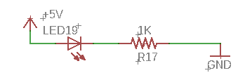

# Simple Circuit

## Overview

A circuit is simply a series of components connected in a way that current can flow from the positive terminal on a voltage source to the negative terminal on a voltage source. One of the simplest examples of a circuit is one designed to light an LED.

### Exercise:

Construct the following circuit using your [bench supply](https://www.google.com/url?q=https://docs.google.com/document/d/1BmZbXzxnD2j17QToSZ9jeZmnP7burwfksfQq2v4zu-Y/edit%23heading%3Dh.x2bqdmttrjfd&sa=D&ust=1587613173836000) as a voltage source. You will simply need to connect the [components](https://www.google.com/url?q=https://docs.google.com/document/d/1BmZbXzxnD2j17QToSZ9jeZmnP7burwfksfQq2v4zu-Y/edit%23heading%3Dh.s6ahz6tu1kg9&sa=D&ust=1587613173836000) in the order shown below. You can connect them by touching the lead of one component to the lead of another component or bending them to hold them in place. You will need two [test leads](https://www.google.com/url?q=https://docs.google.com/document/d/1BmZbXzxnD2j17QToSZ9jeZmnP7burwfksfQq2v4zu-Y/edit%23heading%3Dh.21kolzx0ntn7&sa=D&ust=1587613173836000) to connect your bench supply to your circuit.

The correct circuit will light the LED without destroying the LED. It may take a few tries to get it right and you may need to try placing a component in BOTH directions (i.e. flipping the direction of a component might make the circuit work or not work.) Don’t worry about destroying an LED. This is part of learning.

TEACHER CHECK \_\_\_\_\_

### Exercise:

1.  Change the order of the components so that the LED is directly connected to the 5V lead of the power supply with the resistor following second as shown below. Do you notice any difference in the function of the circuit?

TEACHER CHECK \_\_\_\_\_

2.  Reverse the direction of the LED in the circuit. Does the LED still light? The LED should only work in one direction. Because of this feature, we call an LED a polarized device. Try to identify a feature on the LED that signifies which direction it should be facing in the circuit.

TEACHER CHECK \_\_\_\_\_

3.  Reverse the direction of the resistor in the circuit. Does the LED still light? It should work in either direction. Because of this feature, we call a resistor a non-polarized device.

TEACHER CHECK \_\_\_\_\_
