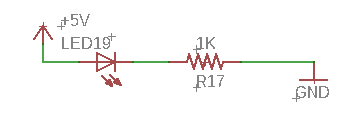

Simple Circuit
==============

Overview
--------

In this first lesson, you will light an LED using just an LED, a resistor, test leads and your bench power supply.  This lesson is as much about lighting an LED as it is about learning to experiment and not be afraid to make mistakes. Engineering is primarily about experimenting and it is hard experiment without making mistakes. In this lesson, you will not be told exactly how to make the LED light. Below you will find a description of each of the components as well as a schematic for the circuit.

Exercise:
~~~~~~~~~

Use the following components and tools to light an LED.

#. LED: LED stands for light emitting diode and is the most common lighting device available today. There are many different shapes, sizes and colors of LEDs. The ones you will be working with today look like the following. Note that LEDs are polarized. This means they only work in one direction.

   .. figure:: images/LED5MM.png

#. Resistor: Resistors are used to limit the current in a circuit. It is important to use a resistor when lighting an LED so that the LED does not receive too much current and break. Resistor values are measured in Ohms. Smaller values have represent resistance and larger values represent more resistance. You will need a resistor with a value between 220 Ohms and 1000 (1K) Ohms. Below is an image of the type of resistor you will use in this first circuit. Note that the color bands are used to represent the resistance values.

   .. figure:: images/resistor-band-code.jpg
   
 #. Bench Supply: A bench supply is used to supply power to your circuits. In order to use the voltage, you need to connect leads (described below) to the black and red binding posts shown on the bench supply below. Note that this bench supply has two sets of binding posts. This is because it can supply two different voltages. The black and red pair on the left provide a fixed 5 volts. The pair on the right provide a variable voltage from 0 to 30 volts.
 
    .. figure:: images/benchsupply.png
    
#. Test Leads: 

You will need the following components for this exercise. 
1) An LED
Construct the following circuit using your `bench
supply <https://www.google.com/url?q=https://docs.google.com/document/d/1BmZbXzxnD2j17QToSZ9jeZmnP7burwfksfQq2v4zu-Y/edit%23heading%3Dh.x2bqdmttrjfd&sa=D&ust=1587613173836000>`__ as
a voltage source. You will simply need to connect the
`components <https://www.google.com/url?q=https://docs.google.com/document/d/1BmZbXzxnD2j17QToSZ9jeZmnP7burwfksfQq2v4zu-Y/edit%23heading%3Dh.s6ahz6tu1kg9&sa=D&ust=1587613173836000>`__ in
the order shown below. You can connect them by touching the lead of one
component to the lead of another component or bending them to hold them
in place. You will need two `test
leads <https://www.google.com/url?q=https://docs.google.com/document/d/1BmZbXzxnD2j17QToSZ9jeZmnP7burwfksfQq2v4zu-Y/edit%23heading%3Dh.21kolzx0ntn7&sa=D&ust=1587613173836000>`__ to
connect your bench supply to your circuit.

The correct circuit will light the LED without destroying the LED. It
may take a few tries to get it right and you may need to try placing a
component in BOTH directions (i.e. flipping the direction of a component
might make the circuit work or not work.) Don’t worry about destroying
an LED. This is part of learning.

TEACHER CHECK \_\_\_\_\_

Exercise:
~~~~~~~~~

1. Change the order of the components so that the LED is directly
   connected to the 5V lead of the power supply with the resistor
   following second as shown below. Do you notice any difference in the
   function of the circuit?

TEACHER CHECK \_\_\_\_\_

2. Reverse the direction of the LED in the circuit. Does the LED still
   light? The LED should only work in one direction. Because of this
   feature, we call an LED a polarized device. Try to identify a feature
   on the LED that signifies which direction it should be facing in the
   circuit.

TEACHER CHECK \_\_\_\_\_

3. Reverse the direction of the resistor in the circuit. Does the LED
   still light? It should work in either direction. Because of this
   feature, we call a resistor a non-polarized device.

TEACHER CHECK \_\_\_\_\_
