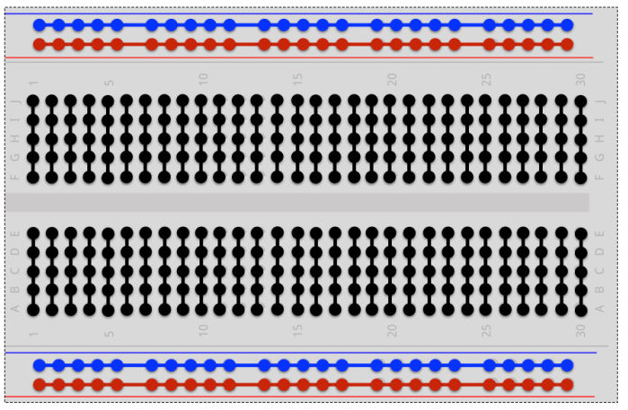

Breadboard Circuit
==================

Overview
--------

Breadboards provide a convenient way to connect components together to make a circuit. In the previous lesson you used your hands or maybe bent the wires to make a connection between components. The breadboard shown below has lots of holes (830 to be exact) that can be used to easily connect your components together. In this lesson you will make the circuits shown below but instead of using your hands (or twisting wires) to connect the compoents, you will use the holes in the breadboard.

.. image:: images/breadboard.jpg

Inside the breadboard are lots of metal clips that determine which holes are connected. Below is an picture of the inside of a breadboard. Notice how the clips are arranged to make connnections. You can see one of the clips pulled out of the breadboard in the upper left.

.. image:: images/breadback.jpg
   :width: 600px
   
This image shows a diagram of how the rows and columns of the breadboard are connected. The black red and blue lines indicate where the holes are connected. 

Exercise:
~~~~~~~~~

Using what you just learned about breadboards construct the following three circuits on your breadboard all at once or individually. Make sure to show your teacher each circuit. In the previous circuit you needed to use your fingers to hold the circuit together. Using the breadboard you should be able to set up the circuit so that it does not require you to hold it. The breadboard can be used to connect the wire leads from the resistor and LED. Note that one of the circuits will not light the LED. Construct it anyway just to show you know how to make connections and follow circuit diagrams.

IMPORTANT: Do not attempt to put two wires in one hole.

.. image:: images/image82.png

TEACHER CHECK \_\_\_\_\_
