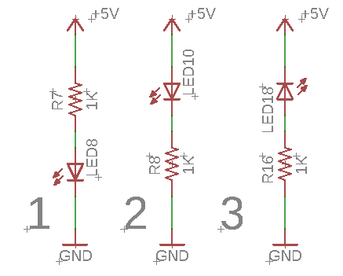

Breadboard Circuit
==================

Overview
--------

Breadboards provide a convenient way to connect components together to make a circuit. In the previous lesson you used your hands or maybe bent the wires to make a connection between components. The breadboard shown below has lots of holes (830 to be exact) that can be used to easily connect your components together. 

.. image:: images/breadboard.jpg

|image0|
~~~~~~~~

Exercise:
~~~~~~~~~

Construct the above three circuits on your
`breadboard <https://www.google.com/url?q=https://docs.google.com/document/d/1BmZbXzxnD2j17QToSZ9jeZmnP7burwfksfQq2v4zu-Y/edit%23heading%3Dh.utuueb8q3cey&sa=D&ust=1587613173841000>`__.
Note that NOT all three circuits will light the LED. What is important
is that you are able to follow the schematic design correctly.
IMPORTANT: Each of the component leads should be placed in one of the
breadboard holes. No holes should have more than one lead.

TEACHER CHECK \_\_\_\_\_

