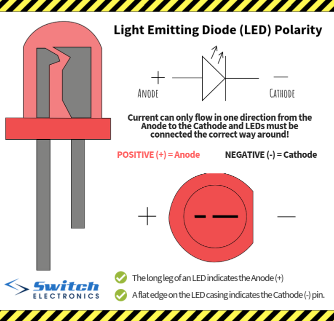

LED Orientation
==============

Overview
--------

In this lesson, you will learn to determine the orientation of an LED by looking at the base of the LED itself. As you now know, LEDs are polarized devices. All LEDs have a flat spot on the LED itself to indicate the cathode or the side the points toward ground. In order to see the flat side of the LED, you will need to look directly at the base of the LED as shown in the lower right image of the diagram below. This will take some practice.

Exercise:
~~~~~~~~~

Using what you learned above show your teacher three of your LEDs and point correctly to the cathode lead, or the lead that points toward ground.

