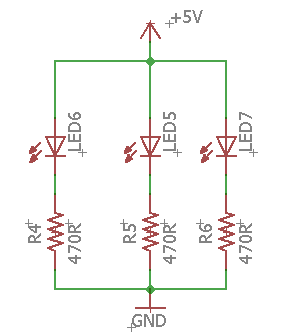

# More Leds

## Overview

In this lesson, you will get more practice using your breadboard. The two circuits are designed to light three LEDs. The first one is a parallel circuit. The second one is a series circuit. The advantage of the parallel circuit is that you can set different resistor values for each LED. The advantage of the second circuit only needs one resistor.

### Exercise:

Following the schematic below, create a circuit to light three LEDs in parallel on your breadboard. You will need three LEDs and three resistors.

TEACHER CHECK \_\_\_\_\_

### Exercise:

Following the schematic below, create a circuit to light three LEDs in series on your breadboard. You will need three LEDs and one resistors.

TEACHER CHECK \_\_\_\_
