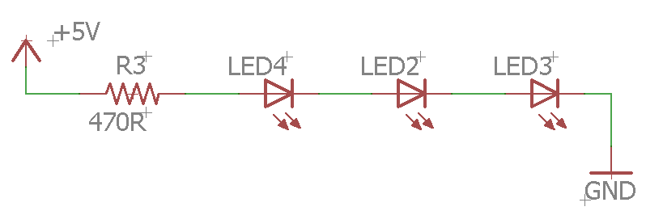

More Leds
=========

Overview
--------

In this lesson, you will get more practice using your breadboard and following circuit diagrams. The two circuits are designed to light three LEDs. The first one is a parallel circuit. The second one is a series circuit. The advantage of the parallel circuit is that you can set different resistor values for each LED. The advantage of the second circuit only needs one resistor.

Exercise:
~~~~~~~~~

Following the schematic below, create a circuit to light three LEDs in parallel on your breadboard. You will need three LEDs and three resistors to make this circuit. As a hint, you might want to start with the bottom of the circuit placing one lead of each of the three resistors into a connected row or column. This way they are all connected together. You can then connect the black lead to just one of them and they will all be tied to ground. The other lead of each resistor will then need to go into UNCONNECTED rows or columns so that you can attach each LED seperately. 

.. figure:: images/image90.png
   :alt: 

TEACHER CHECK \_\_\_\_\_

Exercise:
~~~~~~~~~

Following the schematic below, create a circuit to light three LEDs in series on your breadboard. You will need three LEDs and one resistors. Note that each connection in the series of components will be made in a different connected row or column on your breadboard. Also, note that this circuit might require up to 9V to illuminate.

TEACHER CHECK \_\_\_\_
