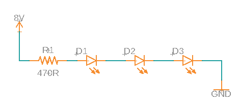

More Leds
=========

Overview
--------

In this lesson, you will get more practice using your breadboard and following circuit diagrams. The two circuits are designed to light three LEDs. The first one is a **parallel** circuit. The second one is a **series** circuit. The advantage of the parallel circuit is that you can set different resistor values for each LED. The advantage of the second circuit only needs one resistor.

Exercise:
~~~~~~~~~

Following the schematic below, create a circuit to light three LEDs in parallel on your breadboard. You will need three LEDs and three resistors to make this circuit. As a hint, you might want to start with using the breadboard to connect the leads of the resistors at the bottom of the schematic. You can do this using a connected row or column on your breadboard. Note that only one side of each resistor is connected together. The other side of the resistor is connected to an individual LED each. These will each need separate connections on the breadboard. 

.. figure:: images/image90.png
   :alt: 

TEACHER CHECK \_\_\_\_\_

Exercise:
~~~~~~~~~

Following the schematic below, create a circuit to light three LEDs in series on your breadboard. You will need three LEDs and one resistors. Note that each connection in the series of components will be made in a different connected row or column on your breadboard. Also, note that this circuit might require more than 5V to illuminate. 

How many volts did your circuit require to light? Does it matter which color? Can you add fourth LED?

TEACHER CHECK \_\_\_\_
