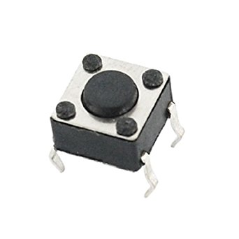
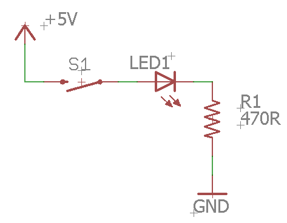

# Overview

In this lesson, you will use a momentary switch to turn on and off an LED. Like all switches, a momentary switch is able to complete or disconnect a circuit with the press of a button. A momentary switch is named for the fact that it is only connected (completing the circuit) when the button is pressed. When the button is released the circuit is disconnected. Below is a picture of a momentary switch.

Momentary Switch

Below are two diagrams from the datasheet for a momentary switch. Note how the four pins are connected in the circuit diagram.

### Exercise:

Complete the following circuit which uses a switch to turn on and off an LED.

### Exercise:

Add a second LED circuit with a switch. Wire the components in a different order from the circuit shown above.

TEACHER CHECK \_\_\_\_\_
