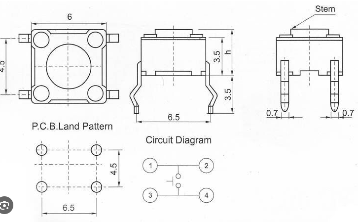
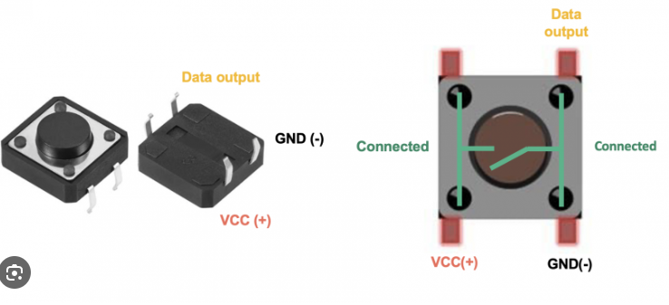

Simple Switch
=============

Overview
--------

In this lesson, you will learn how to place a momentary switch on your breadboard.  A momentary switch is named for the fact that it is only connected (completing the circuit) when the button is pressed or momentarily. When the button is released the circuit is disconnected. Below is a picture of a momentary switch.

Note that it has four leads (or legs). This can make it **VERY** confusing to use since you only need two leads (or legs) to open and close a circuit, but which ones. Learning this now is important because it is easy to make mistakes latter on when you use these in your projects.

.. figure:: images/image89.png

   Momentary Switch

Below are two diagrams from the datasheet for the momentary switch. I both diagrams you can see that pins 1 and 2 are connected and pins 3 and 4 are connected. These pairs act as single pins. It does not matter if you wire up your circuit to pin 1 or 2 since they act as the same pin. The same is true for pins 3 and 4. 

Exercise:
~~~~~~~~~
#. Place your button across the middle of your breadboard, so that it straddles the gap in the middle of your breadbaord with two leads (legs) are on one side and two leads are on the other. 

#. Follow the next lesson to test the button's continuity using a mulitmeter.

