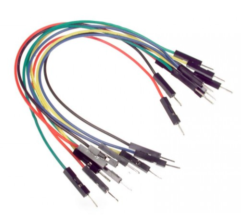

Long Jumpers
==================

Overview
--------

Long jumper wires as shown below can be very helpful when setting up circuits on your breadboard. The ones below are the male/male variety. There is no lesson here, but you will need to use one in the next lesson.

