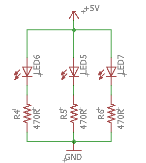

The Power Bus
=============

Overview
--------

Although it is possible to use the breadboard to connect components in a variety of ways, there are certain conventions that will make make using the breadboard much easier to use. You have probably noticed that your breadboard has a pair of rows on the top and bottom of the board. You also might have noticed that these rows are associated with red an blue lines. 

Convention dictates that you connect the red rows to power or the positive lead of whatever power supply you are using. In addition, it is conventional to connect the blue rows to ground or the negative/ground lead of whatever power supply you are using. Since these are connected across the length of your breadboard as you saw in the previous lesson, you only need to connect the power and ground leads to one pin on each row. This way you have easy access to power and ground any where you place you components on your board. IMPORTANT: The two red buses and the two blue buses of your breadboard are not automatically connected. You can connect these with a wire. This will be addressed in future lessons.

.. image:: images/breaddiagram.PNG

Exercise:
~~~~~~~~~

Rebuild the following circuit on your breadboard, but this time use the power and ground buses as described above. 

TEACHER CHECK \_\_\_\_\_

