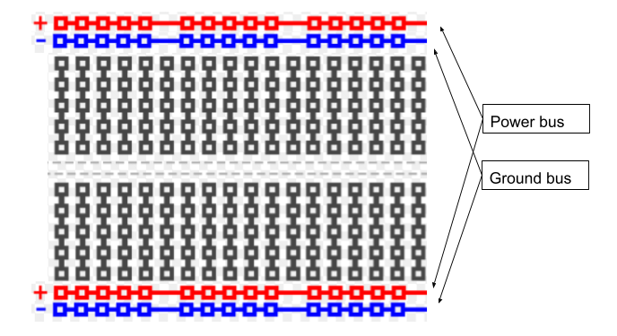

The Breadboard Power Bus
=============

Overview
--------

Although it is possible to use the breadboard to connect components in any way you want, there are certain sorts of conventions that will make make using the breadboard much easier to use. You have probably noticed that your breadboard has a pair of rows on the top and bottom of the board. You also might have noticed that these rows are associated with red an blue lines. 

As the diagram below shows, these rows are referred to as power and ground buses (or power and ground rails).  The power bus is associated with the rows next to the red lines and the ground bus is associated with the rows next to the blue lines. IMPORTANT: There is nothing special about these rows of holes in that they are simply connected by metal clips just like the columns in the breadboard. Using them as power and ground buses is simply a convenient convention. 

The best way to use these rows is to connect power (red) lead of your bench supply to one of the red buses and connect the ground (black) lead of your bench supply to one of the blue buses. This way you have access to power and ground for your circuits across your board. IMPORTANT: The two red buses and the two blue buses of your breadboard are not automatically connected. You can connect these with a wire. This will be addressed in future lessons.

Connect power to your power bus and measure the voltage on your breadboard using a multimeter.

Power Bus
---------

As you may have noted from the guide on
`breadboards <https://www.google.com/url?q=https://docs.google.com/document/d/1BmZbXzxnD2j17QToSZ9jeZmnP7burwfksfQq2v4zu-Y/edit%23heading%3Dh.utuueb8q3cey&sa=D&ust=1587613173846000>`__ in
concepts, the two sets of long rows at the top of and bottom of your
breadboard are referred to as busses. Each bus has a red side and a blue
side. Standard practice is to connect power (the red lead from your
bench supply) to the red side of the bus and ground (the black lead from
your bench supply) to the blue side. You can use alligator clips and
long jump wires.

Exercise:
~~~~~~~~~

1. Set up the board with power and ground as described above. Using a
   `multimeter <https://www.google.com/url?q=https://docs.google.com/document/d/1BmZbXzxnD2j17QToSZ9jeZmnP7burwfksfQq2v4zu-Y/edit%23heading%3Dh.sf66jio1dnm6&sa=D&ust=1587613173847000>`__,
   confirm that correct voltage is on your bus.

TEACHER CHECK \_\_\_\_\_

2. Add a couple of wires to bring power and ground to both sides of your
   board and confirm with a multimeter. One wire should connect the red
   bus on the top of your board to the red bus on the bottom. The other
   wire should connect the blue (ground) bus on the top of your 
   board to the blue (ground) bus on the bottom of your board.

TEACHER CHECK \_\_\_\_\_

3. Set up the following LED circuit on your board, but this time 
   carefully read the  `good practices <https://docs.google.com/document/d/1BmZbXzxnD2j17QToSZ9jeZmnP7burwfksfQq2v4zu-Y/edit#bookmark=id.f8f0p8y93bxg>`__,
   setting up a breadboard and follow these guidelines.
   
.. figure:: images/image96.png
   :alt:
