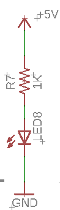

The Power Bus
=============

Overview
--------

Connect power to your power bus and measure the voltage on your
breadboard using a multimeter.

Power Bus
---------

As you may have noted from the guide on
`breadboards <https://www.google.com/url?q=https://docs.google.com/document/d/1BmZbXzxnD2j17QToSZ9jeZmnP7burwfksfQq2v4zu-Y/edit%23heading%3Dh.utuueb8q3cey&sa=D&ust=1587613173846000>`__ in
concepts, the two sets of long rows at the top of and bottom of your
breadboard are referred to as busses. Each bus has a red side and a blue
side. Standard practice is to connect power (the red lead from your
bench supply) to the red side of the bus and ground (the black lead from
your bench supply) to the blue side. You can use alligator clips and
long jump wires.

Exercise:
~~~~~~~~~

1. Set up the board with power and ground as described above. Using a
   `multimeter <https://www.google.com/url?q=https://docs.google.com/document/d/1BmZbXzxnD2j17QToSZ9jeZmnP7burwfksfQq2v4zu-Y/edit%23heading%3Dh.sf66jio1dnm6&sa=D&ust=1587613173847000>`__,
   confirm that correct voltage is on your bus.

TEACHER CHECK \_\_\_\_\_

2. Add a couple of wires to bring power and ground to both sides of your
   board and confirm with a multimeter.

TEACHER CHECK \_\_\_\_\_

3. Set up the following LED circuit on your board.

