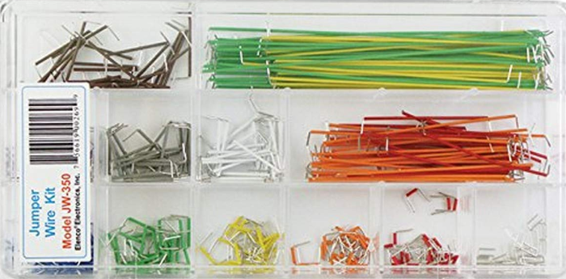
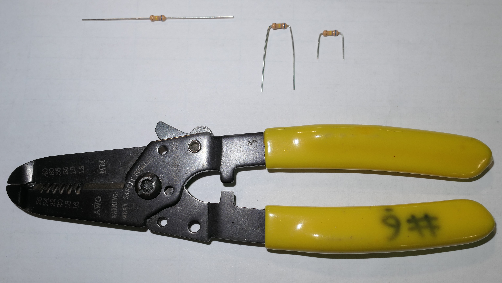

Short Jumps
=============

Overview
--------

This lesson covers two topics. The first is an introduction to short jump wires. The second is a description of how to neaten resistors so that they fit better into your breadboard.  

Short Jump Wires
-----------------

The following is a picture of a box of short jumpwires. As you can see, they come in many colors and sizes. The sizes are designed to conveniently fit between specific numbers of holes in your breadboard. In the next lesson, you will use these jump wires.

Bend and Cut Resistors
-----------------

The picture below shows a resistor properly bent and cut to fit into your breadboard. This will be useful in the next lesson. The wire stripper tool below is used for cutting resistors as well.

