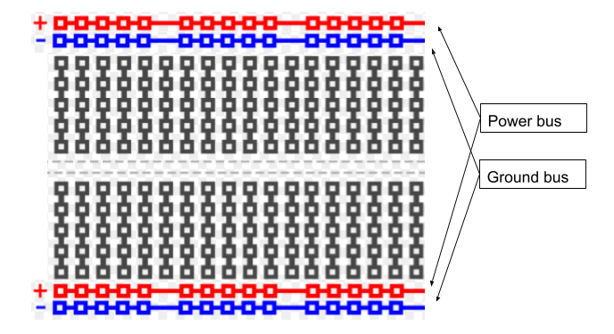

Breadboard Conventions
=============

Overview
--------

The following are good conventions for setting up your breadboard and adding components.

#. Connect the two power buses and connect the two ground buses. As mentioned in the previous lesson, the two ground buses (and the two power buses) are not connected inside the breadboard. In order to connect these two buses you must use jump wires as shown below. IMPORTANT: Make sure only power to power and ground to ground. Do not cross connect these buses.

   .. image:: images/busconnect.jpg
      :width: 400px

#. Use short orange and yellow jump wires for all connections to the power and ground buses. Using these wires will make your board less cluttered and will make it very easy to identify which pins and leads are connected to power and ground. Below is an image showing an integrated circuit and potentiometer both with connections to power and ground.

   .. image:: images/shortjumps.jpg
      :width: 400px

Although it is possible to use the breadboard to connect components in any way you want, there are certain sorts of conventions that will make make using the breadboard much easier to use. You have probably noticed that your breadboard has a pair of rows on the top and bottom of the board. You also might have noticed that these rows are associated with red an blue lines. 

As the diagram below shows, these rows are referred to as power and ground buses (or power and ground rails).  The power bus is associated with the rows next to the red lines and the ground bus is associated with the rows next to the blue lines. IMPORTANT: There is nothing special about these rows of holes in that they are simply connected by metal clips just like the columns in the breadboard. Using them as power and ground buses is simply a convenient convention. 

