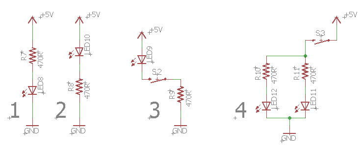

Challenges Circuits
===================

Overview
--------

In this lesson you will get more experience following circuit diagrams. Make sure to use the efficient breadboard techniques that you learned in the previous lesson.                                                    
                                                                           

Exercise:
~~~~~~~~~

Complete the following circuits.

TEACHER CHECK \_\_\_\_\_
