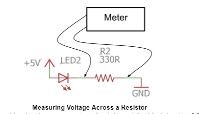
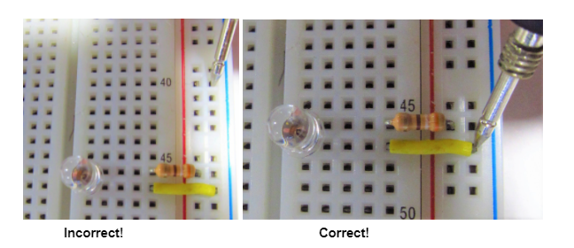

Measuring Voltage
=================

Overview
--------

All electronic circuits require a specific voltage level to operate. Most of the logic circuits you will build in this program will run on 5V. Some more advanced devices run on 3V logic. When you start adding motors, relays, light pannels, pumps and such you may need higher voltages 12V or even 24V. Being able to measure voltage is critical to make sure your circuit is working properly. The best way to measure voltage is using a multimeter shown below.

.. image:: images/multimeter.jpg

Setting up your meter
----------------------
In the image above, you can see the multimeter correctly set up for measuring voltage. The following are the steps required for this configuration.

#. Connect the red test lead to the right most port at the bottom of the meter. This lead will measure the positive voltage on your circuit. 

#. Connect the black test lead to the middle port (COM). This lead will be typlically be connected to ground on your circuit.

#. Turn the dial to VDC (or voltage direct current). Most of the circuits you use in this class will be powered by direct current (DC) as opposed to alternating current (AC). 

#. Press the range button and you should see the decimal point move across the display. The range button sets limits for the range of voltage you wil be measuring. Move the decimal point until it is in the middle of the screen. 

How to measure voltage
----------------------
Voltage can be measured across any two points on your circuit using the two test leads. In the diagram below, the two leads are being used to measure the voltage across the resistor in the circuit. It is possible to measure voltage across one or more components in any circuit. 

Using test leads
----------------
In order make a measurement in your circuit, your leads must be touching metal not plastic. For example, touching your lead to one of the plastic holes on your breadboard will not make a connection to the circuit. As you can see in the images below, you can use the metal leads of any component for making measurements.

Exercise:
~~~~~~~~~

#. Construct a simple LED circuit on your breadboard with one resistor and one LED. Use your multimeter to measure the voltage across the resistor, the voltage across the LED, and the voltage across the entire circuit. Record these measurements in your notebook. 

   Voltage across resistor:          \_\_\_\_\_\_

   Voltage across LED:                \_\_\_\_\_\_

   Voltage across entire circuit:    \_\_\_\_\_\_

   TEACHER CHECK \_\_\_\_\_

#. Note that the total voltage across the entire circuit should equal the voltage of each of the parts. Add up the voltages you measured across the resistor and the LED. How does this compare with the voltage you measured for the entire circuit? Recorde the following equation into your notebook.

   Voltage across resistor \_\_\_\_  + voltage across LED \_\_\_ = Voltage
   across entire circuit  \_\_\_\_

   TEACHER CHECK \_\_\_\_\_
