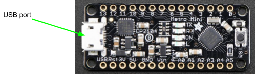

# Programming The Metro Mini

## Overview

In this lesson you will learn how to use a [Metro Mini](https://www.google.com/url?q=https://www.adafruit.com/product/2590&sa=D&ust=1587613173853000) as a basic microcontroller platform. At the heart of the Metro Mini is a microcontroller which is essentially a very small computer that can be programmed to perform an infinite number of tasks.

# USB Connection

In addition to a microcontroller, the Metro Mini includes a micro USB header which allows you to connect the Metro Mini to a computer. The USB cable enables the following:

  - Power Supply: The Metro Mini can get its power (5V and Ground) from the host computer and through the USB cable.
  - Programming: Code written on your computer is uploaded to the Metro Mini through the USB cable.
  - Data Communication: The USB cable can also be used to send data to the Metro Mini from your computer as well as receive data to your computer from the Metro Mini.

# Programming

You will program your Metro Mini using the Arduino Integrated Development Environment (IDE). An IDE is an editor where you can write, compile and download your code to your microcontroller.

### Exercise:

1.  Make Connection: If you have not already done so, connect the Metro Mini to your computer using a USB cable. You DO NOT need to use your breadboard at this point just plug your Metro Mini directly into the USB cable.
2.  Open IDE: Open the Arduino program. This is the IDE you will be using to program your microcontroller. You can find program in the Start menu with the icon shown below.

 

3.  Open the Blink Code File: Select the Blink code file. It can be found under File/Examples/01.Basics/Blink
4.  Select COM Port: Under the Tools/port menu select the highest numbered COM port. If you only see COM1 and COM3 as options wait for help from your teacher.
5.  Select Board: Under the Tools/board menu, make sure that the board selected is Arduino/Genuino Uno.
6.  Compile Code: Press the compile button to confirm that you code can be compiled. The compile button is the circle with a check inside in the upper left of your screen. If there is an error in your code, you will see a message at the bottom of the screen. If you get an error, ask your teacher for help.
7.  Program Controller: Select the program to download your code to the Metro Mini. The program button is the circle with an arrow inside and just right of the compile button. You should see both the yellow TX LED and the yellow RX LED light as the code is being downloaded.
8.  Check: If you code was downloaded correctly the red light on your Metro Mini should blink on and off once every second.

TEACHER CHECK \_\_\_\_\_
