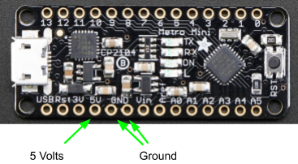
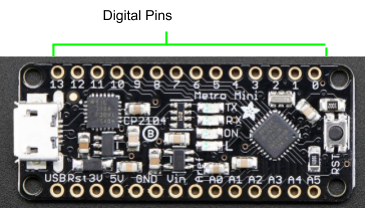

# Metro Mini And Breadboard

## Overview

In order to do something more interesting with your Metro Mini, you will need to connect it to a breadboard.

# Power and Ground

The Metro Mini can supply power to your breadboard through its pins 5V and GND. These will provide power supplied by the computer through the USB cable. Note that there are two pins for ground. You only need to connect one of the pins.

# Digital Pins

The Metro Mini has 14 digital pins (labeled 0 through 13 as shown below) that can be used to control external devices from a simple LED to a complex robot. IMPORTANT: Generally you want to avoid using pins 0 and 1 if possible. Using these pins might interfere with the programming of your device.

### Exercise:

1.  Insert the Metro Mini into your breadboard. Make sure to remove all of your previous circuits before starting this step.
2.  Connect the 5V pin from your Metro Mini to the power bus (red) of your breadboard.
3.  Connect one of the GND pins from your Metro Mini to the ground bus (blue) of your breadboard.
4.  Connect the power buses on your breadboard together and the ground buses on your breadboard together.

<!-- end list -->

5.  Connect a USB Mini cable to your Metro Mini.

TEACHER CHECK \_\_\_\_\_
