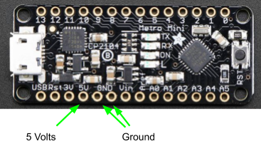
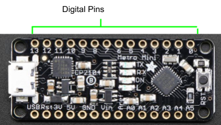

Metro Mini And Breadboard
=========================

Overview
--------

In order to do something more interesting with your Metro Mini, you will need to connect it to a breadboard.

Power and Ground
----------------

As mentioned in the previous section, the Metro Mini can supply power to your breadboard through its pins 5V and GND. The USB cable that connects your Metro Mini to the computer 
has four wires that provide data as well as power (+5V) and ground. This is why you can use your USB cable to charge your phone. YOU WILL NO LONGER NEED YOUR POWER SUPPLY to supply 5V to your breadboard. **IMPORTANT** Disconnect your power supply from your breadboard if you have not already done so. 

Digital Pins
------------

The Metro Mini has 14 digital pins (labeled 0 through 13 as shown below) that can be used to control external devices from a simple LED to a complex robot. IMPORTANT: Generally you want to avoid using pins 0 and 1 if possible. Using these pins might interfere with the programming of your device.

Exercise:
~~~~~~~~~

#. Insert the Metro Mini into your breadboard. Make sure to remove all of your previous circuits before starting this step.
#. Connect the 5V pin from your Metro Mini to the power bus (red) of your breadboard. Use a short wire.
#. Connect one of the GND pins from your Metro Mini to the ground bus (blue) of your breadboard. You will only need to connect one of the two GND pins.
#. If you have not already done so, connect the power buses on your breadboard together and the ground buses on your breadboard together
#. Connect a USB Mini cable to your Metro Mini.
#. Measure the voltage across your power and ground bus. Write your answer in your notebook.

TEACHER CHECK \_\_\_\_\_
