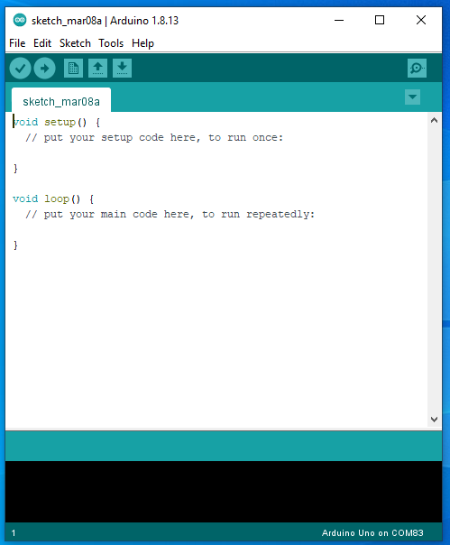

The Arduino IDE
=============

Overview
--------

As you learned in the previous lesson, you can use the Arduino IDE to program your Metro Mini. In the previous lesson, you opened an example code file (or sketch as they are called in Arduino) and then uploaded that code. Now you are going to learn to write your own code (or sketches). 

You also may have noticed that whenever you open a new file (or sketch) in the Arduino IDE, it opens with some pre-written code as shown below. This code includes two functions called "setup" and "loop". For the next few lessons, all of the code you write must be placed within either the setup function or the loop function. Within is defined as between the open curly brace **{** and the closed curly brace **}** of either function.

Note that all code runs in the order it is written. 

setup
^^^^^^
Any code placed within the setup function is run only once during program. That is when you apply power to your device, reprogram it or press the reset button, the code with setup is the first code run and it is run only once. 

loop
^^^^^
Any code placed within the loop function is run continuously, after the code in the setup function has completed.

