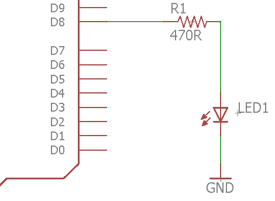

# Programming Leds

## Overview

LEDs are a good example of the kinds of devices you can drive with a microcontroller. LEDs also provide an easy way to indicate if a microcontroller pin is set to HIGH or LOW. IMPORTANT to use a resistor in series with any LED so you do not use too much current. Driving too much current through and LED will damage the LED and the microcontroller.

## Schematic

The following is the schematic for the circuit you need to construct on your breadboard.

It is important that your LED and resistor are not placed directly next to your Metro Mini on the breadboard. This will result in the components interfering with unintended pins. Use a long jump wire from the Metro Mini (pin 8 in this case) to an empty portion of the board. Now add your resistor and LED. See [here](https://www.google.com/url?q=https://docs.google.com/document/d/1BmZbXzxnD2j17QToSZ9jeZmnP7burwfksfQq2v4zu-Y/edit%23heading%3Dh.mfgepxcw4elz&sa=D&ust=1587613173864000) for an example.

TEACHER CHECK \_\_\_\_\_

## Code

1.  Write a program to turn on the LED. NOTE: In this lesson you will be choosing which digital pin to use with you LED. You may use any of the digital pins (0 -13) but you should generally avoid using digital pins 0 and 1 as using these pins might interfere with the programming of your device.

<!-- end list -->

1.  Set the pin you are using to control the LED as an output pin.
2.  Use digitalWrite to drive the pin to 5V.

TEACHER CHECK \_\_\_\_\_

2.  Modify your program to turn off the LED.
3.  Change the LED to a different pin and turn it on.
4.  Add two more LEDs to two additional pins on your microcontroller and turn them all on.

TEACHER CHECK \_\_\_\_\_

DELAYS

## Overview

Delays are used in code to freeze the state of the controller for a specified amount of time. The delay function we are using is measured in milliseconds and have a [range](https://www.google.com/url?q=https://docs.google.com/document/d/1BmZbXzxnD2j17QToSZ9jeZmnP7burwfksfQq2v4zu-Y/edit%23heading%3Dh.7lc2dw9cimru&sa=D&ust=1587613173867000) from 0 to 10,000 milliseconds.

### 

Below is an example of the delay command. In this example, the delay is set for 1500 milliseconds (or 1.5 seconds).

        delay(1500);

## Code

1.  Write a program to turn your LED on and off and on again. The program should turn your LED on for two seconds and then off for one second and then back on. This code should again be placed in your setup function.

IMPORTANT: Do not forget to make sure to set the pin the LED is using to an output.

TEACHER CHECK \_\_\_\_\_
