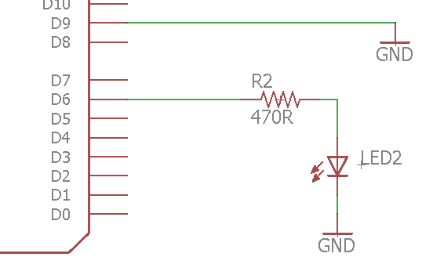

Input Pins
=============

Overview
--------

The digital pins on the Metro Mini can also be set as inputs. As an
input, the Metro Mini can read the value of a pin, i.e. if the pin is
externally driven as HIGH (5 Volts) or LOW (0 Volts), that is the pin 
is tied (connected) to either 5V or ground. Generally inputs are used 
for receiving information from the outside world, such a reading the 
value of a sensor or getting data from a robotic device.

Setting up software and hardware to test an input is a little more
complicated than setting up software and hardware to test an output.

Schematic
---------

Set up the following circuit on your breadboard. MAKE SURE to use a long
jump wire for the connection between pin 9 and ground. You will be
moving one end of this long jump wire between power and ground while 
the other end remains connected to pin 9. By moving the wire between
power (5V) and ground you will be setting the input of pin 9 as HIGH 
and LOW respectively. This wire will essentially act as a crude switch.

Code
----

1. In your  setup function, insert the following two lines to ensure
   that that pin 6 is an OUTPUT and pin 9 is an INPUT.
.. code-block:: c

   pinMode(9, INPUT);        

   pinMode(6, OUTPUT):

2. Type the following code inside of the loop function. This code is set
   in the loop function because it needs to repeatedly check the value
   of pin 9. For more information about how this code works you can
   review
   `conditionals <https://www.google.com/url?q=https://docs.google.com/document/d/1BmZbXzxnD2j17QToSZ9jeZmnP7burwfksfQq2v4zu-Y/edit%23heading%3Dh.o11qq65yx4ek&sa=D&ust=1587613173872000>`__ in
   concepts.
   
.. code-block:: c

   int x = digitalRead(9);    //Reads value of pin 9 and stores value in x
   if (x == HIGH) {           //Checks if value of x equals HIGH. Note double equals sign
      digitalWrite(6, HIGH);  //If the conditional is true than this line is executed.
   }
   else {
      digitalWrite(6, LOW);   //If the conditional is false than this line is executed.
   }

3. Compile and download your code.
4. Connect pin 9 to the power bus (HIGH). The LED should be lit.
5. Connect pin 9 to the ground bus (LOW). The LED should be off.

TEACHER CHECK \_\_\_\_\_

6. What happens when the pin is in neither ground or power? Move the pin
   around or touch it with your hand. A pin when not connected to power
   or ground is said to
   `float <https://www.google.com/url?q=https://docs.google.com/document/d/1BmZbXzxnD2j17QToSZ9jeZmnP7burwfksfQq2v4zu-Y/edit%23heading%3Dh.jcbntq8yv6k7&sa=D&ust=1587613173873000>`__.
7. Modify your code so that it reverses operation. The LED should be lit
   when pin 9 is connected to LOW and vise versa.

TEACHER CHECK \_\_\_\_\_
