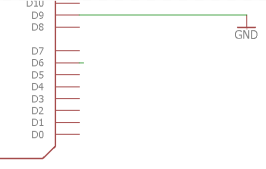

Input Pins
=============

Overview
--------

The digital pins (0-13) on the Metro Mini can also be set as inputs. As an input, the Metro Mini can read the voltage level on any one of the 14 pins. In the Arduino software, a voltage close to 5V will be read as a 1 (HIGH) and a voltage close to 0 volts will be read as a 0 (LOW). Generally inputs are used for receiving information from the outside world, such a reading the value of a sensor or getting data from a robotic device.

Schematic
---------

Set up the following circuit on your breadboard. Essentially, this just requires connecting digital pin 9 to ground. MAKE SURE to use a long jump wire for the connection between pin 9 and ground. By moving one end of the wire between power (5V) and ground (leaving the other end in pin 9) you will be setting the input of pin 9 as HIGH and LOW respectively. This wire will essentially act as a crude button.

The function required to read a digital pin is shown below. The function will read the value (voltage) on pin 9 and convert that value into a either a 1 or 0. If the voltage is close to 5 volts, the value will be 1. If the voltage is close to 0, the value will be 0. This converted value, 0 or 1 will be placed into the variable x. Note the function can be used to read any of 14 digital pins on the Arduino (0-13). It can also use any variable. 

.. code-block:: c
   
   x = digitalRead(9); //Read the value on pin 9 and place this value in x
   
   
In order to use a pin as an input or output, you will first need to specify whether it is going to be used as an input or output. The following code sets the pin to an input and should generally be placed in your *void setup()* function. 

.. code-block:: c
   
   pinMode(9, OUTPUT); //Set digital pin 9 as an output pin.

Challenge
----

#. Write a program to continuously read the value of pin 9 and print this value in your serial monitor. You might need to refer back to both the sections on serial communication and variables to complete this challenge. The values in your serial monitor should be displayed in a column.

#. Move the wire connected to pin 9 between gound and power. In your notebook, record the value of pin 9 when it is connected to power and when it is connected to ground.

#. Add a wire to a second digital pin and display the values from both pins in your serial monitor. The values should be displayed as a pair in two columns.
 
   TEACHER CHECK \_\_\_\_\_

#. What happens when pin 9 is not connected to ground or power? Move the wire around or touch it with your hand. A pin when not connected to power or ground is said to float. That means it is in an undefined state and can float between power and ground. IMPORTANT: Never leave a input pin hanging! Always attach it to power or ground.

   TEACHER CHECK \_\_\_\_\_
