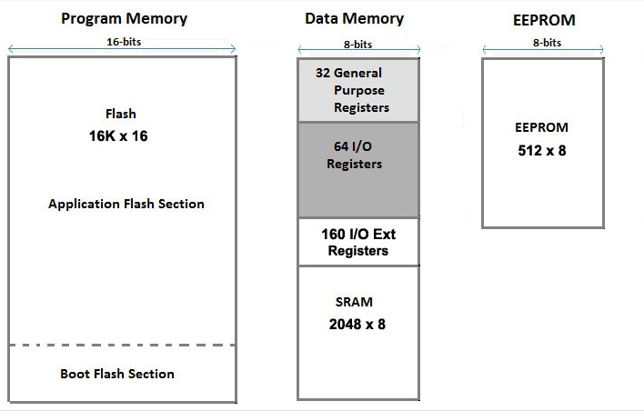

Bits and Bytes
==============

Overview
--------
In this lesson, you will learn a little bit, no pun intended, about how information is stored on your microcontroller and computers in general. The microcontroller on your Arduino Uno or your Metro Mini both use an 8-bit architecture. By comparison, a modern Intel processor uses a 64-bit architecture. A bit refers to the smallest amount of data that can be stored on a processor. A bit is represented by a single transistor and can have only two possible states, on or off. Mathematically, we refer to these states as 1 and 0 respectively. To be clear, your microcontroller can store more than 8 bits of information, but it can only store 8 bits at a time in its data memory, whereas the Intel processor can store 64 bits at a time. Below is a representation of the data storage on a Atmega328 which is the microcontroller used on the Metro Mini and Arduino Uno. The SRAM is where your variables are stored.

A byte is simply a term that refers to 8 bits. There are a number of stories about the origin of this term. Possibly most likely, is that a bite is bigger than a bit, but the spelling of bite would lead to confusion, so it was changed to byte. Its size can be remembered by thinking of byte as by-eight. Why data is measured in increments of 8 also seems to be under debate, but it may have been that some early computers used eight lines for communication. There also exists the term nibble which is rarely used but refers to 4 bits. 

States
--------

How much information can be stored in a bit? 

