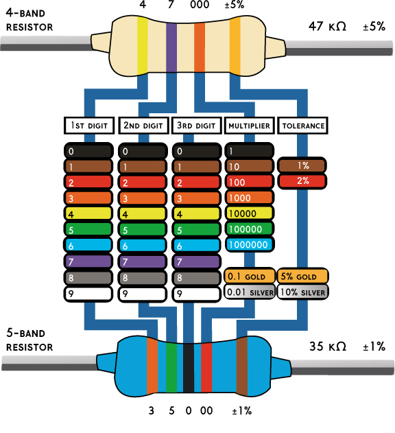

Resistor Values
===============

Overview
--------

All through-hole resistors are marked with colored bands. These bands can be used to determine the value in ohms of the resistor. As you can see in the table below, each color represents a number or multiplier. For example, orange corresponds to value 3 and the multiplier 1000. Using the color bands on the resistor and the table below you can easily determine the value of a resistor. For the most part, we will be using four band resistors. On these types of resistors, the first two bands correspond to the two digits, the third band corresponds to the multiplier and the fourth band corresponds to the tolerance. 

The first step in decodeing the value of a resistor is to make sure it is oriented in the correct direction by making sure the fourth band is on the right. The fourth band can be easily identified because it is either gold or silver. 

While you should be able to work out the resistance value for any resistor based on color bands there are a few you will want to able to identify on site. These are a 330 Ohm, 1K and 10K resistor.

Exercise:
~~~~~~~~~

Copy the following table into your notebook and complete for the resistors given. You can use the guide here for assistance.

+---------+----------+----------+--------------+
| Value   | Band 1   | Band 2   | Multiplier   |
+---------+----------+----------+--------------+
| 10K     |  brown   |  black   |   orange     |
+---------+----------+----------+--------------+
| 330R    |          |          |              |
+---------+----------+----------+--------------+
| 1K      |          |          |              |
+---------+----------+----------+--------------+
| 4.7K    |          |          |              |
+---------+----------+----------+--------------+
| 470R    |          |          |              |
+---------+----------+----------+--------------+

TEACHER CHECK \_\_\_\_\_

Quiz

Have your teacher provide you with three resistors of values 10K, 1K,
330 Ohm. In your notebook, write the three values and place the correct resistor next to each value. 

TEACHER CHECK \_\_\_\_\_
