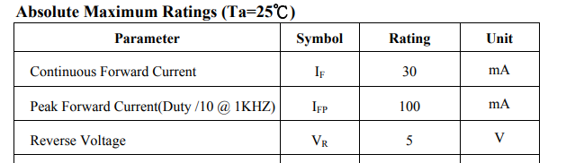
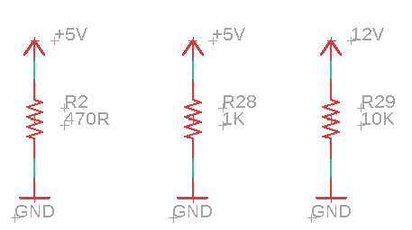
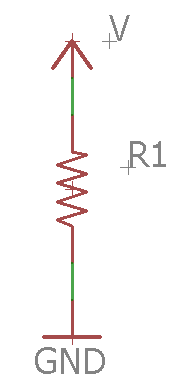

Ohms Law
========

Overview

`Ohms
law <https://www.google.com/url?q=https://docs.google.com/document/d/1BmZbXzxnD2j17QToSZ9jeZmnP7burwfksfQq2v4zu-Y/edit%23heading%3Dh.t5bxsyeu98j2&sa=D&ust=1587613173894000>`__ describes
an important relationship between `voltage, current and
resistance <https://www.google.com/url?q=https://docs.google.com/document/d/1BmZbXzxnD2j17QToSZ9jeZmnP7burwfksfQq2v4zu-Y/edit%23heading%3Dh.7g89z82u0oqw&sa=D&ust=1587613173895000>`__.
Ohm’s law you can correctly specify the proper resistor for limiting
current to any device. Most often in the shop, we are using resistors to
limit current to LEDs. Driving an LED without a resistor will invariably
lead to failure of the LED due to too much current. Driving an LED with
too large an LED will result in no light from the LED.

For each type of LED there is a maximum safe current. The following is a
table from the datasheet for the 334-15/T1C1-4WYA which an Everlight 5mm
Round White LED (T-1 3/4). There are literally millions of different
types of LEDs and each has its own datasheet.

Note that in the table above the recommended maximum current is 30ma. If
you cannot find the datasheet for an LED, it is generally safe to assume
that the maximum current is at least 15ma.

Challenge
---------

Ohm’s law describes the fundamental relationship between `voltage,
current and
resistance <https://www.google.com/url?q=https://docs.google.com/document/d/1BmZbXzxnD2j17QToSZ9jeZmnP7burwfksfQq2v4zu-Y/edit%23heading%3Dh.7g89z82u0oqw&sa=D&ust=1587613173896000>`__.
Voltage represents a pressure driving current. Resistance represents a
pressure limiting current. In other words, the ratio of voltage (V) over
resistance (R) is directly proportional to current (I) or (V/R = I).
More generally this relationship is represented at V = IR. In this
lesson, round your measurements for current to the nearest thousandth.

\_\_\_\_\_\_ Amps                 \_\_\_\_\_\_
Amps                \_\_\_\_\_\_ Amps

TEACHER CHECK \_\_\_\_

Challenge
---------

Using Ohm’s law calculate the missing value in the table below for the
example circuit.

| circuit | voltage | current | resistance |
|---------|---------|---------|------------|
| 1       |         |         |            |
| 2       |         |         |            |
| 3       |         |         |            |
| 4       |         |         |            |
| 5       |         |         |            |
| 6       |         |         |            |

Circuit

Voltage

| Command | Description |
| --- | --- |
| git status | List all new or modified files |
| git diff | Show file differences that haven't been staged |

Current

Resistance

1

5.00 Volts

100 ohms

2

3.00 Volts

.020 Amps

3

.005 Amps

330 ohms

4

12.00 Volts

.400 Amps

5

1.80 Volts

470 ohms

6

.250 Amps

1000 ohms

TEACHER CHECK \_\_\_\_\_
