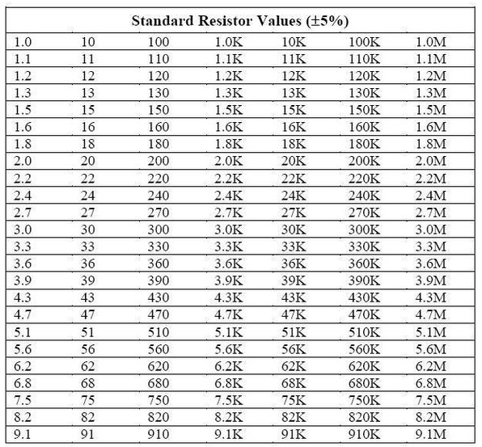
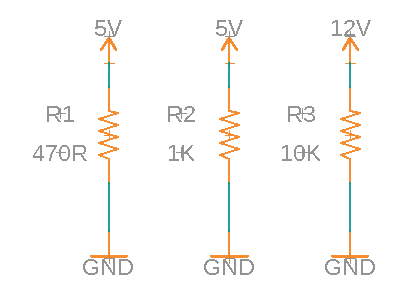
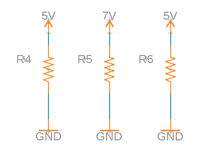

Ohms Law with Resistors
======================

In this lesson you are going to learn about resistors in circuits and using Ohms law to calculate both current and resistance values.

**Reading resistor values:** Note that the values beginning with R are an artifact of the schematic software used to make these circuits. R2 just a label for that resistor. The value of the resistor is indicated either with an R or K at the end of the number, and this is a bit confusing. An R at the end of the number just means that this is a resistor value. So, 470R means 470 ohms. A K at the end of the number indicates engineering notation. So, 470K means 470,000 ohms.

**Common resistor values:** While you can purcahse a resistor with just about any value there are a set of commonly found values. The table below lists some of these values.

Challenge
---------
Use Ohms law to calculate the amount of current flowing in the three circuits shown below. Round your measurements for current to the nearest thousandth. Copy and complete the following circuits in your notebook. Write the values for current next to each circuit. Remember to include the correct units.

 
TEACHER CHECK \_\_\_\_

Use Ohms law to calculate the correct resistor for the three circuits shown below. Based on the target current values below. Once you find the exact value, select the closest match from the table above. Copy and complete the following circuits in your notebook. Write the resistor value next to each circuit. Remember to include the correct units.

1. 20ma        2. 15ma       3. 45ma

