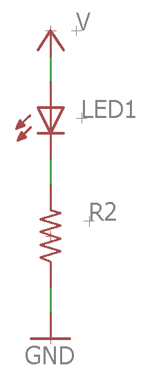

Resistors And Leds
==================

Overview
--------

In this lesson you will learn how to determine the correct value of a
resistor to limit current in an LED circuit. The amount of current
flowing through an LED determines its brightness. If too much current
flows through an LED it will burn out. If too little current flows
through an LED it will be impossible to see.

The following are the two basic steps necessary to calculate the correct
resistor value for an LED circuit. Note that this is essentially the
same circuit you used in the Ohm’s law exercise above except with the
addition of an LED. Each LED drops a specific amount of voltage. Once
you know this voltage drop, you simply subtract it to get the voltage
across the resistor.

1. Subtract the voltage drop of the LED from the circuit to get the
   exact voltage across the resistor.
2. Use Ohm’s law to determine the correct resistor value for the target
   current you are trying to achieve in the circuit.

Supply Voltage

LED Voltage Drop

Target Current

Resistor Value

5 Volts

2.3 Volts

.005 A

5 Volts

1.8 Volts

.002 A

3 Volts

2.0 Volts

.040 A

7 Volts

3.0 Volts

.003 A

12 Volts

1.8 Volts

.015 A

3 Volts

2.0 Volts

.008 A

6 Volts

3.0 Volts

.003 A
