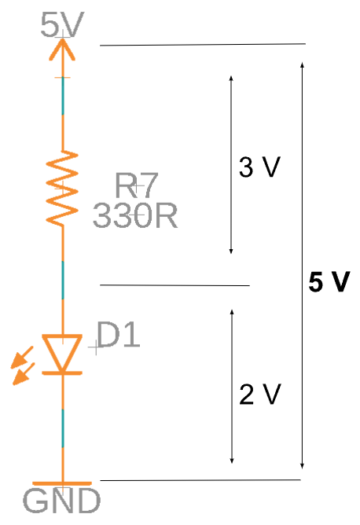

Resistors And Leds
==================

Overview
--------

In this lesson you will learn how to determine the correct value of a resistor to limit current in an LED circuit. The amount of current flowing through an LED determines its brightness. If too much current flows through an LED it will burn out. If too little current flows through an LED it will be impossible to see.

In order to determine either a resistor value or the current flowing through a resistor in the circuit below, you must first determine the voltage across the resistor. This can be done by simply subtracting the voltage across the LED from the total voltage in the circuit. The total voltage drop across any series circuit must equal the sum of each voltage drop in the circuit. Note that in the circuit shown below, the total voltage drop is 5 Volts. If the voltage drop across the LED is 2 Volts then the voltage drop across the resistor must be 3 volts. 

   
Once you know the voltage drop across the resistor, you can proceed as you did in the previous lesson using Ohm's law. 

Exercise
----------

#. Subtract the voltage drop of the LED from the circuit to get the exact voltage across the resistor.
#. Use Ohm’s law to determine the correct resistor value for the target
   current you are trying to achieve in the circuit.
#. Complete the following table in your notebook. NOTE: The circuit must supply
   enough voltage to drive the LED forward. If it does not, indicate that in your
   notebook.

.. list-table:: Resistor Selection
   :widths: 25 25 50 50
   :header-rows: 1

   * - Supply Voltage
     - LED Voltage Drop
     - Target Current
     - Resistor Value
   * - 5 Volts
     - 2.3 Volts
     - .005 Amps
     - 
   * - 5 Volts
     - 1.8 Volts
     - .002 Amps
     - 
   * - 3 Volts
     - 2.0 Volts 
     - .040 Amps
     - 
   * - 7 Volts
     - 3.00 Volts
     - .003 Amps
     - 
   * - 12 Volts
     - 1.80 Volts
     - .015 Amps
     - 
   * - 3 Volts
     - 2.0 Volts
     - .008 Amps
     - 
   * - 2 Volts
     - 2.4 Volts
     - .008 Amps
     - 
   

