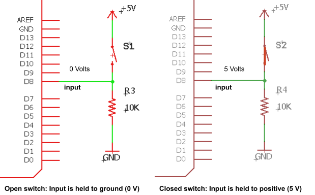
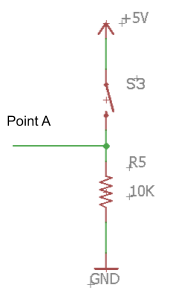

# Buttons

## Overview

Buttons represent the most common form of input found on electronic devices and are used for everything from turning on the device to sending the letter ‘s’ to the computer screen. All buttons have exactly two states. The button is either pressed or it is not pressed. There are no states in between. For this reason they can be categorized as binary devices.

## Button Circuit

In order to make the states of the button readable by a digital electronic device such as your microcontroller, you will need to construct a circuit that converts the states of pressed and not pressed into voltage levels that the microcontroller can use.

Above are two examples of the same circuit. On the left the switch is open and on the right the switch is closed. When the switch is open, the circuit is tied to ground through a resistor so the voltage level at the mid-point is 0 Volts or ground. When the switch is closed, the circuit is tied directly to 5 V. Even though it is also tied to GND through a resistor, the voltage is pulled almost completely to 5 Volts.

### Exercise

Construct the circuit shown below on your breadboard. Using a multimeter record the output voltage for the circuit with the button pressed and not pressed. Make sure to include your units.

|             |                        |
| ----------- | ---------------------- |
|             | Output Voltage Point A |
| Pressed     |                        |
| Not Pressed |                        |

TEACHER CHECK \_\_\_\_

### Exercise:

Construct a circuit that with a button connected to one pin of your microcontroller and a LED connected to another pin. Write code to make the LED turn on when the button is pressed.

TEACHER CHECK \_\_\_\_
