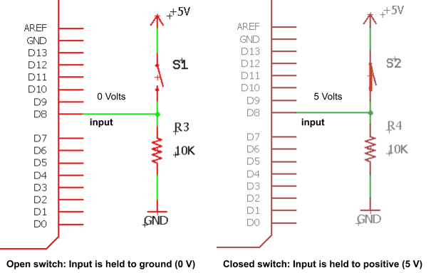
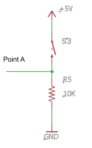

Buttons
=======

Overview
--------

Buttons represent the most common form of input found on electronic devices and are used for everything from turning on the device to controlling the sound level on your phone. All buttons have exactly two states. The button is either pressed or it is not pressed. There are no states in between. For this reason they can be categorized as binary devices.

Button Circuit
--------------

In order to make the states of the button readable by a digital electronic device such as your microcontroller, you will need to construct a circuit that converts the states of pressed and not pressed into voltage levels that the microcontroller can use.

Above are two examples of the same circuit. On the left the switch is open and on the right the switch is closed. When the switch is open, the circuit produces a voltage level of 0 Volts at the point labeled input. This is the point between the resistor and the switch. When the switch is closed, the circuit produces 5 Volts at the point labeled input.

IMPORTANT: In the diagram on the right (labeled closed switch) even though the input is also tied to GND through a resistor, the voltage is pulled almost completely to 5 Volts.

Exercise
~~~~~~~~

#. Construct the circuit shown below on your breadboard. Make sure to construct it exactly as shown below. 

   TEACHER CHECK \_\_\_\_

#. Use a multimeter to measure the voltage at point labeled input (between the resistor and the switch). You may want to use leads with alligator clips so that you have a hand free for the following steps. Remember to connect the black lead to ground (your reference) and the red lead to the point you are measuring.

   TEACHER CHECK \_\_\_\_

#. Record the values on the multimeter for when the button is pressed and not pressed. Make sure to include your units. Complete the following table in your notebook.

+---------------+--------------------------+
|               | Output Voltage Point A   |
+---------------+--------------------------+
| Pressed       |                          |
+---------------+--------------------------+
| Not Pressed   |                          |
+---------------+--------------------------+

TEACHER CHECK \_\_\_\_

