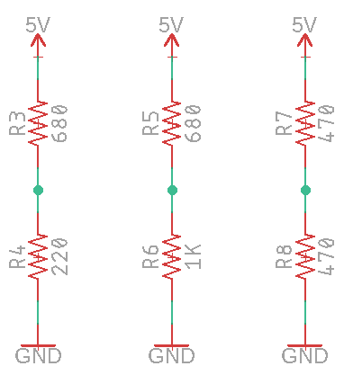

Voltage Dividers N
================

Overview
--------

Voltage dividers are use commonly used as way produce a specific voltage between two voltages. Voltage dividers are also commonly used with resistance-based sensors.

Voltage dividers are designed simply using two resistors in series as shown in the diagrams below. The point between the two resistors is where the voltage is divided.  Depending on the value of the resistors, the voltage will be somewhere between the high voltage in your circuit (in your case 5V) and the low voltage (0V). For example, if you wanted to create a voltage half way (2.5V) between 0 and 5 volts you could use two resistors of equal value and tap the point between the two resistors. The actual value of the resistors does not matter as long as they are equal.

As you learned in a previous lesson, there is a voltage drop across any resistor in a circuit. You can calculate this voltage drop using Ohms law (V=IR) or by measuring the voltage drop with your multimeter. In the example circuits below there are two resistors and therefor two voltage drops. The total of the two voltage drops must equal the total voltage or 5 volts. 

Exercise
~~~~~~~~

For the examples below, use Ohms law to determine the voltage at the point between each of the two resistors. 

#. Step one: Determine the current flowing through each of the circuits using Ohms law. Remember that you can add two resistors in series for a single value. For example, a 520 ohm and 1000 ohm resistor in series would be equivalent to a single 1520 ohm resistor.

#. Step two: Determine the voltage drop through one of the two resistors. Since the current flowing through a series circuit is the same at any point in the circuit, you have the value for current and resistance (the single resistor across which you are calculating). With I and R you can calculate V or the voltage drop across that resistor.

#. Step three: Determine the voltage drop across the other resistor. Since you know the total resistance in the circuit, you can simply subtract the voltage drop across the resistor you calculated above to get the voltage drop across the other resistor.

#. Step four: Draw the circuits in your notebook and record the voltage values you found above.

TEACHER CHECK \_\_\_\_

Construct one of the three circuits above and measure the voltage using a multimeter between the two resistors.

TEACHER CHECK \_\_\_\_
