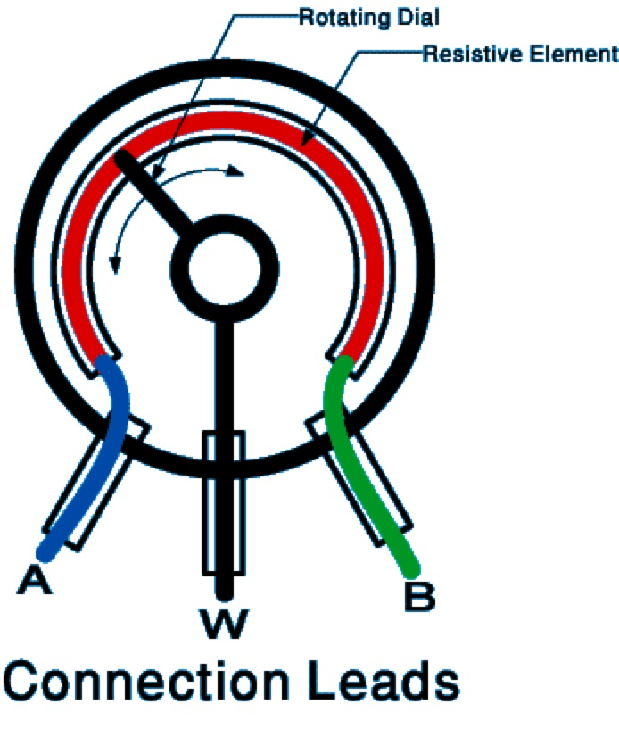
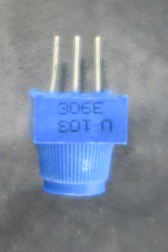
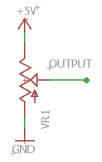
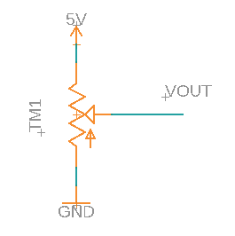

Potentiometers
==============

Overview
--------

Potentiometers are another common form of input for controlling an electronic device. They generally come in two forms: dials and sliders. Dials are commonly used to control the volume on an audio device or temperature on a thermostat. Sliders are commonly used in joysticks to convert the motion of the joystick into signals that can be used by a digital microcontroller.

Potentiometers are essentially variable resistors. The resistance of the potentiometer varies as you turn the dial or move the slider.

Potentiometer Design
--------------------

All potentiometers have three leads as shown in the two diagrams below. The diagram on the left is visual representation of how a potentiometer works. The diagram on the right is a standard schematic symbol for a potentiometer. 

The two outside leads (A and B) form a fixed value resistor. In the case of a 10K potentiometer, the resistance between leads A and B is exactly 10K ohms, regardless of how the potentiometer is turned. The middle lead is the wiper or W. The resistance between A (or B) and W varies as the potentiometer is turned. In the case of a 10K resistor, the resistance varies from 0 ohms to 10,000 ohms. 

|image0|\ |image1|

Below is picture of the actual potentiometer you will use and a schematic showing a potentiometer with leads A and B connected to ground and 5V (note the leads A and B are interchangeable). This is the most common configuration for a potentiometer. In this configuration, the output at W varies in voltage from 0 to 5 volts depending on how the potetiometer is turned. Note that potentiometers are very much like voltage dividers except that you can vary the resistance values by turning a knob.

|image2|\ |image4|

Exercise
~~~~~~~~

#. Place the potentiometer on your breadboard.

#. Measure the resistance between the two outside leads with a multimeter and record this value in your notebook. This will be easiest using alligator clips.

   TEACHER CHECK ___
   
#. Turn the dial and record if this resistance changes.

#. Measure the resistance between the middle lead and one of the outside leads. Turn the dial and record the largest and smallest resistance values in your notebook.

   TEACHER CHECK ___
   
#. Construct the above circuit on your breadboard by connecting the potentiometer pins (A and B) to power and ground. Again, the order does not matter as long as one is connected to power and one is connected to ground. 

#. Measure the voltage at W (output). Turn the potentiometer all the way right and left and record the highest and lowest voltage. Record the highest and lowest voltage readings in your notebook.

   TEACHER CHECK ___

.. |image1| image:: images/image57.png
   :align: top
