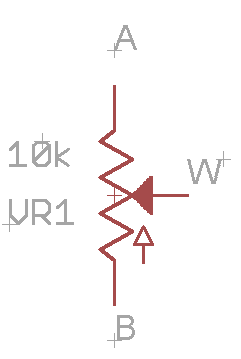

Potentiometers
==============

Overview
--------

Potentiometers are another common form of input for controlling an
electronic device. They generally come in two forms: dials and sliders.
Dials are commonly used to control the volume on an audio device or
temperature on a thermostat. Sliders are commonly used in joysticks to
convert the motion of the joystick into signals that can be used by a
digital microcontroller.

Potentiometer Design
--------------------

All potentiometers have three leads as shown in the diagram below. The
two outside leads (A and B) form a fixed value resistor (i.e. the value
of resistance between A and B is fixed) and is based on the length of the resistive element between A and B. The wiper (W) shorts the
resistor, so the distance between W and A (and W and B) varies as the wiper is turned. Resistance is based on the distance between W and A.
A shorter distance results in less resistance between these two points. Note that the resistance value between W and B is the inverse
of the resistance value between W and A.

|image0|\ |image1|

On the right is a schematic symbol for a potentiometer. Connecting pins
A and B to 5V and ground (the order does not matter) creates a voltage
divider whose output value at W varies with the position of the
potentiometer.

Exercise
~~~~~~~~

Construct the following circuit on your breadboard. Connect the output
to a multimeter. Record the highest and lowest voltage by turning the
potentiometer all the way to the right or left.

.. figure:: images/image60.png
   :alt: 

+-------------------+------------------------+
|                   | Potentiometer Output   |
+-------------------+------------------------+
| Highest Voltage   |                        |
+-------------------+------------------------+
| Lowest Voltage    |                        |
+-------------------+------------------------+

1. TEACHER CHECK \_\_\_\_

.. |image0| image:: images/image71.png

