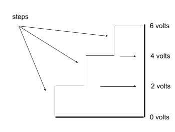

Analog To Voltage Conversion
============================

Overview
--------
In this lesson you will combine what you learned in the previous lesson on analog to digital conversion and scaling to create a simple voltmeter. Since microcontrollers are inherently digital devices any voltage range must be converted into a finite number of steps. In the following diagram a range of 0V to 6V is divided into 3 steps with each step representing two volts.

Exercise
~~~~~~~~

#. Set up your potentiometer as described in the section on potentiometers. Measure the voltage output using a multimeter.
   
#. Complete the following table in your notebook. The two columns represent a source range and the steps column represent a target range. Using the formula you learned in the previous lesson, you can find the Volts per step, or conversion factor. Note that the last row represents the actual values of your microcontroler. The range for your potentiometer is 0V to 5V and the analog converter on your microcontroller has a range of 1024 steps. Round your answers to the nearest 1000th and don't forget to include units.

   +---------------+----------------+---------+------------------+
   | Low Voltage   | High Voltage   | Steps   | Volts per Step   |
   +---------------+----------------+---------+------------------+
   | 0 Volts       | 6 Volts        | 3       | 2 Volts/Step     |
   +---------------+----------------+---------+------------------+
   | 0 Volts       | 8 Volts        | 10      |                  |
   +---------------+----------------+---------+------------------+
   | 0 Volts       | 5 Volts        | 35      |                  |
   +---------------+----------------+---------+------------------+
   | 0 Volts       | 5 Volts        | 200     |                  |
   +---------------+----------------+---------+------------------+
   | 0 Volts       | 5 Volts        | 1024    |                  |
   +---------------+----------------+---------+------------------+

   TEACHER CHECK \_\_\_\_

#. Following the steps below to create a voltmeter. 

   #. Connect the output of your potentiometer to an analog port on your microcontroller or Arduino. 
   
   #. Write a program to display the value of the potentiometer in your terminal window. You should see a range of 0 to 1023 as you turn the potentiometer. Make sure to include a short delay so that your terminal window does not crash.
   
   #. Multiply the value from your potentiometer by the steps (conversion factor) you calculated in the last column of the last row above. Print this number in your terminal window. You should see a value from 0 to 5 which represents a very crude voltmeter ranging from 0 to 5 volts. 

      TEACHER CHECK \_\_\_\_

   #. Modify your code by changing the variable you are using to store the value from your potentiometer from an int to a float. Display your results in your teriminal window.

   TEACHER CHECK \_\_\_\_
