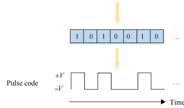

Pulses
======

Overview
--------

Pulses are simply voltage values that range from HIGH to LOW as shown in the below diagram. These pulses can be used to represent data. For
example a high pulse might represent a 1 and a low pulse might represent a zero, as shown in the diagram below. These ones and zeros can in turn 
represent letters, text or other sorts of data.

Pulses can also be used to directly control the speed of a motor or the brightness of a light using what is called pulse
width modulation (PWM). Note in the diagram below the proportion of time the pulse is on versus off determines the speed of 
a motor or the brightness of a light.

.. figure:: images/dutycycle.png
   :alt: 

The following shows an example of how you can write code to create an infinite set of
pulses on a single digital pin on your microcontroller. The diagram shows how each line of code
corresponds to each part of the pulse.

.. figure:: images/image80.png
   :alt: 

Exercise:
~~~~~~~~~

1. Add an LED to your board if there is not already one on there. Write a
   program to flash the LED using code to create a pulse. Use a delay that is 
   large enough that you can see the LED flash on and off.

TEACHER CHECK \_\_\_\_

2. Reduce the delay in your code until you can no longer see that the LED is flashing. Essentially, it is flashing so quickly (on and off) that
   your eye can no longer perceive the individual pulses of the LED.
   
3. Write the value of this delay value in your notebook. Make sure to use the correct units. This is the rate of your critical flicker-fusion
   frequency (CFFF), the fastest flash you can perceive. This is very different for different animals. Read an article about CFFF `here <https://www.google.com/url?q=https://www.economist.com/news/science-and-technology/21586532-small-creatures-fast-metabolisms-see-world-action-replay-slo-mo&sa=D&ust=1587613173941000>`__.
   It is pretty cool.

TEACHER CHECK \_\_\_\_
