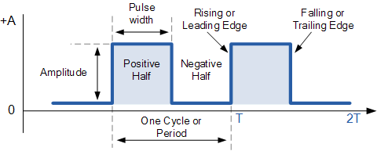

Frequency
====================

Overview
--------

In the previous lesson you made an LED blink by turning it on and off repeatedly. The faster you turned the LED on and off the faster it blinked which
in turn means a higher frequency. The slower you turned the LED off and on, the slower the frequency. Frequency is a measurement of the number of 
blinks over a period of time. Again, more blinks represents a higher frequency.

The unit of measurement for frequency is Hertz which is defined as cycles "blinks" per second. A fast CPU might have a frequency of 3Ghz. That is the processor can
run calculations at 3 billion cycles per second. By contrast the microcontroller that you are using runs at only 16Mhz, or 16 million cycles per second. 

One cycle is represented by one HIGH state and one LOW state as shown in the figure below.

**Period** is the measurement of the length in time of a single pulse or cycle. 

Exercise
~~~~~~~~

In the following exercise, you will use a waves frequency to determine its period and vice versa. Read the section on
`waves <https://www.google.com/url?q=https://docs.google.com/document/d/1BmZbXzxnD2j17QToSZ9jeZmnP7burwfksfQq2v4zu-Y/edit%23heading%3Dh.r3kc4sg9zrj4&sa=D&ust=1587613173942000>`__ in
concepts to learn more about frequency conversion

Using the equation for converting frequency to period complete
the following two tables. Note that the units of Hertz are cycles per
second and as a result the equation you are using produces units of
seconds. Make sure to use CORRECT units and round to the nearest
thousandth. The table also includes a column for converting seconds to
milliseconds. You can find information about converting between
engineering units
`here <https://www.google.com/url?q=https://docs.google.com/document/d/1BmZbXzxnD2j17QToSZ9jeZmnP7burwfksfQq2v4zu-Y/edit%23heading%3Dh.77xfwnlk7wp2&sa=D&ust=1587613173943000>`__.

Find the period of the wave

+-------------+-----------------------+----------------------------+
| Frequency   | Period (in seconds)   | Period (in milliseconds)   |
+-------------+-----------------------+----------------------------+
| 2 Hz        |                       |                            |
+-------------+-----------------------+----------------------------+
| 345 Hz      |                       |                            |
+-------------+-----------------------+----------------------------+
| 32 kHz      |                       |                            |
+-------------+-----------------------+----------------------------+
| 2.7 kHz     |                       |                            |
+-------------+-----------------------+----------------------------+

Find the frequency of the wave

+----------+------------------------+---------------------+
| Period   | Period ( in seconds)   | Frequency (in Hz)   |
+----------+------------------------+---------------------+
| 300 ms   |                        |                     |
+----------+------------------------+---------------------+
| 13 ms    |                        |                     |
+----------+------------------------+---------------------+
| 235 us   |                        |                     |
+----------+------------------------+---------------------+
| 3 us     |                        |                     |
+----------+------------------------+---------------------+
