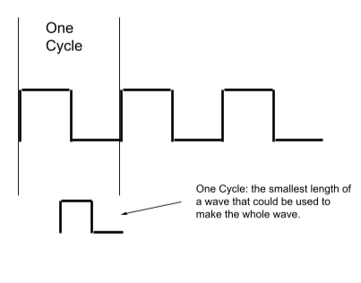

Period
====================

Overview
--------

As mentioned in the previous secton, the unit of measurement for frequency is Hertz which is defined as cycles (or periods) per second. One cycle (or period) is measured as one HIGH pulse and one LOW pulse or smallest section of a wave that could be repeated to make the entire wave as shown in diagram below.

The period of a wave is the length of one cycle in seconds. For example, if you created a wave with a HIGH of 10 ms and a LOW of 10 ms, the period of this wave would be 20 ms or .02 seconds. 

.. figure:: images/waveforms-tim3.png
   :alt: 

Exercise
~~~~~~~~

Complete the following table in your notebook.

.. list-table::
   :widths: 25 25 50
   :header-rows: 1

   * - LOW time
     - HIGH time
     - Period
   * - 20ms
     - 30ms
     -
   * - 500us
     - 500us
     - 
   * - 270us
     - 13ms 
     -
   
