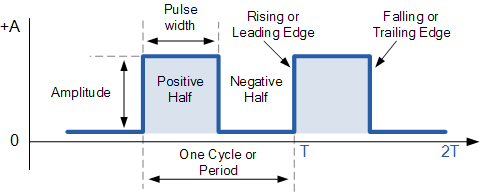

Generating Frequencies
==========================

Overview
--------

In the previous sections you learned about frequency and period and how to convert between the two. In this lesson you will learn how to use the conversion formulas to generate
specific frequencies using your microcontroller. The first step in generating a frequency of 1382Hz is find the period of this frequency using the conversion formula from
the previous section of 1/f = T. Again f stands for frequency and T stands for period. 

1/1382Hz = 0.000723589s

Remember that Hertz is a unit of cycles (or period) per second, so the result of our conversion is seconds. This period is the measure of one cycle or period as shown in
the diagram below. 

But note that the cycle or pulse in your code is made up of two delays. One is for the high part of the pulse and the other is for the low part of the pulse.
Since these two delays make up the period, you will need to divide the period in half. One half of the period will be the delay for the high part of the pulse
and one half of the delay will be the period for the low part of the pulse.

0.000723589s/2 = 0.0003617945s

In order to generate a frequency, you need two delays. One for the high part of the pulse and one for the low part of 
the pulse. This is shown in the diagram below. (For now we will assume these two delays are always equal, but in future lessons you will how making them unequal can be useful.) 

