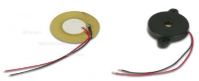
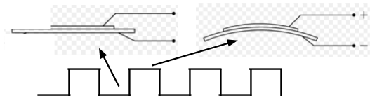
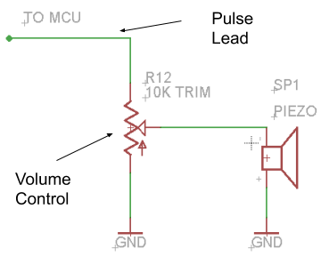

Piezo Speaker
=============

Overview
--------

In this lesson you will learn to drive a piezo speaker to make notes and
sound effects. Piezo speakers are found in lots of common devices such
as microwave ovens or cell phones. A tone from a piezo speaker can be
used to indicate a button press or play a tune letting you know your
friend has called.

Piezo speakers are normally formed around two metal plates as shown in
the picture on the left. The picture on the right shows a piezo speaker
in a secure plastic housing.

A piezo speaker is essentially a thin piece of metal that can make
sounds by vibrating at a very high rate (frequency). The following shows
a  piezo speaker at rest (low pulse) and under voltage (high pulse). By
applying pulses very rapidly to the piezo speaker, it can vibrate very
quickly

Piezo Circuit
-------------

Driving a piezo speaker only requires a single pin that can produce a
pulse.

Exercise
~~~~~~~~

1. Construct the following circuit and connect the pulse lead to one of
   your microcontroller pins. After you complete the circuit, write a
   program to drive your speaker with a frequency of 100 Hz.

TEACHER CHECK \_\_\_\_

2. Modify your code to produce a frequency of 1000Hz. Note you will need
   to use a delayMicroseconds() in order to reach this frequency.

TEACHER CHECK \_\_\_\_

3. What are the highest and lowest frequencies you can hear? These may
   be the highest or lowest you can play. Record your answers below.

+---------------------+--------------------+
| Highest Frequency   | Lowest Frequency   |
+---------------------+--------------------+
+---------------------+--------------------+

Tone Function
-------------

The tone function provides an easy way to send notes to a piezo speaker.
The tone function can be used to set which pin will produce the tone,
the frequency of the tone and duration of the tone. The last argument,
duration is optional.

tone(pin, frequency, duration);
~~~~~~~~~~~~~~~~~~~~~~~~~~~~~~~

In addition, there is a notone function that can be used to produce no
sound. This function can be useful because sometimes even sending a
frequency of 0 will result in the processor making some sound.

        tone (pin);
~~~~~~~~~~~~~~~~~~~

Exercise:
~~~~~~~~~

Write a program to play a A4 (440Hz) for exactly half a second.

TEACHER CHECK \_\_\_\_

Exercise:
~~~~~~~~~

Search on the Internet to find software for the Arduino that can play a
popular song or theme using a piezo speaker. Download the software and
play the song for your teacher.

TEACHER CHECK \_\_\_\_
