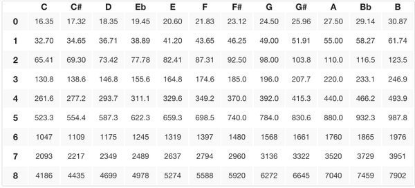

Tone Function
=============

Overview
--------

The tone function provides an easy way to send notes to a piezo speaker.
The tone function can be used to set which pin will produce the tone and
the frequency of the tone.

.. code-block:: C

  tone(pin, frequency);

In addition, there is a notone function that can be used to produce no
sound. This function is useful because once you send a tone to pin it continues to play that tone until you turn it off. Also, sending a
frequency of 0 will often result in the processor making some sound.

.. code-block:: C

  noTone(pin);
  
The following table shows the frequencies for eight octaves of notes. These frequencies can be used directly in the tone function.
  

  
Exercise:
~~~~~~~~~

Write a program to play a A4 (440Hz) for exactly half a second. Confirm that you have generated the correct tone with your multimeter.

TEACHER CHECK \_\_\_\_

Search on the Internet to find software for the Arduino that can play a
popular song or theme using a piezo speaker. Download the software and
play the song for your teacher.

TEACHER CHECK \_\_\_\_
