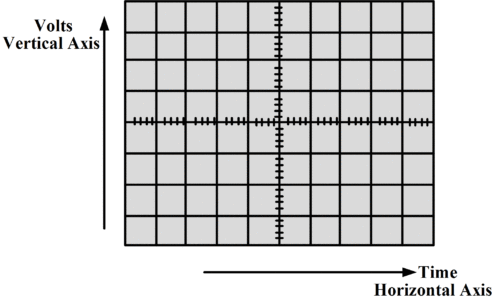

Using An Oscilloscope
=====================

Overview
--------

An oscilloscope is a tool that can be used to visualize electronic signals in your circuit.

Initial Setup
~~~~~~~~~~~~~

#. Turn on you oscilloscope. It takes a few seconds to warm up.

#. Once the scope is on, press the Save/Recall button. It is one of the buttons in the upper two rows of ten buttons. On the screen you will see "Default Setup" displayed in the upper right. Press the button to right of "Default Setup" to enter the default setup. This is generally useful to do any time you set up your scope or if you are having trouble reading a signal.
   
#. Connect a scope lead (see image below) to channel 1 (CH1) NOTE: The channel one connector is toward the bottom of your scope. Be careful with the oscilloscope leads. They are fragile and expensive. 
   
   .. figure:: images/oscopelead.png

   
#. Make sure your scope lead is set to 1X . There is a switch on the end of the scope lead itself. See below, though the picture shows the lead set to 10X it should be set to 1X for this lesson.
   
   .. figure:: images/x10.png
   
#. As with your multimeter, there is a ground lead and a test lead. Connect the ground lead (alligator clip) to ground on your breadboard.

First Test
~~~~~~~~~~

#. Touch the test lead (press the top of the lead also known as the witches hat) to the power bus (5V) of your board.
#. At this point, the yellow line should disappear from your screen.
#. Touch the test lead to ground and the yellow line should reappear.

   NOTE: You can remove the witches hat to reveal and test point which can be easier to use in some situations, but DO NOT LOSE it. These are expesensive!

   TEACHER CHECK \_\_\_\_\_

The Grid
~~~~~~~~~~~~~~~~~~
You will notice that the screen of your oscilloscope is divided into a grid. The **vertical divisions** measure **voltage** and the **horizontal divisions** measure **time** as shown in the diagram below.

**Voltage per division:** In the lowerleft corner of the screen there are two equations, "1=2V" in yellow and "2=2V" in blue. These display the voltage per division for the vertical lines of the grid. The yellow is for channel one and the blue is for channel two. For now, we will only be using one channel. 

**Time per division:** In lower center of your screen you will see value 2.5us. This indicates the present number of microseconds per horizontal division on your scope. In your notebook, draw a grid with just four horizontal lines and four vertical lines. Draw an arrow indicating that each horizontal mark is 2.5us and another arrow indicating that each vertical mark is 2V. 

Reading Vertical Divisions
~~~~~~~~~~~~~~~~~~

#. Turn the VOLTS/DIV dial for channel one so that the vertical divisions are set to 5V per division.

#. Move the test lead between ground and power. You should see the yellow line jump exactly one vertical division. This is because you set the VOLTS/DIV so that one vertical division equals exactly 5 Volts. IMPORTANT: The yellow "1>" on the left of your screen remains in place regardless of the voltage on the test lead. This represents the voltage reference or zero volts.

#. Set the VOLTS/DIV back to 2V for channel one. Touch you test lead to the 5V bus. Now turn the Vertical control for channel one (it is the dial labeled with two up and down arrows) down until you can see the yellow line.
#. How many divisions are there between the voltage reference "1>" and the yellow line? And how many volts does this represent? Write your answers in your notebook.

TEACHER CHECK \_\_\_\_\_

Measuring a Pulse
~~~~~

#. Return your scope to the Default Setup. (see above)
#. Write a program on your microcontroller to make a pulse on pin 2 that is HIGH for 10ms and LOW for 10ms.
#. Connect your oscilloscope's test lead to pin 2 of the Metro Mini (the ground lead should remain on ground).
#. Download your program and you should see the yellow line appear to flash on the screen. Actually, it is showing a pulse, but you cannot see the upper portion of the pulse because it is off the screen.
#. Change your VOLTS/DIV to 5V from the default 2V and you should now be able to see the upper portion of the pulse, but you will still not see a pulse, just a line bouncing up and down.

Reading Horizontal Divisions
~~~~~~~~~~~~~~~~~~~~

#. The reason you cannot see the pulse is because the horizontal divisions which measure time are set by default to 2.5us per division and your pulse is 20ms long. Below is a an example of your scope and the pulse. Notice that you will only see either the top or bottom of the pulse, but not the whole pulse.

   .. figure:: images/image4.png

#. Adjust the horizontal divisions using the TIME/DIV so that each horizontal division is now 2.5ms long. The TIME/DIV dial is at the bottom of the HORIZONTAL menu of the user interface. You should now see the pulse moving across your screen.
#. In order to freeze the pulse, you need to raise the trigger level. The trigger level is set using the dial labeled LEVEL under the TRIGGER menu of your user interface. You can see the trigger level indicated on your screen by the small yellow arrow on the right side of the screen. The trigger level determines how high a pulse must be before it triggers the scope. You want this level (the arrow on the right) to be just below the highest point of your pulse. 

Challenges
~~~~~~~~~~

Answer the following in your notebook based on the pulse you created above. Write your answers in complete sentences.

#. How many volts are there per division? 

#. How many divisions high are your pulses?
                         
#. How much time is there between divisions?

#. How many divisions long is one completely cycle (period) of your pulse?
                                                           
#. How many divisions long is the high portion of the pulse? 

#. How many divisions long is the low portion of the pulse?

   TEACHER CHECK \_\_\_\_\_

#. Modify your code to make a new wave form that has a high time of 300us and a low time of 200us. Adjust your time division so that you can see more than one pulse on the screen at a time. Adjust the HORIZONTAL dial so that the pulse lines up exactly with the grid. In your book record the time/division setting. 

   TEACHER CHECK \_\_\_\_\_

#. Create a waveform that is 350Hz and display it on your scope. If you have done this correctly, you should see ~350Hz shown next to the green f at the bottom of your scope.

TEACHER CHECK \_\_\_\_\_
