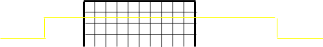

Using An Oscilloscope
=====================

Overview
--------

An oscilloscope is a tool that can be used to visualize electronic
signals in your circuit.

Connections
-----------

In order to test a a signal on your circuit with an oscilloscope you
must connect it to your circuit.

Initial Setup
~~~~~~~~~~~~~

1. Set up a simple breadboard circuit with a Metro Mini.
2. Turn on you oscilloscope. It takes a few seconds to warm up.
3. Once the scope is on, press the Save/Recall button. On the screen you
   will see Default Setup in the upper right. Press the button to enter
   the default setup. This is generally useful to do any time you set up
   your scope or if you are having trouble reading a signal.
4. Connect a scope lead to channel 1 (CH1) NOTE: Be careful with the
   oscilloscope leads. They are fragile and expensive.
5. Make sure your scope lead is set to 1X. There is a switch on the end
   of the scope lead.
6. Connect the ground lead (alligator clip).

First Test
~~~~~~~~~~

1. Connect the test lead (micro connector with the witches hat) to the
   power bus (5V) of your board.
2. At this point, the yellow line should disappear from your screen.
3. Move the test lead to ground and the yellow line should reappear.

TEACHER CHECK \_\_\_\_\_

Vertical Divisions
~~~~~~~~~~~~~~~~~~

1. Notice that in the lower left corner of the screen the vertical
   divisions of the screen for channel one are set to 2V per division (1
   = 2V). Turn the VOLTS/DIV dial for channel so that the vertical
   divisions are set to 5V per division.
2. Move the test lead between ground and power. You should see the
   yellow line jump exactly one vertical division. This should make
   sense since one vertical division on the screen corresponds to
   exactly 5V.
3. Set the VOLTS/DIV back to 2V for channel one and make sure your test
   lead is in the 5V bus. Now turn the Vertical control for channel one
   (it is the dial labeled with two up and down arrows) down until you
   can see the yellow line.

.. raw:: html

   <!-- end list -->

4. How many divisions are there between the yellow 1 (the ground
   reference for channel one on the screen) and the yellow line:
   \_\_\_\_\_\_\_\_\_

TEACHER CHECK \_\_\_\_\_

Pulse
~~~~~

1. Return your scope to the Default Setup. (see above)
2. Write a program to toggle pin 2 at so that it is HIGH for 10ms and
   LOW for 5ms.
3. Connect your test lead to pin 2 of the Metro Mini (the ground lead
   should remain on ground)
4. Download your program and you should see the yellow line appear to
   flash on the screen. Actually, it is showing a pulse, but you cannot
   see the upper portion of the pulse because it is off the screen.
5. Set your VOLTS/DIV to 5V (from 2V) and you should now be able to see
   the upper portion of the pulse, but you will still not see a pulse,
   just a line bouncing up and down.

Horizontal Divisions
~~~~~~~~~~~~~~~~~~~~

1. The reasons you cannot see the pulse is because the horizontal
   divisions are too fine. Below is a an example of your scope and the
   pulse. Notice that you will only see either the top or bottom of the
   pulse, but not the whole pulse.

2. Note that each horizontal division is set at 2.5us by default. See
   the lower middle of your screen.
3. Adjust the horizontal divisions using the TIM/DIV so that each
   horizontal division is 2.5ms. The TIME/DIV dial is at the bottom of
   the HORIZONTAL menu of the user interface. You should now see the
   pulse moving across your screen.
4. In order to freeze the pulse, set the trigger level to just below the
   highest point of your pulse. The trigger level is set using the dial
   labeled LEVEL under the TRIGGER menu of your user interface. You can
   see the trigger level indicated on your screen by the small yellow
   arrow on the right side of the screen.

Challenges
~~~~~~~~~~

1. Record the following from your screen for the waveform you created in
   the above lesson. Note that the divisions are the dotted lines on
   your screen. There are both vertical and horizontal divisions. In the
   vertical direction the divisions measure voltage. In the horizontal
   direction the divisions measure time.

.. raw:: html

   <!-- end list -->

1. Voltage per division:                                
                           \_\_\_\_ V
2. Time per  divisions:
                                                           \_\_\_\_ ms
3. Number of vertical divisions for each complete
   pulse:                \_\_\_\_ divisions
4. Number of horizontal divisions for the low portion of the
   pulse:        \_\_\_\_ divisions
5. Number of horizontal divisions for the high portion of the pulse:
           \_\_\_\_ divisions

TEACHER CHECK \_\_\_\_\_

2. Modify your code to make a new wave form that has a high time of
   300us and a low time of 200us. Adjust your time division so that the
   the high pulse is exactly three horizontal divisions wide.

TEACHER CHECK \_\_\_\_\_

3. Create a waveform that is 350Hz and display it on your scope. If you
   have done this correctly, you should see ~350Hz shown next to the
   green f at the bottom of your scope.

TEACHER CHECK \_\_\_\_\_
