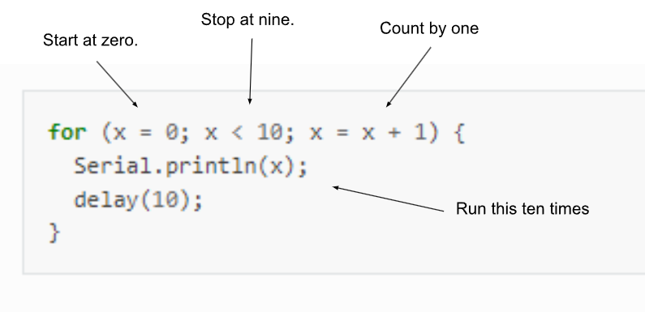

For Loops
=========================

Overview
--------

In this lesson, you will create *for loops*. *For loops* are one of the key features of any programming language. They allow you to increment or decrement a variable over a precise range of numbers. The following is a basic a example of a for loop that prints the numbers 0 to 9 in your terminal window. IMPORTANT: A *for loop* should be placed inside one of your functions, either setup or loop. They are not functions and cannot stand on their own in your code.

There are three steps to creating a *for loop*. 

:: 

   Set the initial value: x = 0; // x starts with a value of 0 Note: You can use any number
   Set the limit value: x < 10; // Continue to execute loop while x is less than 10
   Set the rate of change: x = x + 1 // After each time the loop is executed add one to x  
   
**IMPORANT** You must initlize any variable before you use it in your code.
   

  
Exercise:
~~~~~~~~~

#. Copy the above code into your setup() function, NOT loop() function. 
#. Include in your code file everything else you need to run this program.
#. Display the results in your terminal window.

   TEACHER CHECK \_\_\_\_\_

#. Modify your code so that it starts counting from a differnt initial value.
#. Modify your code so that it counts to a different final value.
#. Mofify your code so that it counts by a different increment (not just one).

   TEACHER CHECK \_\_\_\_\_

#. Modify your code so that it counts down by 2 from 94 to -2.

   TEACHER CHECK \_\_\_\_\_

#. Modify your for loop so that it prints two values in two columns. The first value is a count from 1 to 25. The second column is double the first or as in a count from 2 to 50 as shown below. You should do this with only ONE for loop. Also, this can be done with a single variable. Refer to the last exercise in the previous lesson.

   ::

      1  2
      2  4
      3  6

   TEACHER CHECK \_\_\_\_\_

#. Place your for loop code into your loop() function and note the difference.

