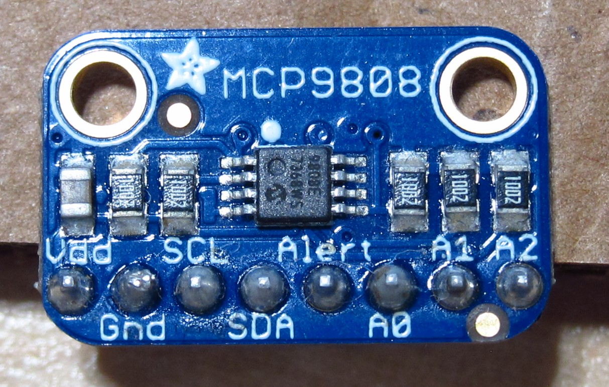

Complex Device Rules
==========================

Overview
--------
In the next section you will be adding your first complex device to your breadboard outside of the Metro Mini itself. So far you have only added individual components to
your breadboard including, resistors, LEDs, potentiometers and a piezo speaker. I am defining a complex device as one that is made up of multiple components, such as the
Metro mini itself. Below is an image of the temperature sensor you will be using in the next lesson. Note that like all complex devices it has pins for power (Vdd) and ground.
It also has pins for communicating with your microcontroller, the Metro Mini in your case. In the case of this device, the communication pins are SDA and SCL.

Before adding a complex device to your breadboard make sure to follow the rules listed below. 

1. Always remove power from your board when setting up a complex device. This is generally a good idea when adding any component to your breadboard, but very important
   when adding a complex device. These devices cost more than individual components and can be damaged more easily. The easiest way to remove power from your board
   is to unplug the USB.
   
2. Carefully connect the device to your circuit following the schematic and instructions provided.

3. MOST IMPORTANT: Make sure the power and ground are attached correctly. Reversing these two connections is the number one reason for damaging and complex device.

4. Apply power to your board. If you see smoke or it gets hot, remove power immediately.
