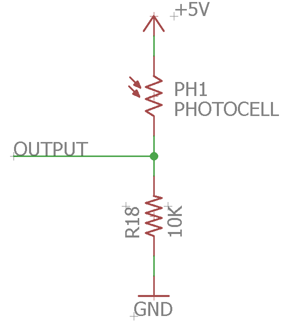

Resistive Light Sensor
==============

Overview
--------

In this lesson you will be measuring the light level in the room using a
photocell. A photocell is a resistor that varies the value of its
resistance based on the level of light that strikes its surface.

.. figure:: images/image34.png
   :alt: 

Exercise:
~~~~~~~~~

1. Construct the circuit shown above.
2. Measure the voltage at the output using a multimeter.
3. Copy the following table into your note book and record voltages when the photocell is covered with the following materials.

.. list-table:: Light Sensor
   :widths: 25 25 
   :header-rows: 1
   
   * - Sensor Block
     - Voltage
   * - Uncovered
     - 
   * - Paper
     - 
   * - Tape
     - 
   * - Pinky
     - 
   * - Thumb
     - 
   * - Wood
     - 

What would account for the different voltages and light levels?

TEACHER CHECK \_\_\_\_

4. Connect the output of the light sensor circuit to one of the analog pins on your
   Metro Mini.
5. Write a program to read the value of the output and print it in the
   Serial Monitor in a single column.
6. Note the changes in values in different light levels.

TEACHER CHECK \_\_\_\_
