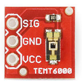

TEMT6000 Light Sensor
==============

Overview
--------

In this lesson you will use a TEMT6000 breakout board for measuring light levels in the classroom. The TEMT6000 is designed to produce and analog signal proportional to the level of ambient light. Unlike the resistive sensor, this one is more accurate and produces a linear output.

Exercise:
~~~~~~~~~

#. Insert the TEMT6000 board into your breadboard.

   REMINDER: ALWAYS UNPLUG YOUR BOARD (USB CABLE) FROM POWER BEFORE ADDING OR REMOVING ANY COMPONENTS.

#. Connect VCC (power) and GND (ground) from the sensor to the ground and power on your breadboard.
#. Connect the SIG (signal) to one of your analog ports and display the values in your Serial Monitor.

   TEACHER CHECK \_\_\_\_

#. Write a program that turns on an LED when light in the room drops. You can mimic low light levels in the room by move your had so that it casts a shadow over the light sensor.

   TEACHER CHECK \_\_\_

#. Write a program to change the frequency of a tone on a piezo speaker based on the level of light that reaches the sensor.

   TEACHER CHECK \_\_\_\_
